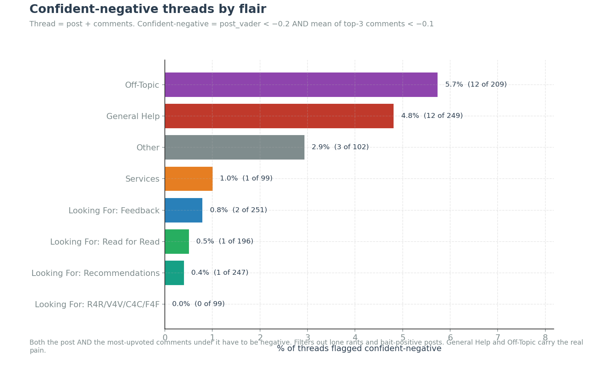
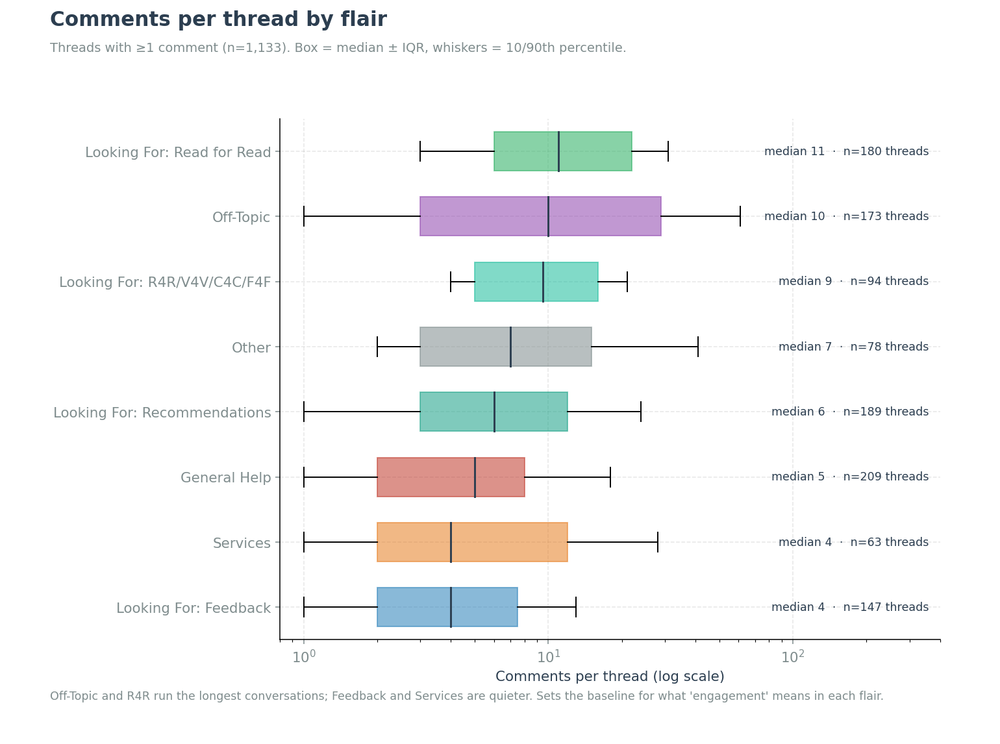
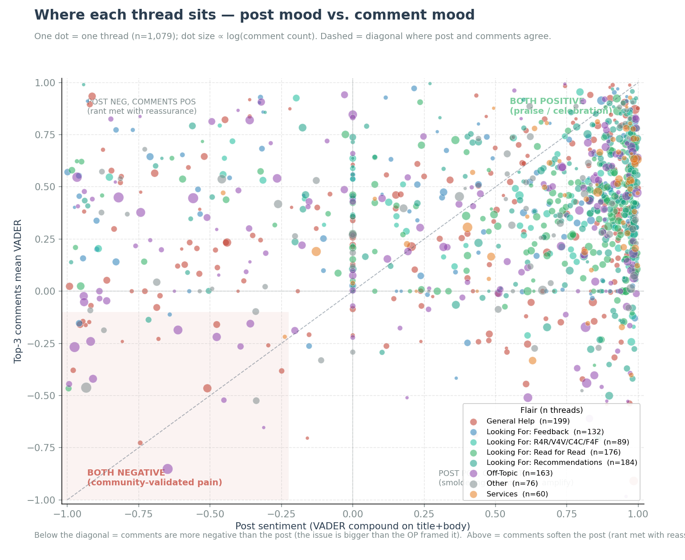
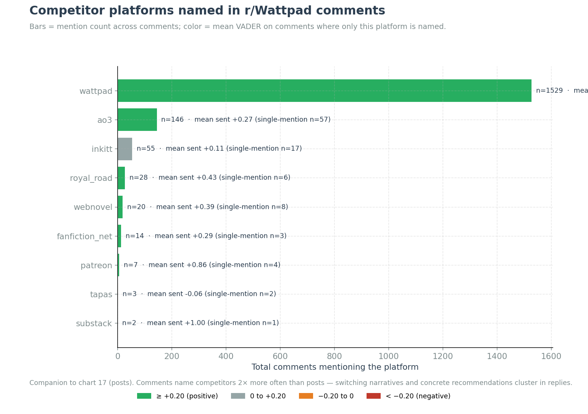

# Top threads — r/Wattpad analysis

_Generated 2026-05-18 from `data/thread_descriptives.parquet`._

_Corpus: 1,452 platform-discussion threads (post + every comment beneath, parent-chain resolved) from r/Wattpad over the last 2 years, after dropping 4 structurally-positive flairs (Weekly Promotion, Monthly Discussion, Announcement, Milestone)._

_1,133 threads have at least one comment · 32 are confident-negative · 477 have a competitor mention in the comments._

### Where the pain lives



*[Chart: `analysis/findings/18_confident_negative_by_flair.png`]*


Pain concentrates in two flairs: **General Help** and **Off-Topic** both flag ~5.7% of their threads as confident-negative. The other six flairs are essentially clean (≤1.4%). Read those two flair sections first.

### How conversational each flair is



*[Chart: `analysis/findings/21_comments_per_post_by_flair.png`]*


Off-Topic, Read-for-Read, and R4R run the longest conversations (median 10-11 comments). Feedback and Services are quieter (median 4). Sets the right baseline for what "engagement" means in each flair section below.

---

## How threads were selected

For each of the 8 analytical flairs, three lists are surfaced. Each answers a different product question.

### 1. Most-discussed threads (top 10 per flair)

**Goal:** "Where did the community actually show up?"

**Quality score:**

```
quality = log(1 + n_comments) × log(1 + max_comment_score) × (|post_vader| + 0.5)
```

Three factors multiplied:

- **`log(1 + n_comments)`** — conversation volume. Logged so a 200-comment thread isn't 100× a 2-comment thread; the difference compresses.
- **`log(1 + max_comment_score)`** — peak endorsement. The strongest single comment matters more than total volume (a thread with one 100-upvote comment beats one with twenty 5-upvote ones).
- **`|post_vader| + 0.5`** — opinion strength. Calm threads get the floor; opinionated threads (positive or negative) rise. A thread where the OP has a strong view tends to attract a real conversation.

### 2. Confident-negative threads (top 10 per flair)

**Goal:** "Where do we have community-validated pain?"

**Filter (two signals must agree):**

```
post_vader < −0.2          # OP is clearly negative on title + body
AND
top3_mean_vader < −0.1     # mean VADER of the top-3 highest-scored comments is also negative
```

Both signals are required. This filters out:

- **Lone rants** — negative post but comments push back ("you're overreacting"). Not a community problem.
- **Sarcastic-positive bait** — positive-sounding post that's actually upset. Edge case but exists.
- **Mild venting** — only post is negative, comments are neutral chit-chat.

Within the filtered set, threads are sorted by `consensus_neg` (the fraction of all comments with VADER < −0.05), then by comment count. Threads near the top are the ones where both the OP and the community agreed something is wrong.



*[Chart: `analysis/findings/19_post_vs_top3_sentiment.png`]*


Every dot is one thread. The dashed diagonal is where post and comments agree. **Below the diagonal = comments are more negative than the post** (a smoldering issue the OP under-stated). The lower-left quadrant is the confident-negative zone — what this filter surfaces.

### 3. Threads with competitor talk (top 8 per flair)

**Goal:** "Where are users actually naming alternatives?"

**Filter:** at least one comment in the thread mentions one of 11 tracked platforms via regex on canonical names and aliases (case-insensitive): AO3 (incl. `archiveofourown`), Royal Road, Inkitt, Substack, Patreon, Tapas, Webnovel, Radish, Kindle Vella, fanfiction.net (incl. `ffn`, `ff.net`), Wattpad (self-references).

Ranked by total competitor-mention count in the thread, then by comment count. Comments mention competitors at 2× the rate posts do — switching narratives concentrate here.



*[Chart: `analysis/findings/22_competitor_mentions_in_comments.png`]*


AO3 dominates by a wide margin; Royal Road, Inkitt, and fanfiction.net follow. Bar color = mean VADER on comments where only that platform is named (single-mention sentences only, to avoid co-mention contamination).

### What each thread shows

For every selected thread:

- **Header line:** `post_id` · post ↑ score · n comments · post sentiment · top-3 comment sentiment · % negative comments
- **Flag line** (when applicable): 🔴 confident-negative, 🔁 N competitor mentions, 🚪 N switching-language comments (verbs like *moved*, *switching*, *quitting* + direction)
- **Post body:** up to 400 characters
- **Top 5 comments by score:** each with score, author, sentiment marker (🟢 positive · ⚪ neutral · 🔴 negative), up to 250 characters of body

### Notes on the underlying signals

- **VADER** is a lexicon-based sentiment scorer (range −1 to +1). Standard thresholds: > 0.05 positive, < −0.05 negative. Used here for *ranking and filtering*, not as ground truth on individual comments — see `analysis/findings/vader_validation.md` for spot-check results once labels are in.
- **consensus_neg** = fraction of English comments in the thread with VADER < −0.05. A blunt "how loud is the negative chorus" measure.
- **top3_mean_vader** uses the three highest-scored English comments. Captures the *endorsed* sentiment, not the loudest single voice.
- **Comments per thread are parent-chain resolved** — depth-N replies count as part of their root post's thread. Comments whose chain was broken by deleted ancestors are excluded.
- **Flair-drop reasoning:** Weekly Promotion / Monthly Discussion / Announcement / Milestone are excluded from sentiment analyses because they're structurally positive by design (mod megathreads, celebration posts).


## Table of contents

| Flair | Threads | With comments | Confident-neg | With competitor |
|---|---:|---:|---:|---:|
| [General Help](#general-help) | 249 | 209 | 12 | 104 |
| [Off-Topic](#off-topic) | 209 | 173 | 12 | 97 |
| [Other](#other) | 102 | 78 | 3 | 36 |
| [Looking For: Feedback](#looking-for-feedback) | 251 | 147 | 2 | 46 |
| [Looking For: Recommendations](#looking-for-recommendations) | 247 | 189 | 1 | 65 |
| [Looking For: Read for Read](#looking-for-read-for-read) | 196 | 180 | 1 | 69 |
| [Looking For: R4R/V4V/C4C/F4F](#looking-for-r4r-v4v-c4c-f4f) | 99 | 94 | 0 | 33 |
| [Services](#services) | 99 | 63 | 1 | 27 |

---

## General Help

_249 posts in scope · 209 have at least one comment · 12 flagged confident-negative · 104 mention a competitor platform._

### General Help — 1. Most-discussed threads (top 10)

#### I’m sick of AI
`t3_1jbkql9` · post ↑ 245 · 64 comments · post sentiment +0.98 · top-3 comments -0.91 · % negative comments 37%
🔁 8 competitor mentions · 🚪 4 switching-language

> So i'm a writer for almost 16 years, My writing developed over years until I reached a point that my writing is so good "i'm not trying to compliment myself", But i know my writings is good and poetic. The fandom that i'm in is so small maybe in wattpad we are near 30 users only,, and not all of us write... And lately i've been seeing a lot of these users use AI to write?!? Like it is so obvious i…

**Top 5 comments:**

- **↑ 50** · *Abducted_by_neon* 🔴
  > I got accused of using AI a few months back because I was describing a car and used the wrong terminology for something. It wasn't even an important piece of information and it was a rough draft. Some dude go all high and mighty and insisted I was wr…
- **↑ 32** · *Reasonable-Use-9294* 🔴
  > The problem is that AI is harder to notice than people make it out to be.
  AI often repeats the same words? Yeah, but an human being *will* make that mistake too.
  AI lacks emotion? Again, someone might still be an amateur and probably at first be…
- **↑ 17** · *Abducted_by_neon* 🔴
  > He also insisted it was AI because I described a skeleton as white, but it was meant as symbolism. To show that the characters "pure" at the beginning and as time goes the skeleton starts to rot to show him become more and more messed up. But because…
- **↑ 12** · *CHR0MEHRTS* 🔴
  > My thing is I just don’t understand the whole thing “Ai writing thing” people are obviously wasting their breaths and thumbs ranting when it’s not going away but yeah the accusations are weird.
- **↑ 10** · *The-Potat* 🟢
  > AI users accusing actual talented people of using AI is both a compliment and a showcase of how much their brains have receded.

---

#### What should I do?
`t3_1lswj56` · post ↑ 419 · 50 comments · post sentiment -0.51 · top-3 comments -0.47 · % negative comments 38%
🔴 **confident negative** · 🔁 13 competitor mentions · 🚪 4 switching-language

> What should I do? I feel like taking my book down 🥴 Should I report it on Amazon? Where exactly do I do that? I'm so angry!

**Top 5 comments:**

- **↑ 146** · *saltygamer677* 🔴
  > Report it to amazon. Write a whole complaint. Message on amazon's social media as well. The person could be sued but it would be hard if people they are stealing from living in different regions.
- **↑ 58** · *Saltysuzy21* 🔴
  > WHY do people feel the need to steal other people’s work????? Like is it so hard to just be a decent person???
- **↑ 49** · *Human-Law-422* 🔴
  > I'm starting to regret ever posting anything on Wattpad. I honestly feel like crying...
- **↑ 42** · *saltygamer677* 🔴
  > It is okay. It can happen, no online space is safe. Just remember at the end of the day, you are the one with talent. Some day you would signing deals with publishers not them. But make sure to fight for this stolen work and have it taken down.
- **↑ 25** · *Nony_m* ⚪
  > Please make sure to report it. A lot of people are stealing from Wattpad writers and making money off our works through kdp

---

#### Do readers actually like character intro pages and moodboards?
`t3_1tc6vyh` · post ↑ 25 · 75 comments · post sentiment +0.93 · top-3 comments +0.36 · % negative comments 14%
🔁 7 competitor mentions · 🚪 1 switching-language

> As a reader, do you enjoy character intro pages / moodboards at the beginning of Wattpad stories, or do you prefer jumping straight into the story? If you like them, what style works best for you?

**Top 5 comments:**

- **↑ 18** · *RaspberryCanoeing* 🔴
  > I avoid them completely so I prefer the to be at the end if they exist. The point of reading the story, for me at least, is be to see what the author sees via the words they use!
- **↑ 16** · *DanyStormborn333* 🟢
  > No. I usually click away from them. Because I’ve found that often, if an author adds these things, they don’t describe anything and use the photos instead. Or they info dump everything about a character right before I read and I don’t want to have to…
- **↑ 15** · *maarshiexcry* 🟢
  > If i see a "all characters page" chapter i leave the book instantly and dont look back. I want to find out the cast *reading the book*. 
  Moodboards for *just book* are cool, little aesthetic can make it look more eye-catching, but overloading the b…
- **↑ 12** · *aidensummers* 🟢
  > Character info pages give me the impression of a bad writer (my opinion). I feel like it's there because the writer can't properly convey a character in the story.
  Make them, sure, but keep them to yourself or put them in the end if anyone wants to…
- **↑ 6** · *Competitive-Hat-9975* 🟢
  > I like them, but I also like the descriptions added in throughout writing. Because I forget easily so a quick bit about their hair color or eyes with the character pages is nice. And I think that's good too for people that don't like character intro…

---

#### Do people still read Wattpad anymore?
`t3_1teexja` · post ↑ 58 · 47 comments · post sentiment +0.84 · top-3 comments -0.05 · % negative comments 26%
🔁 13 competitor mentions · 🚪 3 switching-language

> I actually really miss writing and I used to be a bit popular on Wattpad but I ended up stopping when I started college... I don't really NEED wattpad but I really do miss writing. I'm done with school now and I really wish I could get that motivation/fun for all my hobbies that I love.

**Top 5 comments:**

- **↑ 32** · *StrangeWar2530* ⚪
  > I reread old stories. Wattpad ain’t the same these days.
- **↑ 12** · *taorthoaita* 🟢
  > I’m a hypocrite. I’ll write and post on there, but I won’t read. Not because there isn’t good stories, just the ads drive me nuts. 
  Edit: thanks for the advice everyone
- **↑ 9** · *AdFit6651* 🔴
  > Ikr😭😭😭 its so different now
- **↑ 7** · *im_broke18*
  > Use it on website  zero ads
- **↑ 7** · *bluubirrdd* 🔴
  > I religiously pay monthly for my Wattpad subscription

---

#### Nobody reads no more
`t3_1t90vl5` · post ↑ 46 · 38 comments · post sentiment +0.78 · top-3 comments +0.26 · % negative comments 16%
🔁 20 competitor mentions · 🚪 8 switching-language

> I have been writing on Wattpad since 2017. I had a (very poorly written) story with over 200k reads (and decided to take it offline in a whim a while ago (shouldn't have done that)). I have always kept writing on there but for some stories I couldn't find the time to finish them,, so those were taken offline. Now, I have started writing more seriously again, I publish every week around the same ti…

**Top 5 comments:**

- **↑ 36** · *smilesandblues* 🟢
  > It depends if the fandom is active on Wattpad or not. I know it's insanely popular over ao3 and as someone already said, huge fandoms also have a disadvantage, your work gets lost in the huge sea of other works. 
  Don't mind me but I was checking yo…
- **↑ 15** · *neuromantyk* ⚪
  > Question: do you read works of other authors?
- **↑ 15** · *Stinacilia* ⚪
  > Years ago I read alot on wattpad. But today if you don't pay for it, you get a lot of advertisements, and that's throwing me off my reading, so I almost never use it anymore, and I don't want to pay subscription, because it's too expensive to pay sub…
- **↑ 8** · *AggravatingNail44* 🟢
  > I've copied and pasted my work from AO3 to wattpad so my audience who don't have AO3 accounts can read my wattpad account 🤷‍♀️
  And honestly, I don't think anyone is reading it, just me, when I upload a fic 😭💔
- **↑ 6** · *DanyStormborn333* 🟢
  > Heated Rivalry is massive on Ao3. You’d have more luck there, if you want to try it. I think some fandoms don’t do well on Wattpad but getting reads there for anything is impossible nowadays.

---

#### I admit it. I need help.
`t3_1stunm9` · post ↑ 19 · 94 comments · post sentiment +0.99 · top-3 comments +0.87 · % negative comments 9%
🔁 10 competitor mentions · 🚪 10 switching-language

> I poured my heart and soul into writing a book on wattpad only for it to be a massive flop when I posted it. I can't say it deserved more because it didn't. Even I'm capable of recognizing bad writing but dispite that I thought it'd do somehow better. I've reached a point in writing where I know my best isn't going to cut it. I want to get better and I want to improve but I don't know how. I'm scr…

**Top 5 comments:**

- **↑ 10** · *OneCatMind* 🟢
  > The best way to become a better writer is to read more. Read other books in the audience age range and genre youre going for. Doing this will train your brain on how to write like people who are published.  
  Also I highly recommend a book called Th…
- **↑ 7** · *OneCatMind* 🟢
  > It feels like thats your biggest problem. You dont have time to make yourself a better writer, and if you cant find books you enjoy its going to be near impossible to write (and publish) anything.
- **↑ 6** · *angry_crayons* 🟢
  > **Fixing your prose**
  I would suggest reading more. Not just wattpad books (though those too) but traditionally published books of good quality. It will level up your prose. Read a lot in your genre but also in other genres as diversity flexes your…
- **↑ 6** · *angry_crayons* 🟢
  > Theyre just fishing for beta readers. Thanks btw for callingmy comment a "gold nugget" that fely nice lol
- **↑ 5** · *Pure-Lawfulness-1212* 🟢
  > Try to read on your phone. Anything works. One-shots that are 2-5 k words work great and take no time at all. Read during lunch, on the way to work, on the elevator. It's a habit. I read even when I'm in the suppermarket.

---

#### How should i remove my votes.
`t3_1suac5l` · post ↑ 17 · 21 comments · post sentiment -0.99 · top-3 comments +0.02 · % negative comments 25%
🔁 2 competitor mentions

> Guys helpppp, how the fuck can I hide my votes from my readers because why the fuck does my readers need to know what the hell I am reading and voting????? It is sooo embarassijhhgsggsgsgs 😭😭😭😭😭😭😭😭😭😭

**Top 5 comments:**

- **↑ 24** · *ConsciousRoyal* ⚪
  > I had a conversation with someone about this when it was just books in reading lists where your followers were notified.
  You read weird stuff, I read weird stuff. Let’s agree not to judge the other on what we’re reading.
  Same with voting.
- **↑ 11** · *milejdyvan* 🟢
  > I’m sure the writer whose story you’re reading would very much appreciate your vote showing to potential readers :) same way you would appreciate your readers liking your story appearing to others. Win/win.
- **↑ 10** · *ParticularCandy36* 🔴
  > Am I weird for siding with OP’s embarrassment? Like if they’re uncomfortable with this, then why is everyone pressuring them to see it as “something good”. I also hate this new update for the same reason; I’m just a private person.
- **↑ 7** · *MediocreVisit7468* 🟢
  > tell me about it lol
- **↑ 6** · *Firm_Emu8229* ⚪
  > Huh. So that's one way to deal with votes for votes.

---

#### Is getting only this much views, votes and comments normal? 😭
`t3_1tap7oh` · post ↑ 27 · 51 comments · post sentiment -0.44 · top-3 comments +0.23 · % negative comments 24%
🔁 3 competitor mentions

> its an Indian enemies to lovers, w college drama, slow burn where he falls first.

**Top 5 comments:**

- **↑ 44** · *Informal-Roll468* ⚪
  > You guys are getting comments?
- **↑ 17** · *Informal-Roll468* 🟢
  > At least you have friends that support you.
- **↑ 10** · *YogurtclosetOk970* ⚪
  > Be patient, they will come eventually. With the comments you have already, you are flowing at a steady pace.
- **↑ 8** · *venomous_velvet* 🔴
  > 😭Theyre js my mutual friends commenting, no one else :(
- **↑ 6** · *AccomplishedStill164* 🟢
  > Felt this so hard lol. Because same 😂

---

#### What is wattpad like nowadays?
`t3_1t2x481` · post ↑ 20 · 32 comments · post sentiment +0.95 · top-3 comments +0.90 · % negative comments 14%
🔁 12 competitor mentions · 🚪 3 switching-language

> I was thinking about joining and posting some of my original content there. Mostly to engage with a community since I suck at advertising myself and this seemed like a good way to build a community and possibly even make friends? Do people still get excited about wattpad or did AO3 kinda kill it? Do authors still get joy from it? Can you still branch off and get published if you wanted too? I'm ve…

**Top 5 comments:**

- **↑ 13** · *Pure-Ad2574* 🟢
  > Personally I’ve returned to Wattpad after a 10 year break, it definitely isn’t what is used to be, but for the month I’ve been there, I feel like I’ve built a little community already. I’m definitely one to make friends, support each other etc, but I…
- **↑ 4** · *Odd-Interaction-8* 🟢
  > It’s still a good place to publish, though wayyyy less active and fun as it was back in 2015-2018. I find it easier to build an audience on ao3, but you can easily still build an interested little community on wattpad. I personally cross post on both…
- **↑ 4** · *Pure-Ad2574* 🟢
  > I definitely think it’s worth it, but you have to engage with the community from your side as well, which obviously makes sense! Let me know if you decide to join and I’ll drop you a follow ❤️
- **↑ 4** · *Odd-Interaction-8* 🟢
  > You can post whatever you want on there, but full warning, original works do not get as much attention there. Not really because of disinterest. It’s mainly cause they’re not easy to find. Fanfic is easier for people to search up and discover cause t…
- **↑ 3** · *Plus-Guess-5905* 🟢
  > That's great to hear! My focus really is just to attempt to build a community and churn out original content that brings me joy! I'm so so bad at socials like IG, FB, tiktok etc and I have one book published on Amazon but I rarely even get the word o…

---

#### It Always Hurts When Your Story Gets Removed
`t3_1tdaq7r` · post ↑ 40 · 37 comments · post sentiment +0.68 · top-3 comments +0.19 · % negative comments 56%
🔁 15 competitor mentions · 🚪 9 switching-language

> So, I got a notification in my inbox and came to this email: "Hello, Gwen Vs The Supernatural (BOOK 1 and 2, COMPLETE) has been removed from Wattpad due to a violation of our policies and/or guidelines. You can find our Terms of Service, Content Guidelines, Community Standards and Code of Conduct here: ( ) We reserve the right to remove any content or accounts that violate Wattpad's policies. We d…

**Top 5 comments:**

- **↑ 20** · *Mountain_Jaguar2664* 🔴
  > This is sadly happening to more and more writers every day. At least 4 of my favourite authors have had stories removed and 2 more have pulled their work entirely.  All it takes is for one person to not like what you’ve read, interpret/take it the wr…
- **↑ 8** · *HarperAveline* 🟢
  > There's Ao3, which is more fanfiction than original content but there's still a decent amount of original stuff. Any writing site that allows fanfiction tends to be dominated by it, but Ao3 has more of a balance than some other places I've seen. Oh,…
- **↑ 7** · *Odd-Interaction-8* 🟢
  > AO3 is the best. It’s got whatever you wanna read and basically no rules as to what you can post
- **↑ 5** · *ConsciousRoyal* 🔴
  > Oh! Jem that’s a damn shame.
  I can’t think what Gwen Vs The Supernatural could have done to trigger that. 
  Hopefully you’ll get an explanation. If not move on to bigger and better things.
- **↑ 5** · *Certain-Hat4781* ⚪
  > What's your alternative to Wattpad?

---

### General Help — 2. Confident-negative threads (10 found)

#### Notifications UI Update T-T
`t3_1sgyzzk` · post ↑ 7 · 3 comments · post sentiment -0.74 · top-3 comments -0.73 · % negative comments 100%
🔴 **confident negative** · 🔁 1 competitor mentions

> Is anyone else pissed about the fact that what used to be "Notifications" in the top right-hand menu now leads to "Updates" and the automatic option is SOCIAL FEED like since when do I have a social feed come on I want to see what bots have sent me "upgrade to Wattpad Premium for 33% off" or "this guy replied to a comment you made 4 years ago" I don't want to be sent to an empty page of social fee…

**Top 5 comments:**

- **↑ 1** · *ReaUsagi* 🔴
  > Well, wouldn't say that. The news feed is a pretty old feature that they added back BECAUSE people were asking for it. But the implementation is, admittedly, extremely bad.
- **↑ 1** · *Unusual-Fun8131*
  > Je viens de voir ça et ça me casse les pieds au plus au point. J'espère que la fonction va pouvoir être désactivable à l'avenir car je ne suis pas sûre de rester bien plus longtemps dans le cas contraire
- **↑ 0** · *go_to_sleep-yes-you* 🔴
  > Everyone I heard from is pissed about it, but I didn't hear about a way to get rid of this. Just another trash update on Wattpad's part. First they take the private chat function, now they add this shit no one wanted

---

#### How do I stop bots from commenting my stories
`t3_1t67g29` · post ↑ 2 · 2 comments · post sentiment -0.30 · top-3 comments -0.26 · % negative comments 100%
🔴 **confident negative**

> Title

**Top 5 comments:**

- **↑ 2** · *go_to_sleep-yes-you* 🔴
  > You don't. You can't. Block and report.
- **↑ 1** · *Ok-Use2335*
  > Okay..thanks :(

---

#### Drugs and taboo topics
`t3_1slcvt4` · post ↑ 2 · 1 comments · post sentiment -0.81 · top-3 comments -0.24 · % negative comments 100%
🔴 **confident negative** · 🔁 1 competitor mentions

> 3 years ago I wrote 8 episodes of story that revolves around drugs and rape. Left this at a draft. I want to do a continuation of this story with the person that gets sober and gets a new life. Do you think wattpad could bring down my story or block my account for these topics?

**Top 5 comments:**

- **↑ 1** · *The_Slytherin_Vamp* 🔴
  > Im not sure; it might. You could try Ao3, though. There are tags specifically for these topics

---

#### Hunger Games sex slavery/rape.
`t3_1swswd7` · post ↑ 0 · 5 comments · post sentiment -0.98 · top-3 comments -0.38 · % negative comments 60%
🔴 **confident negative** · 🔁 1 competitor mentions

> The title isn't working; I need help. I have read countless rape scenes, and I think it's horrible that it's romanticized. I came here for help! I am writing a Hunger Games fic and want to know if it's appropriate to write a scene like that. Not in detail, that's disgusting. I want it to express how horrible and gross the Capitol is. And how traumatic it is for poor girls and boys. I am not doing…

**Top 5 comments:**

- **↑ 9** · *OneCatMind* 🔴
  > As long as you write it respectfully and include trigger warnings and the mature tag, its fine. Bad shit happens to people sometimes. Not writing about it doesnt make it dissappear.
- **↑ 1** · *Rennaleigh* 🔴
  > Keep in mind that what you are suggesting breaks the TOS of Wattpad, as it is considered illegal in Canada which is where Wattpad is based.
  Also, as a side-note, there are some genuine reasons why people read Dark Romance, which is what I'm assumin…
- **↑ 1** · *Wonderful-Assist-977* 🟢
  > That’s what I thought. But I guess if someone in this thread is calling me out on TOS and people who read it for coping methods or important stuff i’ve triggered something. 
  I want to express the importance of it but if people can’t handle it and I…
- **↑ 1** · *LeatherTeam5755* ⚪
  > Suzanne Collins just alludes to it, so you could do the same and have the same effect
- **↑ -1** · *Wonderful-Assist-977* 🔴
  > That’s my answer then. 
  And of course I wasn’t insulting anyone that did it for their own reasons like that who have, I was referring to those who haven’t and have a fetish or kink and do it for their pleasure. I had no idea it violated TOS and I w…

---

#### MOST RIDICULOUS RULE EVER!!! But a bypass to security questions
`t3_1suqpi9` · post ↑ 23 · 2 comments · post sentiment -0.94 · top-3 comments -0.16 · % negative comments 50%
🔴 **confident negative** · 🔁 1 competitor mentions

> I DID IT!!! So if anybody saw the other post I finally solved the issue of digital information protection rights being violated. after 7+ ridiculous support conversations about display of private information and them declining to protect my personal information after numerous attempts. ALL IT TOOK WAS SAYING I KNEW THE ACCOUNT LIED ABOUT THE BIRTHDAY!!! ARE YOU FUCKING KIDDING. they didnt even ask…

**Top 5 comments:**

- **↑ 5** · *customerservicevoice* 🟢
  > I love your resourcefulness. 
  Part of why I dread posting on WP is because of crap like this. As someone who writes smut, one context is fine the next I get a warning.
- **↑ 2** · *Billy-The-Cow* 🔴
  > Wtf 😭 So weirdos can lie about you lying about your age, even if you did nothing wrong, and have your account removed just like that?
  Hold up, let me pack my bags for AO3 as backup real quick

---

#### Wattpad no ads trick
`t3_1szzdy4` · post ↑ 4 · 2 comments · post sentiment -0.92 · top-3 comments -0.15 · % negative comments 50%
🔴 **confident negative**

> Whenever I would skip ads I would always just click on the next chapter on the contents page but has wattpad flagged it because I’ve started seeing ads even when I’m doing that and I’m so annoyed because that was the lowkey the only thing keeping me on wattpad cause the ads are so bad

**Top 5 comments:**

- **↑ 1** · *DanyStormborn333* 🔴
  > Use the browser version. No ads there.
- **↑ 1** · *nottheonlyone709* ⚪
  > I usually back out and find the next chapter from the main parts page. I loath ads.

---

#### Is Wattpad down or am I screwed?
`t3_1tb2jcq` · post ↑ 4 · 2 comments · post sentiment -0.68 · top-3 comments -0.23 · % negative comments 50%
🔴 **confident negative**

> Its not letting me comment on someone's story, I keep getting errors and my notifications aren't updating.

**Top 5 comments:**

- **↑ 1** · *LeoGrD15* ⚪
  > Maybe, the main page doesn't load in my case
- **↑ 1** · *Deyady* 🔴
  > For me, social feed is down. Everyone seems to have some kind of problem.

---

#### Can I publish this kind of story?
`t3_1so1rx5` · post ↑ 3 · 5 comments · post sentiment -0.25 · top-3 comments -0.38 · % negative comments 40%
🔴 **confident negative** · 🔁 2 competitor mentions · 🚪 1 switching-language

> I am writing a story of werewolf men who will have terror with quite explicit Gore (like visceral descriptions among many other things). Where is the limit in Wattpad so that they won't eliminate it even if it's set as Maturity and for +18?

**Top 5 comments:**

- **↑ 4** · *milejdyvan* 🔴
  > Violence is fairly fine and isn’t an automatic tag for mature. Only you know the level of violence but yes if there’s a lot of gore just be safe and make it mature. The only thing that could get you banned is overly detailed imagery of severe violenc…
- **↑ 3** · *go_to_sleep-yes-you* 🔴
  > Check out the content guidelines. Graphic depictions of violence are permitted if rated mature.
  https://preview.redd.it/v4keekgccrvg1.jpeg?width=1169&amp;format=pjpg&amp;auto=webp&amp;s=465fbc33aca125f91e8d0a52c2f76ccd2240fe10
  But if it's about w…
- **↑ 2** · *Empty_Ad_9455* 🟢
  > The content guidelines are a bit vague, but Wattpad is quite lenient when it comes to violence. As long as it's set within the context of a story, marked as mature and not just violent for the sake of it they tend to allow it.
- **↑ 2** · *Ordinary-Ad-3456* 🟢
  > AO3 is a good place to upload for explicit and gore. One of my stories, Favourite Girl (https://www.wattpad.com/story/409391863?utm_source=android&amp;utm_medium=link&amp;utm_content=story_info&amp;wp_page=story_details_button&amp;wp_uname=Mistress_I…
- **↑ 1** · *Shoddy_King280* ⚪
  > I do the same, I upload the unhinged versions of my story on A03.

---

#### What should I do?
`t3_1lswj56` · post ↑ 419 · 50 comments · post sentiment -0.51 · top-3 comments -0.47 · % negative comments 38%
🔴 **confident negative** · 🔁 13 competitor mentions · 🚪 4 switching-language

> What should I do? I feel like taking my book down 🥴 Should I report it on Amazon? Where exactly do I do that? I'm so angry!

**Top 5 comments:**

- **↑ 146** · *saltygamer677* 🔴
  > Report it to amazon. Write a whole complaint. Message on amazon's social media as well. The person could be sued but it would be hard if people they are stealing from living in different regions.
- **↑ 58** · *Saltysuzy21* 🔴
  > WHY do people feel the need to steal other people’s work????? Like is it so hard to just be a decent person???
- **↑ 49** · *Human-Law-422* 🔴
  > I'm starting to regret ever posting anything on Wattpad. I honestly feel like crying...
- **↑ 42** · *saltygamer677* 🔴
  > It is okay. It can happen, no online space is safe. Just remember at the end of the day, you are the one with talent. Some day you would signing deals with publishers not them. But make sure to fight for this stolen work and have it taken down.
- **↑ 25** · *Nony_m* ⚪
  > Please make sure to report it. A lot of people are stealing from Wattpad writers and making money off our works through kdp

---

#### Wattpad deleted my published fic and now I cant get to it 😑😑
`t3_1te3k6e` · post ↑ 0 · 15 comments · post sentiment -0.96 · top-3 comments -0.16 · % negative comments 33%
🔴 **confident negative** · 🔁 6 competitor mentions · 🚪 4 switching-language

> So it's been a while since i hopped on wattpad, but back when i would write, i wrote some smut (shocker i know) and had published it. It wasn't the best thing ever, in fact i came back to private it. But i came back to find it missing entirely. And when i checked my messages, wattpad had told me it was deleted because it broke policy. No way to at least get my old writing back or anything. Just th…

**Top 5 comments:**

- **↑ 8** · *Delusiv_* 🔴
  > Writing smut books is against guidelines so it's to be expected it got deleted and although Wattpad can definitely be harsh and unfair which they are a lot. You should of backed up your work, it's a tale as old as time.
- **↑ 3** · *EliyelPrkl* 🟢
  > I happen to talk with teens around 13-15 who start writing and among global tips that's what I keep telling them 🫠😅
- **↑ 3** · *Delusiv_* 🔴
  > I didn't say that lol, I said **Smut Books** i.e. literally smut shot books with no plot etc... are not allowed.
  Smut is allowed to a certain extent of course.
- **↑ 2** · *EliyelPrkl* ⚪
  > We all make mistakes 🫠
  Prob occupational hazard, my actual job is tutoring 😆
- **↑ 2** · *Emo_Trash1998* 🟢
  > I'm not sure how to go about getting it back or if it's even still in their databases but I do recommend using something like Word, Google Docs or Scrivener to write any future stories so you have a back up just in case
  Wattpad can be so buggy some…

---

### General Help — 3. Threads with competitor talk (top 8 of 104)

#### Nobody reads no more
`t3_1t90vl5` · post ↑ 46 · 38 comments · post sentiment +0.78 · top-3 comments +0.26 · % negative comments 16%
🔁 20 competitor mentions · 🚪 8 switching-language

> I have been writing on Wattpad since 2017. I had a (very poorly written) story with over 200k reads (and decided to take it offline in a whim a while ago (shouldn't have done that)). I have always kept writing on there but for some stories I couldn't find the time to finish them,, so those were taken offline. Now, I have started writing more seriously again, I publish every week around the same ti…

**Top 5 comments:**

- **↑ 36** · *smilesandblues* 🟢
  > It depends if the fandom is active on Wattpad or not. I know it's insanely popular over ao3 and as someone already said, huge fandoms also have a disadvantage, your work gets lost in the huge sea of other works. 
  Don't mind me but I was checking yo…
- **↑ 15** · *neuromantyk* ⚪
  > Question: do you read works of other authors?
- **↑ 15** · *Stinacilia* ⚪
  > Years ago I read alot on wattpad. But today if you don't pay for it, you get a lot of advertisements, and that's throwing me off my reading, so I almost never use it anymore, and I don't want to pay subscription, because it's too expensive to pay sub…
- **↑ 8** · *AggravatingNail44* 🟢
  > I've copied and pasted my work from AO3 to wattpad so my audience who don't have AO3 accounts can read my wattpad account 🤷‍♀️
  And honestly, I don't think anyone is reading it, just me, when I upload a fic 😭💔
- **↑ 6** · *DanyStormborn333* 🟢
  > Heated Rivalry is massive on Ao3. You’d have more luck there, if you want to try it. I think some fandoms don’t do well on Wattpad but getting reads there for anything is impossible nowadays.

---

#### Hi!
`t3_1tdyjow` · post ↑ 15 · 34 comments · post sentiment +0.99 · top-3 comments +0.64 · % negative comments 9%
🔁 17 competitor mentions · 🚪 3 switching-language

> I'm twenty years old and recently had a story idea I would like to publish on wattpad, but I have this silly voice in the back of my head saying I'm too old and that wattpad is for thirteen year olds writing and reading fanfiction. Can any of you lovely people please reassure me? I would also like to say I'm new to this subreddit/community, but from what I've seen so far, you all seem really nice…

**Top 5 comments:**

- **↑ 8** · *DanyStormborn333* 🟢
  > I’m 33 and still publish my books on Wattpad. It’s not the best place to do that nowadays, but there’s plenty people older than me that write there. Age is meaningless, anyone can write or read wherever they want. They wouldn’t allow mature stories i…
- **↑ 6** · *Delusiv_* 🟢
  > Bro I'm twenty six and just returned last year after leaving the site for like seven years or so. Plus, I am only writing fanfic atm so trust me you are not too old. 
  Wattpad is full of both young and older people just following their passion for w…
- **↑ 6** · *Dramatic_Paint7757* 🟢
  > 42, on Wattpad. And my books are damn serious 😄 THey should not be there but whatever 😄
- **↑ 5** · *squeezedmochi* ⚪
  > You guys…. I’m 38 🥲 what does that make me then?
- **↑ 5** · *ConsciousRoyal* ⚪
  > I’m 51 and having a blast.

---

#### It Always Hurts When Your Story Gets Removed
`t3_1tdaq7r` · post ↑ 40 · 37 comments · post sentiment +0.68 · top-3 comments +0.19 · % negative comments 56%
🔁 15 competitor mentions · 🚪 9 switching-language

> So, I got a notification in my inbox and came to this email: "Hello, Gwen Vs The Supernatural (BOOK 1 and 2, COMPLETE) has been removed from Wattpad due to a violation of our policies and/or guidelines. You can find our Terms of Service, Content Guidelines, Community Standards and Code of Conduct here: ( ) We reserve the right to remove any content or accounts that violate Wattpad's policies. We d…

**Top 5 comments:**

- **↑ 20** · *Mountain_Jaguar2664* 🔴
  > This is sadly happening to more and more writers every day. At least 4 of my favourite authors have had stories removed and 2 more have pulled their work entirely.  All it takes is for one person to not like what you’ve read, interpret/take it the wr…
- **↑ 8** · *HarperAveline* 🟢
  > There's Ao3, which is more fanfiction than original content but there's still a decent amount of original stuff. Any writing site that allows fanfiction tends to be dominated by it, but Ao3 has more of a balance than some other places I've seen. Oh,…
- **↑ 7** · *Odd-Interaction-8* 🟢
  > AO3 is the best. It’s got whatever you wanna read and basically no rules as to what you can post
- **↑ 5** · *ConsciousRoyal* 🔴
  > Oh! Jem that’s a damn shame.
  I can’t think what Gwen Vs The Supernatural could have done to trigger that. 
  Hopefully you’ll get an explanation. If not move on to bigger and better things.
- **↑ 5** · *Certain-Hat4781* ⚪
  > What's your alternative to Wattpad?

---

#### What should I do?
`t3_1lswj56` · post ↑ 419 · 50 comments · post sentiment -0.51 · top-3 comments -0.47 · % negative comments 38%
🔴 **confident negative** · 🔁 13 competitor mentions · 🚪 4 switching-language

> What should I do? I feel like taking my book down 🥴 Should I report it on Amazon? Where exactly do I do that? I'm so angry!

**Top 5 comments:**

- **↑ 146** · *saltygamer677* 🔴
  > Report it to amazon. Write a whole complaint. Message on amazon's social media as well. The person could be sued but it would be hard if people they are stealing from living in different regions.
- **↑ 58** · *Saltysuzy21* 🔴
  > WHY do people feel the need to steal other people’s work????? Like is it so hard to just be a decent person???
- **↑ 49** · *Human-Law-422* 🔴
  > I'm starting to regret ever posting anything on Wattpad. I honestly feel like crying...
- **↑ 42** · *saltygamer677* 🔴
  > It is okay. It can happen, no online space is safe. Just remember at the end of the day, you are the one with talent. Some day you would signing deals with publishers not them. But make sure to fight for this stolen work and have it taken down.
- **↑ 25** · *Nony_m* ⚪
  > Please make sure to report it. A lot of people are stealing from Wattpad writers and making money off our works through kdp

---

#### Do people still read Wattpad anymore?
`t3_1teexja` · post ↑ 58 · 47 comments · post sentiment +0.84 · top-3 comments -0.05 · % negative comments 26%
🔁 13 competitor mentions · 🚪 3 switching-language

> I actually really miss writing and I used to be a bit popular on Wattpad but I ended up stopping when I started college... I don't really NEED wattpad but I really do miss writing. I'm done with school now and I really wish I could get that motivation/fun for all my hobbies that I love.

**Top 5 comments:**

- **↑ 32** · *StrangeWar2530* ⚪
  > I reread old stories. Wattpad ain’t the same these days.
- **↑ 12** · *taorthoaita* 🟢
  > I’m a hypocrite. I’ll write and post on there, but I won’t read. Not because there isn’t good stories, just the ads drive me nuts. 
  Edit: thanks for the advice everyone
- **↑ 9** · *AdFit6651* 🔴
  > Ikr😭😭😭 its so different now
- **↑ 7** · *im_broke18*
  > Use it on website  zero ads
- **↑ 7** · *bluubirrdd* 🔴
  > I religiously pay monthly for my Wattpad subscription

---

#### What is wattpad like nowadays?
`t3_1t2x481` · post ↑ 20 · 32 comments · post sentiment +0.95 · top-3 comments +0.90 · % negative comments 14%
🔁 12 competitor mentions · 🚪 3 switching-language

> I was thinking about joining and posting some of my original content there. Mostly to engage with a community since I suck at advertising myself and this seemed like a good way to build a community and possibly even make friends? Do people still get excited about wattpad or did AO3 kinda kill it? Do authors still get joy from it? Can you still branch off and get published if you wanted too? I'm ve…

**Top 5 comments:**

- **↑ 13** · *Pure-Ad2574* 🟢
  > Personally I’ve returned to Wattpad after a 10 year break, it definitely isn’t what is used to be, but for the month I’ve been there, I feel like I’ve built a little community already. I’m definitely one to make friends, support each other etc, but I…
- **↑ 4** · *Odd-Interaction-8* 🟢
  > It’s still a good place to publish, though wayyyy less active and fun as it was back in 2015-2018. I find it easier to build an audience on ao3, but you can easily still build an interested little community on wattpad. I personally cross post on both…
- **↑ 4** · *Pure-Ad2574* 🟢
  > I definitely think it’s worth it, but you have to engage with the community from your side as well, which obviously makes sense! Let me know if you decide to join and I’ll drop you a follow ❤️
- **↑ 4** · *Odd-Interaction-8* 🟢
  > You can post whatever you want on there, but full warning, original works do not get as much attention there. Not really because of disinterest. It’s mainly cause they’re not easy to find. Fanfic is easier for people to search up and discover cause t…
- **↑ 3** · *Plus-Guess-5905* 🟢
  > That's great to hear! My focus really is just to attempt to build a community and churn out original content that brings me joy! I'm so so bad at socials like IG, FB, tiktok etc and I have one book published on Amazon but I rarely even get the word o…

---

#### I admit it. I need help.
`t3_1stunm9` · post ↑ 19 · 94 comments · post sentiment +0.99 · top-3 comments +0.87 · % negative comments 9%
🔁 10 competitor mentions · 🚪 10 switching-language

> I poured my heart and soul into writing a book on wattpad only for it to be a massive flop when I posted it. I can't say it deserved more because it didn't. Even I'm capable of recognizing bad writing but dispite that I thought it'd do somehow better. I've reached a point in writing where I know my best isn't going to cut it. I want to get better and I want to improve but I don't know how. I'm scr…

**Top 5 comments:**

- **↑ 10** · *OneCatMind* 🟢
  > The best way to become a better writer is to read more. Read other books in the audience age range and genre youre going for. Doing this will train your brain on how to write like people who are published.  
  Also I highly recommend a book called Th…
- **↑ 7** · *OneCatMind* 🟢
  > It feels like thats your biggest problem. You dont have time to make yourself a better writer, and if you cant find books you enjoy its going to be near impossible to write (and publish) anything.
- **↑ 6** · *angry_crayons* 🟢
  > **Fixing your prose**
  I would suggest reading more. Not just wattpad books (though those too) but traditionally published books of good quality. It will level up your prose. Read a lot in your genre but also in other genres as diversity flexes your…
- **↑ 6** · *angry_crayons* 🟢
  > Theyre just fishing for beta readers. Thanks btw for callingmy comment a "gold nugget" that fely nice lol
- **↑ 5** · *Pure-Lawfulness-1212* 🟢
  > Try to read on your phone. Anything works. One-shots that are 2-5 k words work great and take no time at all. Read during lunch, on the way to work, on the elevator. It's a habit. I read even when I'm in the suppermarket.

---

#### What makes a good Wattpad story?
`t3_1t2l4z1` · post ↑ 10 · 12 comments · post sentiment +0.99 · top-3 comments +0.17 · % negative comments 8%
🔁 9 competitor mentions

> Something that's really interesting about Wattpad (and other online writing platforms like RoyalRoad and Inkitt) is how oftentimes a story can have good writing quality but because it's unengaging people don't read it. Or a story can have grammatical errors and cringe stuff, but people love it. So, since traditional metrics of what makes a good story just...don't matter with Wattpad as far as I've…

**Top 5 comments:**

- **↑ 7** · *DanyStormborn333* 🔴
  > Luck. That’s literally it. You could be the next Stephen King, or Shakespeare, but without luck on Wattpad, you’re screwed.
- **↑ 2** · *AccomplishedStill164* 🟢
  > So real. It’s luck if you don’t promote. And if you promote, good marketing skills and yes, luck too.
- **↑ 2** · *DanyStormborn333* 🟢
  > Exactly. I’ve tried all the ways to promote for Wattpad, I get nothing. Thankfully, I do well on other platforms. Wattpad is just impossible these days.
- **↑ 2** · *Expensive-Ticket-557* 🟢
  > I've only been a Wattpad user for a couple of months, but the things that work here are the same as in the market nowadays, I believe. 
  To sum it up: 
  
  - Quality matters, but story matters more. People don't expect expert writers on Wattpad.…
- **↑ 1** · *AccomplishedStill164* 🟢
  > Sometimes it also depends on the genre. I cross post and wattpad has the best engagement

---


## Off-Topic

_209 posts in scope · 173 have at least one comment · 12 flagged confident-negative · 97 mention a competitor platform._

### Off-Topic — 1. Most-discussed threads (top 10)

#### Someone left a disturbing message on my Wattpad board. Should I be worried?
`t3_1lqs60c` · post ↑ 692 · 290 comments · post sentiment -0.97 · top-3 comments -0.27 · % negative comments 39%
🔴 **confident negative** · 🔁 33 competitor mentions · 🚪 12 switching-language

> Wattpad is not safe anymore. Like WTF. Someone just put this in my message board two days ago and now I’m seeing this shit. This shit is not fucking okay.

**Top 5 comments:**

- **↑ 227** · *Cautious_Choice_8110* 🔴
  > Just someone looking for attention. Ignore, block.
  There's idiots like this all over the internet.
- **↑ 223** · *Cautious_Choice_8110* 🔴
  > Just someone looking for attention. Ignore, block.
  There's idiots like this all over the internet.
- **↑ 160** · *Junior-Blood563* 🟢
  > i think they’re trying to say they want to keep you in their basement so you can write
- **↑ 157** · *Junior-Blood563* 🟢
  > i think they’re trying to say they want to keep you in their basement so you can write
- **↑ 75** · *Choosyhealer16* 🔴
  > Either they suck at jokes or they are a troll,  just ignore them.

---

#### Did this person use Ai to comment on my story???
`t3_1k9yptj` · post ↑ 512 · 216 comments · post sentiment +0.82 · top-3 comments -0.17 · % negative comments 25%
🔁 12 competitor mentions · 🚪 11 switching-language

> Maybe I'm just tripping but this sounds like Ai. I mean at least I'm getting comments I guess😅. What do yall think??

**Top 5 comments:**

- **↑ 250** · *Dull_Feet* 🔴
  > Why the fuck would people use AI to comment on people’s stories??
- **↑ 121** · *Adept-Union6876* 🟢
  > Absolutely sounds like AI
- **↑ 105** · *SpiritualReveal8366* 🔴
  > And it's crazy because this person made a post and said comment your stories and I'll read them and give genuine feedback and then they go and use Ai
- **↑ 70** · *JayValere* 🟢
  > the speed tells me it AI. 1 minute then a couple more so quick apart. Amazed AI does emojis and says thing like "I'm all in on her journey". Suspicious but it's interaction and so far not asking for anything. would leave it alone honestly.
  Option t…
- **↑ 61** · *Dull_Feet*
  > I just don’t get it. Like you could just… Not comment

---

#### I'm not reading your story if you use AI to make the cover
`t3_1k66jqc` · post ↑ 747 · 290 comments · post sentiment -0.82 · top-3 comments +0.45 · % negative comments 32%
🔁 40 competitor mentions · 🚪 20 switching-language

> Do writers really not see the hypocrisy of using AI to create their covers? We're living in an age where artists and writers and now seen as disposable due to the advent of AI; a technology that steals from other artists and fabricates their work while destroying the planet. If you use AI to create your cover, I know what type of person you are. You're lazy and uncreative and I can expect the same…

**Top 5 comments:**

- **↑ 132** · *Angelzewolf* 🟢
  > Back in the old ancient days, I really just looked for what I wanted in Pinterest/Google and used it. Writing was a hobby, and I was a young teen, so I never took it seriously.
  Nowadays, I actually commission covers. Not really because I'm expectin…
- **↑ 83** · *oliviaxtucker* 🟢
  > https://preview.redd.it/9vgwysxb5owe1.jpeg?width=1410&amp;format=pjpg&amp;auto=webp&amp;s=0310846dbce8387ab4215e8eb17fada11ab33c36
  This was the first cover I ever made on Canva. Without a subscription. So people saying they can’t use Canva, please…
- **↑ 52** · *writing_dragon* 🟢
  > THIS 100%
  if you use Ai for a cover, then I will assume you also wrote your story with Ai
  people are extremely lazy to the point they cant even bother to find a cover shop on wattpad and ask a designer to make them a cover (especially since they'…
- **↑ 45** · *scarlettrosestories* 🟢
  > I make my covers using (mostly) Procreate now, but before I had an iPad, it was Canva and depositphotos all the way. 
  Have I made some truly awful covers? You bet! But it’s all part of the learning process. There are also amazing cover shops for th…
- **↑ 44** · *red-ate-*
  > I still use pintrest 😭

---

#### I just found my 2017 Wattpad story “Pregnant by My Bully” and… I have no words 😭
`t3_1laa98i` · post ↑ 1446 · 309 comments · post sentiment -0.65 · top-3 comments -0.85 · % negative comments 33%
🔴 **confident negative** · 🔁 47 competitor mentions · 🚪 33 switching-language

> It was 2017. I was 14. I wrote a single chapter of a Wattpad story called Pregnant by My Bully and genuinely believed I was creating a masterpiece. Those were the days~ 😭

**Top 5 comments:**

- **↑ 242** · *DramaticFactor7460* 🔴
  > What prompted your 14 years old self to write this abomination 😭😭😭
- **↑ 240** · *DramaticFactor7460* 🔴
  > What prompted your 14 years old self to write this abomination 😭😭😭
- **↑ 238** · *DramaticFactor7460* 🔴
  > What prompted your 14 years old self to write this abomination 😭😭😭
- **↑ 105** · *QueenOfDarknes5*
  > "I can fix them"
- **↑ 104** · *QueenOfDarknes5*
  > "I can fix them"

---

#### Sorry but I need to get this off my chest. And yeah, I know I’ll get downvoted to hell for this, but IDC.
`t3_1l9ld42` · post ↑ 641 · 168 comments · post sentiment +1.00 · top-3 comments +0.47 · % negative comments 19%
🔁 30 competitor mentions · 🚪 11 switching-language

> I’m so tired of seeing the same elitist attitudes on this sub, where certain Redditors feel the need to constantly tear down writers and genres that don’t align with their personal taste. Every single week it’s the same tired arguments! Like, okay? We get it! You think mafia romances are problematic. That they’re oversaturated and undeserving of the hype. That romanticising toxicity is the downfal…

**Top 5 comments:**

- **↑ 95** · *nadzzsam* 🟢
  > And with this... I'm proudly saying my 2nd book will be a mafia romance 😂😂😂
- **↑ 26** · *tuxedo_cat_socks* 🔴
  > What really gets me is when people refer to writing they don't like as "slop". It's so unnecessarily rude and mean. 
  I don't write mafia romance, but I do write other genres and tropes many might consider overdone or simplistic or whatever. And it'…
- **↑ 24** · *Onlinebookbud95* 🟢
  > Haha! Share the link so us Mafia lovers can read it!
- **↑ 23** · *Nieunoftz* 🟢
  > My grandmothers spare bedroom was full of shelves absolutely covered in dimestore romance novels with Fabio on the cover in all manner of ridiculous (and often mostly nude) poses. My great grandmother had romance novels so ancient and trashy that whe…
- **↑ 17** · *Onlinebookbud95* 🟢
  > Yes! This kind of attitude makes my blood boil. Calling stories “slop” because they don’t fit someone’s narrow idea of what “good” writing is, is so cruel and belittling. It completely dismisses the effort, time, and emotion writers pour into their w…

---

#### Is this rude or I'm just emotionally too sensitive?
`t3_1lgjfgj` · post ↑ 332 · 62 comments · post sentiment +0.98 · top-3 comments +0.06 · % negative comments 47%
🔁 3 competitor mentions · 🚪 5 switching-language

> The title explains everything! Hello again. So, I asked about a cover I drew way back in r/WattpadCovers if people check/read a story with the cover. I know this is not the place where I should ask something like this, but I'm afraid that if I ask on the subreddit, the same person will come after me. I know it's kind of obvious, but... you know, just to make sure. I'm still new to Reddit despite m…

**Top 5 comments:**

- **↑ 170** · *the_blunt_stick* 🟢
  > That was rude. I think you handled it the best you could. Keep your chin up.
- **↑ 85** · *free_-_spirit* 🟢
  > They’re definitely throwing jabs at ya
- **↑ 38** · *but_does_she_reddit* 🔴
  > Everyone is awful and I’m sorry
- **↑ 17** · *jmeyers987* 🔴
  > Keep practicing! Those people probably can’t even draw stick figures. No real artist would tear down another. 
  As for the subject matter. you must tread with a bit of caution and research heavily as to not glorify the Nazi concept and even then the…
- **↑ 15** · *moomeansmoo* 🟢
  > Well you asked for opinions, and you got them. 
  The internet rarely pulls its punches. 
  I went to your page to see the drawing. You’re not asking for feedback on your drawing skills, so I’m not gonna comment on that. But the main takeaway from th…

---

#### Why are we romanticizing the Mafia?
`t3_1lj5s7r` · post ↑ 273 · 149 comments · post sentiment -0.97 · top-3 comments +0.55 · % negative comments 50%
🔁 5 competitor mentions · 🚪 11 switching-language

> Why is everyone so obsessed with mafia boss stories? I'm Italian, and maybe that's why I've experienced the reality of the mafia firsthand. I know that a mafia boss isn't just a 30-something guy dressed in black, carrying a gun, and looking mysterious. The mafia is a horrific reality, not a romanticized fantasy. It’s deeply disturbing to see people using the mafia as a storytelling device, as if i…

**Top 5 comments:**

- **↑ 63** · *General-Meaning6477* 🟢
  > As an Italian, trust me I have been asking myself the same thing. 
  Even because if they knew anything about Mafia in Italy they wouldn’t find it so fascinating anymore.
  Dark romance is one thing, but many simply romanticise people that irl melt p…
- **↑ 46** · *Beautiful_War5848* ⚪
  > Don’t you guys have this conversation every other day on here?
- **↑ 40** · *b0ttl3_7* 🟢
  > historically speaking i think it comes from mostly American fascination with the American Mafia. Al Capone for example was and still kinda is a celebrity. He had in the American zeitgeist a 'well put together' appearance and a big personality. They m…
- **↑ 39** · *ResolverOshawott* 🔴
  > Dude, you're getting all bothered over obvious fictional fantasy tropes. Everyone knows that romance book mafia boss is nothing like the real one. 
  \&gt; PEOPLE CAN'T just take that kind of real-world evil and twist it into something romantic.
  Th…
- **↑ 35** · *juxgimmeaname* 🟢
  > I don't personally like mafia stories, but I think they're aware.
  They just romanticize fantasy mafia, not real ones. Like how they romanticize fantasy wolves, not real ones.

---

#### I wrote a book. I won an award. Wattpad Webtoon bought it. And no one's reading...
`t3_1pret13` · post ↑ 233 · 53 comments · post sentiment +0.98 · top-3 comments +0.69 · % negative comments 8%
🔁 17 competitor mentions · 🚪 5 switching-language

> So I wrote a Haunteds, a horror-mystery-thriller. And it was the first book I've ever written. So imagine my surprise, my joy when it won the Wattys2020 award. And then Wattpad bought the rights! Just winning the Wattys means Wattpad themselves would promote your story like hell to all their users. Fast forward 5 years, 2025, and the contract expired. And my story is still stuck at 193k views. Of…

**Top 5 comments:**

- **↑ 170** · *TEZofAllTrades* 🟢
  > Congrats! Hmm interesting, but surely your end goal isn’t to “get reads on Wattpad”? You’ve said yourself what genres do well there. Now you’ve got these accolades, shouldn’t you be using them to help you get a deal with a traditional publisher that…
- **↑ 70** · *punk_rock_barbie* 🟢
  > 193k is pretty damn incredible numbers for something that doesn’t fall under the CEO/Mafia/Supernatural Shadow Daddy umbrella to be honest. Anything lacking romance tends to struggle on Wattpad. I’ve read a lot of really well written thrillers there,…
- **↑ 64** · *Rai-San6* 🟢
  > This needs to stay at the top. A million views on a web story doesn't do nearly as well as being able to say that your story(first one at that) has these accolades. Well definitely take them further
- **↑ 32** · *ReaUsagi* 🔴
  > 99% of people struggle to even get 1k reads, but as always, numbers make you blind. You sit at 10 reads and the 100 reads seem far away, you sit at 1k and 2k seems far away. You sit at 193k reads and compare yourself to what? The few stories with 1m…
- **↑ 19** · *Nieunoftz* 🟢
  > I second this. One of the best books I've ever read, Carrier Wave by Robert Brockway, I found on Wattpad at less than 23k reads. Eventually when I went looking for it, it was gone and I never saw it go above 40k reads. I did however find out that a f…

---

#### My extremely honest and harsh rant as to why you don't get reads
`t3_1hnfukn` · post ↑ 363 · 144 comments · post sentiment +0.82 · top-3 comments -0.44 · % negative comments 31%
🔁 35 competitor mentions · 🚪 17 switching-language

> Your story barely has any reads because people don't want to read it. You can cry and cry all you want because some stories on Wattpad are CLEARLY INFERIOR to yours and get thousands or millions of reads while your masterpiece is undiscovered. Those stupid peasant Wattpad readers clearly don't have any good taste in books, surely if we removed all cliche romances, all werewolves, and all the mafia…

**Top 5 comments:**

- **↑ 97** · *eating_candles* 🔴
  > this is all extremely valid, but now I'm filled with a debilitating fear that you're talking about me 😭😭😭
- **↑ 69** · *AJ_Gaming125* 🔴
  > Hah, mine dont get any reads because they suck AND I don't advertise them!
- **↑ 63** · *spoonieshehulk* 🟢
  > Yeah, seriously. I posted a milestone with my screenshot of 10K and got downvoted. People be salty asf.
- **↑ 36** · *Fancy_Individual_715* 🟢
  > That's fine, when you write anything on the internet you have to keep in mind there are going to be people who will love it, not care, or hate it.
  I wrote this fully knowing I'd get downvoted to the dumps and equally get very angry comments, I'm al…
- **↑ 34** · *Fancy_Individual_715* 🟢
  > Every author cringes and hates their first or couple of first stories despite how they felt while writing it. That means growth, and it's a good thing.

---

#### The future of Wattpad
`t3_1k6scxn` · post ↑ 521 · 311 comments · post sentiment -0.56 · top-3 comments +0.45 · % negative comments 31%
🔁 58 competitor mentions · 🚪 40 switching-language

> This is so depressing. I was about to read this wattpad story, when I fell on what you can see in the image of the post at the bottom of the summary. What's even more shocking is the story has about 100k views and NOBODY in the comment section seems to have a problem with it. I've been on Wattpad for years now and I stayed despite all the wrong decisions they took for the app but I can never stay…

**Top 5 comments:**

- **↑ 109** · *Pumpkin-Inevitable* 🟢
  > I wholeheartedly agree. With the rise of AI, it seems to strap any enjoyment out of me writing ANYTHING anymore if original content isn’t going to be recognized but rather AI. It’s also sneaky that they put it at the BOTTOM of the summary rather than…
- **↑ 108** · *Pumpkin-Inevitable* 🟢
  > I wholeheartedly agree. With the rise of AI, it seems to strap any enjoyment out of me writing ANYTHING anymore if original content isn’t going to be recognized but rather AI. It’s also sneaky that they put it at the BOTTOM of the summary rather than…
- **↑ 62** · *sallintha* 🟢
  > At least they disclosed it I guess. Plenty of people don't. But yeah, the internet is getting flooded with AI slop, this seems inevitable. And it's even more insidious than with AI images because with many of them there are still tells that give away…
- **↑ 58** · *Left_Fish_8916* 🔴
  > While I get it's annoying that AI is everywhere, I don't think it's going to completely take over the writing space on Wattpad - there are thousands of writers who are posting their craft without using AI. At the very most I think Wattpad might intro…
- **↑ 58** · *sallintha* 🟢
  > At least they disclosed it I guess. Plenty of people don't. But yeah, the internet is getting flooded with AI slop, this seems inevitable. And it's even more insidious than with AI images because with many of them there are still tells that give away…

---

### Off-Topic — 2. Confident-negative threads (10 found)

#### Anyone else have buggy notifications?
`t3_1skokh7` · post ↑ 3 · 1 comments · post sentiment -0.31 · top-3 comments -0.65 · % negative comments 100%
🔴 **confident negative**

> Lately it's been happening a lot. I click one notification and Wattpad seems to open an... entirely different thing? let's say there's a very recent notification I got that's about someone adding my book to their reading list, at the very top. I click it. it opens an entirely random selected notification down lower or from days ago like a very old chapter release from someone. anyone else have thi…

**Top 5 comments:**

- **↑ 2** · *anonymouswriter-wp* 🔴
  > I do not receive those messy notifications, but any books in my library that have been updated do not appear on my notification list. I despise that. I need to check the book to see if there have been any updates. This primarily refers to book clubs…

---

#### People who "Have an idea for your story" and want to add you on social media
`t3_1sh335o` · post ↑ 5 · 5 comments · post sentiment -0.45 · top-3 comments -0.52 · % negative comments 50%
🔴 **confident negative**

> What's the deal. I've refused to reply at that point. Has anyone ever added them and see what kind of crap they are pushing? (I assume some kind of service like marketing/art, right?) Just curious. It's just about the only interaction I have gotten on my story so far, it's a little discouraging overall.

**Top 5 comments:**

- **↑ 3** · *Ella_shay_the_writer* ⚪
  > They are bot comments, not real people. Just delete them and move on.
- **↑ 2** · *Agamar13* 🔴
  > Scam. Their "idea" will be "artwork" for your story, which they'll want you to pay for. If you pay, you'll either see no artwork or get some AI generated slop.
- **↑ 1** · *Carina_dis* 🔴
  > Me too, He was African, we started being friends at first, then we started flirting really quickly. We broke up because of my mom. What really gave me the side eye was because turns out, he was broke and his mom was dying. It was strange because I th…
- **↑ 1** · *SystemeLune*
  > Après il n'y a pas que des mauvaises personnes
- **↑ 1** · *rubbersnakex2* ⚪
  > This is the answer.  These are professional scammers, this is big business in developing countries.

---

#### These clankers...
`t3_1srncsj` · post ↑ 57 · 10 comments · post sentiment -0.39 · top-3 comments -0.26 · % negative comments 40%
🔴 **confident negative** · 🔁 2 competitor mentions · 🚪 1 switching-language

> WHY THE HELL DO YOU KEEP SPAMMING MY BOOKS WITH COMMENTS LIKE THESE But hey, atleast maybe the algorithm will allow users to view my books???

**Top 5 comments:**

- **↑ 8** · *Downtown-Dream424* 🔴
  > Those scammers aren't worth your attention and energy except to report them and block them. They are infested in Wattpad so much in the last a few years..
- **↑ 5** · *J0YB0Y_CRK* ⚪
  > They're different alt accounts by the way because they keep sending the same email
- **↑ 5** · *HelicopterPopular874* 🔴
  > Fr, I get three or four of these a day. I just delete their comments and block them. Simple as that
- **↑ 4** · *Downtown-Dream424* 🔴
  > Oh, the same scammer with the same e-mail while switching in between his different accounts to pollute the comment section with his sus comments; it's reportable to get his rid of his accounts and email.
- **↑ 2** · *ReaUsagi* ⚪
  > They are AI-fueled bots. It's not a person.

---

#### Someone left a disturbing message on my Wattpad board. Should I be worried?
`t3_1lqs60c` · post ↑ 692 · 290 comments · post sentiment -0.97 · top-3 comments -0.27 · % negative comments 39%
🔴 **confident negative** · 🔁 33 competitor mentions · 🚪 12 switching-language

> Wattpad is not safe anymore. Like WTF. Someone just put this in my message board two days ago and now I’m seeing this shit. This shit is not fucking okay.

**Top 5 comments:**

- **↑ 227** · *Cautious_Choice_8110* 🔴
  > Just someone looking for attention. Ignore, block.
  There's idiots like this all over the internet.
- **↑ 223** · *Cautious_Choice_8110* 🔴
  > Just someone looking for attention. Ignore, block.
  There's idiots like this all over the internet.
- **↑ 160** · *Junior-Blood563* 🟢
  > i think they’re trying to say they want to keep you in their basement so you can write
- **↑ 157** · *Junior-Blood563* 🟢
  > i think they’re trying to say they want to keep you in their basement so you can write
- **↑ 75** · *Choosyhealer16* 🔴
  > Either they suck at jokes or they are a troll,  just ignore them.

---

#### Anyone else tired of shit like this?
`t3_1g3c9oq` · post ↑ 265 · 91 comments · post sentiment -0.61 · top-3 comments -0.19 · % negative comments 39%
🔴 **confident negative** · 🔁 8 competitor mentions · 🚪 5 switching-language

> _(no body)_

**Top 5 comments:**

- **↑ 160** · *Cautious_Choice_8110* 🟢
  > Almost sure this might be someone here💀They were recently complaining about silent readers and giving their readers targets.
  I'd take that book out of my library so fast-
- **↑ 29** · *SpinachSpinosaurus* 🔴
  > I just stopped the daily update because they are too stressful and nobody reads them anyway, lol. so I decided to chill down and just write. Sadly, if I could how I liked, I would put these 1500 word "chapters" I had to turn into arks into one. this…
- **↑ 29** · *Disastrous_Alarm_719* 🔴
  > “I’m losing interest bc you’re a dick, not because I don’t like your work.” Is what I’d comment
- **↑ 26** · *Aggressive-Employ724* 🔴
  > This is so negative :( very sad. I would never speak to someone who spent the time to read my books like this. That being said sometimes I do take weeks to update and I can’t believe people come back to read when I do, it’s a blessing, I have a very…
- **↑ 21** · *Disastrous_Alarm_719* 🔴
  > More like embarrassing for them. What a shitty entitlement

---

#### I was just pointing out something that wattpad is now doing? 😭🙏
`t3_1ni5daq` · post ↑ 239 · 54 comments · post sentiment -0.48 · top-3 comments -0.22 · % negative comments 35%
🔴 **confident negative** · 🔁 15 competitor mentions · 🚪 2 switching-language

> _(no body)_

**Top 5 comments:**

- **↑ 44** · *tofu_ology* ⚪
  > That cover is so AI generated☠️
- **↑ 20** · *Competitive_Green656* 🔴
  > Yea. The same thing happened to me when someone asked for a link, all I did was copy and paste it from another post and somehow I’m the one getting the warning.
- **↑ 20** · *Rachnerra* 🔴
  > I saw that, and was like wtf.
- **↑ 18** · *hashtag_amf* 🟢
  > thats what i was thinking, wattpad is promoting AI on the main page
- **↑ 17** · *scarsnflaws* 🟢
  > It’s literally c-h-a-t-g-p-t my friend

---

#### Guys I’ve started writing my new horror book
`t3_1svnand` · post ↑ 1 · 8 comments · post sentiment -0.99 · top-3 comments -0.45 · % negative comments 33%
🔴 **confident negative** · 🔁 1 competitor mentions

> Name: Doctor Stone Genre: Horror, Thriller, Detective Plot; From the very dawn of humanity, we have grown accustomed to watching demons being expelled from human bodies. With each passing century, the punishments become harsher and more merciless, increasingly logical yet utterly unpredictable.In our world, there are those who deserve to pay for their sins. But among all the people they thought th…

**Top 5 comments:**

- **↑ 2** · *MonkDiligent2509* 🔴
  > Sorry to ask, how many horror book have you written before?
- **↑ 2** · *MonkDiligent2509* ⚪
  > I'm talking about those that you've already published?
- **↑ 2** · *AdFar204* 🔴
  > No, I understand what you mean, but I published maybe 5 books in horror genre
- **↑ 2** · *MonkDiligent2509* 🟢
  > That's interesting, do you have it in other platform as well?
- **↑ 1** · *Miserable_Speaker_93*
  > Link pls

---

#### I just found my 2017 Wattpad story “Pregnant by My Bully” and… I have no words 😭
`t3_1laa98i` · post ↑ 1446 · 309 comments · post sentiment -0.65 · top-3 comments -0.85 · % negative comments 33%
🔴 **confident negative** · 🔁 47 competitor mentions · 🚪 33 switching-language

> It was 2017. I was 14. I wrote a single chapter of a Wattpad story called Pregnant by My Bully and genuinely believed I was creating a masterpiece. Those were the days~ 😭

**Top 5 comments:**

- **↑ 242** · *DramaticFactor7460* 🔴
  > What prompted your 14 years old self to write this abomination 😭😭😭
- **↑ 240** · *DramaticFactor7460* 🔴
  > What prompted your 14 years old self to write this abomination 😭😭😭
- **↑ 238** · *DramaticFactor7460* 🔴
  > What prompted your 14 years old self to write this abomination 😭😭😭
- **↑ 105** · *QueenOfDarknes5*
  > "I can fix them"
- **↑ 104** · *QueenOfDarknes5*
  > "I can fix them"

---

#### I hate Wattpad Originals
`t3_1gj6pjd` · post ↑ 217 · 40 comments · post sentiment -0.91 · top-3 comments -0.42 · % negative comments 32%
🔴 **confident negative** · 🔁 21 competitor mentions · 🚪 3 switching-language

> Half my notifications nowadays consist of shoving these stupid things down my throat. And all of them (at least the ones I get recommended) follow the most unoriginal, overused story of all time. The dark mafia, werewolf, possessive boyfriend plotline. I'm sick of thinking my work is getting engagement, only to be recommended Twilight Remake Number 487. I also just hate the "bad boy" cliche. I was…

**Top 5 comments:**

- **↑ 32** · *DepravitySixx* 🟢
  > Try learning to read. I literally said "at least the ones I'm recommended".
- **↑ 27** · *DepravitySixx* 🔴
  > Where did I say that all stories are objectively shit? This is obviously rooted in my own subjective experiences and opinions.
- **↑ 23** · *DepravitySixx* 🔴
  > Basic logic tells you I hate Wattpad Originals because of my own personal experience with them. Why and more importantly how would I make this post based off other people's experiences? I don't get other people's recommendations, nor do I have their…
- **↑ 18** · *baeharbour* 🟢
  > The reasons those are so popular is because preteens read it, and the site is catered toward that audience especially now. We need a better place to share our original stories.
  edit: Royal Road looks promising! and there’s forums??
- **↑ 13** · *Scrambledsoupreme* 🔴
  > The lack of variety is what really annoys me.

---

#### Bro— what the hell? (I stalked myself 🥲)
`t3_1t2h894` · post ↑ 117 · 32 comments · post sentiment -0.36 · top-3 comments -0.16 · % negative comments 21%
🔴 **confident negative** · 🔁 5 competitor mentions · 🚪 1 switching-language

> I am in no way popular. But I was just curious and I googled my username and this is what popped up. Also, The Perfect Score is not my most popular book. It's literally on hiatus. I'm currently (not) writing Twelve Ways to Kill Men. But this was fun.

**Top 5 comments:**

- **↑ 41** · *Familiar_Ad_5169* 🟢
  > My friend who is an author too , did the same and he was shocked that it stated the city he also lives. He said that was not known information 😯
- **↑ 18** · *ConsciousRoyal* 🔴
  > Huh:
  “Theme: ConsciousRoyal’s work often features complex, character-driven narratives, such as a "good girl x bad boy" story with a twist where no character is purely evil or perfect.”
  Not one of my stories is good girl x bad boy.
- **↑ 14** · *H0C1G3R7* 🟢
  > That's not strange, the IP tells the city (and more).
- **↑ 9** · *hashtag_amf* 🟢
  > lo. hence the phrase: you cannot believe everything you read on the internet 🤣
- **↑ 8** · *randomquestionaire* 🟢
  > lol i did mine and it came up with the wattpad awards contest... gotta start doing more lmao

---

### Off-Topic — 3. Threads with competitor talk (top 8 of 97)

#### The future of Wattpad
`t3_1k6scxn` · post ↑ 521 · 311 comments · post sentiment -0.56 · top-3 comments +0.45 · % negative comments 31%
🔁 58 competitor mentions · 🚪 40 switching-language

> This is so depressing. I was about to read this wattpad story, when I fell on what you can see in the image of the post at the bottom of the summary. What's even more shocking is the story has about 100k views and NOBODY in the comment section seems to have a problem with it. I've been on Wattpad for years now and I stayed despite all the wrong decisions they took for the app but I can never stay…

**Top 5 comments:**

- **↑ 109** · *Pumpkin-Inevitable* 🟢
  > I wholeheartedly agree. With the rise of AI, it seems to strap any enjoyment out of me writing ANYTHING anymore if original content isn’t going to be recognized but rather AI. It’s also sneaky that they put it at the BOTTOM of the summary rather than…
- **↑ 108** · *Pumpkin-Inevitable* 🟢
  > I wholeheartedly agree. With the rise of AI, it seems to strap any enjoyment out of me writing ANYTHING anymore if original content isn’t going to be recognized but rather AI. It’s also sneaky that they put it at the BOTTOM of the summary rather than…
- **↑ 62** · *sallintha* 🟢
  > At least they disclosed it I guess. Plenty of people don't. But yeah, the internet is getting flooded with AI slop, this seems inevitable. And it's even more insidious than with AI images because with many of them there are still tells that give away…
- **↑ 58** · *Left_Fish_8916* 🔴
  > While I get it's annoying that AI is everywhere, I don't think it's going to completely take over the writing space on Wattpad - there are thousands of writers who are posting their craft without using AI. At the very most I think Wattpad might intro…
- **↑ 58** · *sallintha* 🟢
  > At least they disclosed it I guess. Plenty of people don't. But yeah, the internet is getting flooded with AI slop, this seems inevitable. And it's even more insidious than with AI images because with many of them there are still tells that give away…

---

#### I just found my 2017 Wattpad story “Pregnant by My Bully” and… I have no words 😭
`t3_1laa98i` · post ↑ 1446 · 309 comments · post sentiment -0.65 · top-3 comments -0.85 · % negative comments 33%
🔴 **confident negative** · 🔁 47 competitor mentions · 🚪 33 switching-language

> It was 2017. I was 14. I wrote a single chapter of a Wattpad story called Pregnant by My Bully and genuinely believed I was creating a masterpiece. Those were the days~ 😭

**Top 5 comments:**

- **↑ 242** · *DramaticFactor7460* 🔴
  > What prompted your 14 years old self to write this abomination 😭😭😭
- **↑ 240** · *DramaticFactor7460* 🔴
  > What prompted your 14 years old self to write this abomination 😭😭😭
- **↑ 238** · *DramaticFactor7460* 🔴
  > What prompted your 14 years old self to write this abomination 😭😭😭
- **↑ 105** · *QueenOfDarknes5*
  > "I can fix them"
- **↑ 104** · *QueenOfDarknes5*
  > "I can fix them"

---

#### I'm not reading your story if you use AI to make the cover
`t3_1k66jqc` · post ↑ 747 · 290 comments · post sentiment -0.82 · top-3 comments +0.45 · % negative comments 32%
🔁 40 competitor mentions · 🚪 20 switching-language

> Do writers really not see the hypocrisy of using AI to create their covers? We're living in an age where artists and writers and now seen as disposable due to the advent of AI; a technology that steals from other artists and fabricates their work while destroying the planet. If you use AI to create your cover, I know what type of person you are. You're lazy and uncreative and I can expect the same…

**Top 5 comments:**

- **↑ 132** · *Angelzewolf* 🟢
  > Back in the old ancient days, I really just looked for what I wanted in Pinterest/Google and used it. Writing was a hobby, and I was a young teen, so I never took it seriously.
  Nowadays, I actually commission covers. Not really because I'm expectin…
- **↑ 83** · *oliviaxtucker* 🟢
  > https://preview.redd.it/9vgwysxb5owe1.jpeg?width=1410&amp;format=pjpg&amp;auto=webp&amp;s=0310846dbce8387ab4215e8eb17fada11ab33c36
  This was the first cover I ever made on Canva. Without a subscription. So people saying they can’t use Canva, please…
- **↑ 52** · *writing_dragon* 🟢
  > THIS 100%
  if you use Ai for a cover, then I will assume you also wrote your story with Ai
  people are extremely lazy to the point they cant even bother to find a cover shop on wattpad and ask a designer to make them a cover (especially since they'…
- **↑ 45** · *scarlettrosestories* 🟢
  > I make my covers using (mostly) Procreate now, but before I had an iPad, it was Canva and depositphotos all the way. 
  Have I made some truly awful covers? You bet! But it’s all part of the learning process. There are also amazing cover shops for th…
- **↑ 44** · *red-ate-*
  > I still use pintrest 😭

---

#### My extremely honest and harsh rant as to why you don't get reads
`t3_1hnfukn` · post ↑ 363 · 144 comments · post sentiment +0.82 · top-3 comments -0.44 · % negative comments 31%
🔁 35 competitor mentions · 🚪 17 switching-language

> Your story barely has any reads because people don't want to read it. You can cry and cry all you want because some stories on Wattpad are CLEARLY INFERIOR to yours and get thousands or millions of reads while your masterpiece is undiscovered. Those stupid peasant Wattpad readers clearly don't have any good taste in books, surely if we removed all cliche romances, all werewolves, and all the mafia…

**Top 5 comments:**

- **↑ 97** · *eating_candles* 🔴
  > this is all extremely valid, but now I'm filled with a debilitating fear that you're talking about me 😭😭😭
- **↑ 69** · *AJ_Gaming125* 🔴
  > Hah, mine dont get any reads because they suck AND I don't advertise them!
- **↑ 63** · *spoonieshehulk* 🟢
  > Yeah, seriously. I posted a milestone with my screenshot of 10K and got downvoted. People be salty asf.
- **↑ 36** · *Fancy_Individual_715* 🟢
  > That's fine, when you write anything on the internet you have to keep in mind there are going to be people who will love it, not care, or hate it.
  I wrote this fully knowing I'd get downvoted to the dumps and equally get very angry comments, I'm al…
- **↑ 34** · *Fancy_Individual_715* 🟢
  > Every author cringes and hates their first or couple of first stories despite how they felt while writing it. That means growth, and it's a good thing.

---

#### my story got deleted after 9 years
`t3_1k0p8ti` · post ↑ 373 · 76 comments · post sentiment +0.61 · top-3 comments -0.51 · % negative comments 40%
🔁 34 competitor mentions · 🚪 16 switching-language

> i went to show a friend my story recently, mainly the comments. my most recently edited was something else so i hit edit another story and didn't see it. kept refreshing like crazy but to no avail. then i see this message. i started this in 6th grade, i'm a junior in college now. this had just hit almost half a million views, which for some may not be a lot, but meant a lot to me. i added the matu…

**Top 5 comments:**

- **↑ 45** · *mimia_k* 🔴
  > What?? That's Insane. Another account also got their story deleted, in spite of nothing going against the rules. This is horrible, I'm so sorry this is happening. 
  Try to see if there's any way at all to appeal against this. I really hope you get y…
- **↑ 43** · *LaylaBelle12* 🔴
  > Sadly Wattpad will only say you violated a guideline but they won’t tell you which one. I had one taken down a couple years ago, but I admit it did push some boundaries on sexual content.
- **↑ 13** · *wingsoffreedom61* 🔴
  > This is getting scary
- **↑ 13** · *_R1yoconversat1ons* 🔴
  > At this point if you have a story on wattpad start backing it up and switching to AO3 or Inkitt. Wattpad are actually moving crazy right now
- **↑ 12** · *NewAnt3365* 🟢
  > Wattpad has just been getting strict with mature stories recently. Someone reported you, the AI moderator flagged you. 
  It happens. And is one of the many reason people need to stop using Wattpad to write. Use Google docs and save your other works…

---

#### Someone left a disturbing message on my Wattpad board. Should I be worried?
`t3_1lqs60c` · post ↑ 692 · 290 comments · post sentiment -0.97 · top-3 comments -0.27 · % negative comments 39%
🔴 **confident negative** · 🔁 33 competitor mentions · 🚪 12 switching-language

> Wattpad is not safe anymore. Like WTF. Someone just put this in my message board two days ago and now I’m seeing this shit. This shit is not fucking okay.

**Top 5 comments:**

- **↑ 227** · *Cautious_Choice_8110* 🔴
  > Just someone looking for attention. Ignore, block.
  There's idiots like this all over the internet.
- **↑ 223** · *Cautious_Choice_8110* 🔴
  > Just someone looking for attention. Ignore, block.
  There's idiots like this all over the internet.
- **↑ 160** · *Junior-Blood563* 🟢
  > i think they’re trying to say they want to keep you in their basement so you can write
- **↑ 157** · *Junior-Blood563* 🟢
  > i think they’re trying to say they want to keep you in their basement so you can write
- **↑ 75** · *Choosyhealer16* 🔴
  > Either they suck at jokes or they are a troll,  just ignore them.

---

#### Sorry but I need to get this off my chest. And yeah, I know I’ll get downvoted to hell for this, but IDC.
`t3_1l9ld42` · post ↑ 641 · 168 comments · post sentiment +1.00 · top-3 comments +0.47 · % negative comments 19%
🔁 30 competitor mentions · 🚪 11 switching-language

> I’m so tired of seeing the same elitist attitudes on this sub, where certain Redditors feel the need to constantly tear down writers and genres that don’t align with their personal taste. Every single week it’s the same tired arguments! Like, okay? We get it! You think mafia romances are problematic. That they’re oversaturated and undeserving of the hype. That romanticising toxicity is the downfal…

**Top 5 comments:**

- **↑ 95** · *nadzzsam* 🟢
  > And with this... I'm proudly saying my 2nd book will be a mafia romance 😂😂😂
- **↑ 26** · *tuxedo_cat_socks* 🔴
  > What really gets me is when people refer to writing they don't like as "slop". It's so unnecessarily rude and mean. 
  I don't write mafia romance, but I do write other genres and tropes many might consider overdone or simplistic or whatever. And it'…
- **↑ 24** · *Onlinebookbud95* 🟢
  > Haha! Share the link so us Mafia lovers can read it!
- **↑ 23** · *Nieunoftz* 🟢
  > My grandmothers spare bedroom was full of shelves absolutely covered in dimestore romance novels with Fabio on the cover in all manner of ridiculous (and often mostly nude) poses. My great grandmother had romance novels so ancient and trashy that whe…
- **↑ 17** · *Onlinebookbud95* 🟢
  > Yes! This kind of attitude makes my blood boil. Calling stories “slop” because they don’t fit someone’s narrow idea of what “good” writing is, is so cruel and belittling. It completely dismisses the effort, time, and emotion writers pour into their w…

---

#### I hate Wattpad Originals
`t3_1gj6pjd` · post ↑ 217 · 40 comments · post sentiment -0.91 · top-3 comments -0.42 · % negative comments 32%
🔴 **confident negative** · 🔁 21 competitor mentions · 🚪 3 switching-language

> Half my notifications nowadays consist of shoving these stupid things down my throat. And all of them (at least the ones I get recommended) follow the most unoriginal, overused story of all time. The dark mafia, werewolf, possessive boyfriend plotline. I'm sick of thinking my work is getting engagement, only to be recommended Twilight Remake Number 487. I also just hate the "bad boy" cliche. I was…

**Top 5 comments:**

- **↑ 32** · *DepravitySixx* 🟢
  > Try learning to read. I literally said "at least the ones I'm recommended".
- **↑ 27** · *DepravitySixx* 🔴
  > Where did I say that all stories are objectively shit? This is obviously rooted in my own subjective experiences and opinions.
- **↑ 23** · *DepravitySixx* 🔴
  > Basic logic tells you I hate Wattpad Originals because of my own personal experience with them. Why and more importantly how would I make this post based off other people's experiences? I don't get other people's recommendations, nor do I have their…
- **↑ 18** · *baeharbour* 🟢
  > The reasons those are so popular is because preteens read it, and the site is catered toward that audience especially now. We need a better place to share our original stories.
  edit: Royal Road looks promising! and there’s forums??
- **↑ 13** · *Scrambledsoupreme* 🔴
  > The lack of variety is what really annoys me.

---


## Other

_102 posts in scope · 78 have at least one comment · 3 flagged confident-negative · 36 mention a competitor platform._

### Other — 1. Most-discussed threads (top 10)

#### Help?
`t3_1m5h9md` · post ↑ 921 · 354 comments · post sentiment -0.93 · top-3 comments -0.46 · % negative comments 47%
🔴 **confident negative** · 🔁 56 competitor mentions · 🚪 48 switching-language

> Hey so I woke up this morning hoped on Wattpad to check if any of my stories I've read have gotten updated and I see a author just spammed mey Message board I have the message from my notification board screenshoted and it's absolutely ridiculous on why they got mad I think? To be honest I'm not even sure how or why they mad. If my thinkings right there mad BECAUSE IM A GUY WHO READ A STORY LIKE G…

**Top 5 comments:**

- **↑ 237** · *tomizu2303* 🔴
  > I don't think they should upload their stories to public websites if they have such an emotional breakdown when a guy reads it. Just report them and block them.
- **↑ 236** · *tomizu2303* 🔴
  > I don't think they should upload their stories to public websites if they have such an emotional breakdown when a guy reads it. Just report them and block them.
- **↑ 182** · *Fabulous-Funny-8728* 🔴
  > It’s because they think you have a lesbian fetish.
  Someone posted on their board and said “Hey just a heads up, you're being posted on the r/wattpad Reddit by a gxg fetisher.” And now the og person is asking everyone to report your post for harassm…
- **↑ 180** · *Fabulous-Funny-8728* 🔴
  > It’s because they think you have a lesbian fetish.
  Someone posted on their board and said “Hey just a heads up, you're being posted on the r/wattpad Reddit by a gxg fetisher.” And now the og person is asking everyone to report your post for harassm…
- **↑ 98** · *Usual_Explanation285* 🔴
  > If you didn't post any inappropriate comments on their story then this is pure harassment.
  
  Women can be as fetishizing as men,  and BelaxFemale-reader sounds exactly like someone fetishizing themselves with a character from a twilight movie no m…

---

#### Guys, don't write with AI.
`t3_1erchns` · post ↑ 265 · 101 comments · post sentiment +0.67 · top-3 comments +0.00 · % negative comments 36%
🔁 6 competitor mentions · 🚪 5 switching-language

> I'm not gonna name any names or show any covers, but I encountered someone who wrote an entire fic with ChatGBT. I know this because they literally SAID in the description that the whole thing was AI-generated. Being honest about using AI does not make it any less disrespectful.

**Top 5 comments:**

- **↑ 103** · *87lonelygirl* 🔴
  > I'm actually for using AI once a book is read, a bit like you would use an editor to look for spelling, grammar and tense errors. As for them generating a whole book, not sure you can call that writing, so I'm with you on that
- **↑ 53** · *waterlily_the_potato* 🔴
  > I use AI to get ideas if I'm stuck on something. Then I write everything in my own words. 
  I wouldn't read any book that specifically used AI to "write" theirs though.
- **↑ 49** · *DinoSaidRawr* 🟢
  > I wouldn’t use it for writing but it is a great and quick way to get revisions on grammar and stuff, along with getting other people to proofread it
- **↑ 32** · *ReaUsagi* 🔴
  > As a none native speaker I sometimes write weird sentences that are completely valid in my language but may be wrong in English. So I ask AI if I wrote it correctly. But that's about the only thing I use it for as it is quite a handy dictionary.…
- **↑ 21** · *Salty_Reason_9268* 🟢
  > Can't stand AI on books. Constantly see it everywhere on the site, ai art, covers, etc. 
  All my mutuals are using it. I was so excited to find someone who was writing a high-fantasy, just for them to say "ChatGPT is gonna love the new name I made u…

---

#### Do I just quit posting?
`t3_1quvien` · post ↑ 358 · 109 comments · post sentiment +0.37 · top-3 comments +0.45 · % negative comments 11%
🔁 36 competitor mentions · 🚪 16 switching-language

> I'm not gonna quite writing this book but 27 chapters and a Prologue and I'm not getting votes, or views worth anything, do I just quit posting? Maybe it's just not work for Wattpad. Sci-fi with a bit of horror and slow burn romance.

**Top 5 comments:**

- **↑ 273** · *Uruvi* 🟢
  > Hello I was curious about what you wrote and went to check your story. I opened the prologue and noticed something immediately. The main issue is you don't put enough space between your lines and paragraphs for a smooth reading experience.
  The writ…
- **↑ 68** · *Uruvi* 🟢
  > Yes basically. Picture below is how I see your chapter. A blank line is needed in between the dialogue.
  https://preview.redd.it/bqvxex557bhg1.jpeg?width=1080&amp;format=pjpg&amp;auto=webp&amp;s=2c6239ccb672315e1bfa3241a3d9a7d0d2c6015f
- **↑ 68** · *Billy-The-Cow* 🟢
  > Yes, one glance at this format, and I would click away. Include spaces between lines when something new is happening, such as the action of a different charcter or a different character talking. 
  I would highly recommend looking through very popula…
- **↑ 54** · *BhavanaVarma* 🟢
  > Hey. I don’t know if it helps but write for yourself first. Do you enjoy writing this story. Then keep going. 
  There are so many stories and books that go viral years after it’s out.
  Also, look at how marketing works. These days just writing does…
- **↑ 41** · *KingdomOfSquishy* 🟢
  > So just to clarify, I need to do something like double space between lines? I really appreciate the advice, I just want to make sure I am interpreting this correctly!

---

#### Okay, y'all, I feel I should officially quit.
`t3_1t0q3zh` · post ↑ 32 · 68 comments · post sentiment -0.46 · top-3 comments +0.54 · % negative comments 11%
🔁 21 competitor mentions · 🚪 8 switching-language

> I published an entire book and got, like, less than a thousand reads, and I deleted my book altogether. Now, after some time, I re-edited it and published it again, and the same thing is happening. I feel like an absolute failure, not gonna lie. What the hell am I supposed to do now...?

**Top 5 comments:**

- **↑ 66** · *ExpertNo2564* 🟢
  > How long did you wait tho? 
  My book gained its organic traction like after 6 months of posting. 
  Why quit? Just leave it there and let it cook.
- **↑ 29** · *Familiar_Ad_5169* 🟢
  > I would say the amount of views does not equate to the value of your work or how great it is. Generally it seems a lot of us writers on wattpad are not getting much views. So I would say do not delete it. As well you could enter competitions on there…
- **↑ 22** · *bornconfused888* ⚪
  > lmaooo yesss let it cook
- **↑ 22** · *DarkWxlf993* 🟢
  > Lol everyone is depending on the views to determine if their book is good. Don’t focus on what others think of ur book just write it for urself is simple
- **↑ 21** · *smilesandblues* 🟢
  > It's not even two months you started writing, and there's little to zero activity from you on your account. How do you suppose readers find your account/story? 
  Edited; I should've have said this first, so apologises but don't let low views decide…

---

#### Uhhhh, huh?
`t3_1sr88n5` · post ↑ 117 · 23 comments · post sentiment -0.69 · top-3 comments +0.04 · % negative comments 33%
🔁 2 competitor mentions · 🚪 1 switching-language

> Looking at my book to see how it was doing and seeing what was most read, then I discovered that, somehow, had negative 1 comments????

**Top 5 comments:**

- **↑ 77** · *HuntressJem* 🔴
  > I'm sorry, but the negative 1 took me out 😂
- **↑ 37** · *Samyron1*
  > "I take it back"
- **↑ 26** · *HuntressJem* 🟢
  > Also, it's probably just a glitch, haha ✨️
- **↑ 26** · *Whole_Instance_4276* ⚪
  > r/BroGotDowncommented
- **↑ 20** · *yahcchi*
  > You have a comment debt. 🙃

---

#### Writers, what’s a small win you had recently? Let’s motivate each other.
`t3_1tdfmh0` · post ↑ 20 · 70 comments · post sentiment +0.97 · top-3 comments +0.01 · % negative comments 8%
🔁 1 competitor mentions · 🚪 2 switching-language

> Since completing the first book in my series, writing has felt like an endless cycle of random plot points and hiatuses. So I want to come and ask what small wins have you had recently that kept you going. Was it finally completing a scene you were stuck on? Getting votes or kind comments from your readers? Or just opening your draft/document because that definitely counts lol. I’ll go first, my w…

**Top 5 comments:**

- **↑ 9** · *AccomplishedStill164* 🟢
  > I don’t get comments from most of my readers. But when that one reader—who i know is so into the story like i do—comments and gives feedback, it’s enough for me to push through for weeks 😂. 
  I got their comments last night on my new chapter, big wi…
- **↑ 8** · *AdExpert7964* ⚪
  > i got my first comments on my story!!
- **↑ 6** · *TheMagicalMole* 🔴
  > I had a follower who did this but suddenly stopped and they still talk to me on wattpad and I have no idea what I did 😭 my trilogy has just finished and I have like four people who got to the end but no one will leave a comment so for all I know they…
- **↑ 4** · *Odd-Interaction-8* 🔴
  > The cringe fanfic I wrote at age 12 on an old account I no longer have access to finally got deleted 🤩 no idea how or why, but I’ve been waiting for this day 😭🤞
- **↑ 4** · *punk_rock_barbie* 🟢
  > Got some really great comments from people who seemed to legitimately enjoy the story, so I’m actively fighting the writers block now lol

---

#### WHAT was I cooking at the ripe age of 12😭
`t3_1jihei9` · post ↑ 271 · 49 comments · post sentiment -0.26 · top-3 comments +0.42 · % negative comments 39%
🔁 2 competitor mentions · 🚪 2 switching-language

> Just logged back into my old wattpad account and found this. Was apparently supposed to be a rewrite of a whole other fic but this was all I typed out.

**Top 5 comments:**

- **↑ 69** · *Level-Ad-8972* 🟢
  > better than anything I wrote at 12
- **↑ 42** · *FriendlyChildhood590* 🟢
  > Hey that's not bad for 12. Gosh your should see mine. 😭🤣
- **↑ 27** · *Nyx_w0rld* 🟢
  > THAT IS SO MUCH BETTER THAN ANYTHING I WROTE AT 12 😭🙏🏻
- **↑ 17** · *Alternative-Job5894* 🟢
  > Why do I kinda wanna read this tho😂
- **↑ 11** · *crashingburnin* 🟢
  > Much better than anything I wrote at 12 but I have some absolutely wild stuff I retrieved from my Wattpad account that I wrote as a teenager

---

#### Drop ur book links(not R4R, just Rs)
`t3_1sq1tn1` · post ↑ 24 · 47 comments · post sentiment +0.99 · top-3 comments +0.07 · % negative comments 21%
🔁 3 competitor mentions · 🚪 1 switching-language

> Everything until tmr 9pm GMT OMGGG its too muchh😭😭 Until 30 comments. No more. I won't do no more! You can't force me!!!! Guys. Its closed. Everytime yall give me more request, i feel bad for rejecting it. I will do all of ur books okay. DW. Let me finish everything on my list rn. I will post another after that.. Also I HAVE EXAMS right now so I have to study. So don't think I'm ignoring ur books.…

**Top 5 comments:**

- **↑ 8** · *Acrobatic-Truth-3018* 🔴
  > Its been 15 mins😭😭😭. Im gonna PERISH before finishing everything!
- **↑ 3** · *ExpertNo2564*
  > Danggg i'm late lol
- **↑ 2** · *Odd-Yogurt2628* 🟢
  > https://www.wattpad.com/story/406040998?utm_source=android&amp;utm_medium=link&amp;utm_content=story_info&amp;wp_page=story_details_button&amp;wp_uname=metti22
  
  
  Here's mine in case you like fantasy and all that magic stuff.
- **↑ 2** · *Elantryys* 🟢
  > Here’s mine! If you check it out, thank you. If not, I understand you’ll probably get a ton of links so no worries!
  
  [The Night Library](https://www.wattpad.com/story/399768761?utm_source=ios&amp;utm_medium=link&amp;utm_content=share_writing&amp;…
- **↑ 2** · *Acrobatic-Truth-3018* 🟢
  > Okay guys. Listen. I WILL do ALL of your books. Its gonna take some time so don't get sad if I haven't dropped by yet cus I will, pretty soon(hopfully). Unless I Perish.

---

#### Mean girls
`t3_1sdpqwd` · post ↑ 10 · 13 comments · post sentiment +0.97 · top-3 comments -0.08 · % negative comments 38%
🚪 1 switching-language

> Hey everyone, I’m trying to understand “mean girl” dynamics better. Especially the kind that doesn’t really have a clear reason behind it. If you’re comfortable sharing, what are some things mean girls did in high school (to you or someone else) just because they didn’t like them? Not necessarily big dramatic incidents, but also the smaller, everyday behaviors, things that got under your skin or m…

**Top 5 comments:**

- **↑ 12** · *gradstudentmit* 🟢
  > A lot of it was subtle stuff like fake friendliness, backhanded compliments, and quietly excluding people from things. If you’re writing it, the pattern is usually insecurity + wanting social control, not some big dramatic reason.
- **↑ 4** · *MinnieWritess* 🔴
  > Mean girls are mean simply bc they are haters. Jealous. Insecure. Wanting attention so they sabotage others to get it. Doesn’t matter how they get it bc they are usually desperate for it.
- **↑ 3** · *anuhanuh* 🟢
  > Do you have any stories you could share??
- **↑ 3** · *az6girl* 🔴
  > I remember a lot of popular girls having weird drama with the other popular girls (their alleged besties). Like I remember one girl was really snarky to the other one day and it really upset the other one. And I remember one girl was very prideful in…
- **↑ 3** · *BlindButterfly33* 🟢
  > I was friends with a mean girl, and one of the big things she would do is call out my insecurities in front of other people, not in a big way, but in some kind of backhanded subtle way that made it seem like she wasn’t trying to make me uncomfortable…

---

#### Holy crap this was the actual first human comment from someone I don't know, there MIGHT be hope
`t3_1szbk40` · post ↑ 39 · 19 comments · post sentiment +0.73 · top-3 comments +0.33 · % negative comments 36%
🚪 1 switching-language

> Whoever it is thank you I'll remember you when I get to the big leagues (trust)

**Top 5 comments:**

- **↑ 13** · *yahcchi* 🔴
  > I hate to dampen your hopes, but... 
  https://preview.redd.it/3bljlc6587yg1.jpeg?width=720&amp;format=pjpg&amp;auto=webp&amp;s=a2294fae42daab60b0a9410f0a9e4c8d76b28aee
- **↑ 11** · *Volarevia29* 🟢
  > 
  Whoopsie, got caught off guard by the fact she actually meantioned stuff that was going on in the chap...  
  Thanks for the tip though
- **↑ 8** · *Firm_Emu8229* 🟢
  > Hahaha you want a real human reader? We can do read for read.
- **↑ 6** · *yahcchi* 🟢
  > That's how most of them roll now to get you to engage to them, then they'd be like this once you replied to them. 😭 If they never commented/engaged in your previous chapters, and they suddenly popped in your latest chapter within 24 hours of updating…
- **↑ 4** · *Volarevia29* 🔴
  > She did pop on the latest chapter. Crap. Alright nvm everyone

---

### Other — 2. Confident-negative threads (3 found)

#### Authors, can we all drop screenshots of our wattpad profile here?
`t3_1t7jpxy` · post ↑ 11 · 13 comments · post sentiment -0.34 · top-3 comments -0.52 · % negative comments 50%
🔴 **confident negative**

> Also, explain if your profile if it has some deep meaning!

**Top 5 comments:**

- **↑ 4** · *Nikkiswanstories* 🔴
  > https://preview.redd.it/so9n766fozzg1.jpeg?width=1170&amp;format=pjpg&amp;auto=webp&amp;s=ef6957c059cd82a30e5fd3e5285b5ddde8266c12
    
  The description cuts off just in time to block where I wrote “Oh wait, this is supposed to be about me, not swan…
- **↑ 3** · *whisper_kitten0* 🔴
  > https://preview.redd.it/0tt1sl3q5zzg1.png?width=1900&amp;format=png&amp;auto=webp&amp;s=e1f1548f0a8ca282d47f789a95f07258bf3d9921
  Here's mine!
  I like to give of the cute, but can kill you vide lol. Also, Whisper is my cat.
- **↑ 1** · *Rachnerra* 🔴
  > https://preview.redd.it/qsdplr9kizzg1.jpeg?width=1320&amp;format=pjpg&amp;auto=webp&amp;s=96cb5cff12838b21210446b6feadfb03dbbcec2a
    
  Nothing special haha.
- **↑ 1** · *whisper_kitten0*
  > goth vibess
- **↑ 1** · *TheLadyAmaranth* 🟢
  > https://preview.redd.it/llujl6m4200h1.png?width=1746&amp;format=png&amp;auto=webp&amp;s=e8480ee3878cf62a7e05e2808681667266c8712f
  Nothing all that exiting just something I made with procreate XD Its all Hazbin Xreader fics.
  The name though is Arty…

---

#### Tags
`t3_1t1y1iw` · post ↑ 4 · 6 comments · post sentiment -0.87 · top-3 comments -0.19 · % negative comments 50%
🔴 **confident negative**

> I was editing my tags since I was scrolling and saw someone had badboygoodgirl as a tag and I thought oh yeah I should add one similar. So I go and then there’s no fucking tag. Bffr. I’ve never liked bbgg and that’s why I wrote the book but I’m very perplexed that there’s no tag for bbbg like even absinthe has a tag but not this? I even tried putting an x in between. What the fuck yall got going o…

**Top 5 comments:**

- **↑ 5** · *Shandy202* ⚪
  > i put the tag into the search bar and it’s there for me   
  
  https://preview.redd.it/d0dlou27tryg1.jpeg?width=1170&amp;format=pjpg&amp;auto=webp&amp;s=746d33d25de220f45955a5fbd738e1a619c2050f
- **↑ 3** · *Willmadqfit* 🟢
  > It doesn’t pop up for me when I try to search it so idk gang. I just #needthis tag. It’s legit only that tag 💔🙏
- **↑ 2** · *go_to_sleep-yes-you* 🔴
  > I don't really see the problem here, though. It's not like you can't use the tag or that other ppl won't see it when you use it.
- **↑ 2** · *go_to_sleep-yes-you* 🔴
  > Click it? But I see in the image that you added it. Your story has it. Is the problem that you can't search for it?
- **↑ 1** · *Willmadqfit* 🔴
  > Idk it won’t let me click it. I thought it didn’t exist but it does so I think it’s the system that’s not letting me add it

---

#### Help?
`t3_1m5h9md` · post ↑ 921 · 354 comments · post sentiment -0.93 · top-3 comments -0.46 · % negative comments 47%
🔴 **confident negative** · 🔁 56 competitor mentions · 🚪 48 switching-language

> Hey so I woke up this morning hoped on Wattpad to check if any of my stories I've read have gotten updated and I see a author just spammed mey Message board I have the message from my notification board screenshoted and it's absolutely ridiculous on why they got mad I think? To be honest I'm not even sure how or why they mad. If my thinkings right there mad BECAUSE IM A GUY WHO READ A STORY LIKE G…

**Top 5 comments:**

- **↑ 237** · *tomizu2303* 🔴
  > I don't think they should upload their stories to public websites if they have such an emotional breakdown when a guy reads it. Just report them and block them.
- **↑ 236** · *tomizu2303* 🔴
  > I don't think they should upload their stories to public websites if they have such an emotional breakdown when a guy reads it. Just report them and block them.
- **↑ 182** · *Fabulous-Funny-8728* 🔴
  > It’s because they think you have a lesbian fetish.
  Someone posted on their board and said “Hey just a heads up, you're being posted on the r/wattpad Reddit by a gxg fetisher.” And now the og person is asking everyone to report your post for harassm…
- **↑ 180** · *Fabulous-Funny-8728* 🔴
  > It’s because they think you have a lesbian fetish.
  Someone posted on their board and said “Hey just a heads up, you're being posted on the r/wattpad Reddit by a gxg fetisher.” And now the og person is asking everyone to report your post for harassm…
- **↑ 98** · *Usual_Explanation285* 🔴
  > If you didn't post any inappropriate comments on their story then this is pure harassment.
  
  Women can be as fetishizing as men,  and BelaxFemale-reader sounds exactly like someone fetishizing themselves with a character from a twilight movie no m…

---

### Other — 3. Threads with competitor talk (top 8 of 36)

#### Help?
`t3_1m5h9md` · post ↑ 921 · 354 comments · post sentiment -0.93 · top-3 comments -0.46 · % negative comments 47%
🔴 **confident negative** · 🔁 56 competitor mentions · 🚪 48 switching-language

> Hey so I woke up this morning hoped on Wattpad to check if any of my stories I've read have gotten updated and I see a author just spammed mey Message board I have the message from my notification board screenshoted and it's absolutely ridiculous on why they got mad I think? To be honest I'm not even sure how or why they mad. If my thinkings right there mad BECAUSE IM A GUY WHO READ A STORY LIKE G…

**Top 5 comments:**

- **↑ 237** · *tomizu2303* 🔴
  > I don't think they should upload their stories to public websites if they have such an emotional breakdown when a guy reads it. Just report them and block them.
- **↑ 236** · *tomizu2303* 🔴
  > I don't think they should upload their stories to public websites if they have such an emotional breakdown when a guy reads it. Just report them and block them.
- **↑ 182** · *Fabulous-Funny-8728* 🔴
  > It’s because they think you have a lesbian fetish.
  Someone posted on their board and said “Hey just a heads up, you're being posted on the r/wattpad Reddit by a gxg fetisher.” And now the og person is asking everyone to report your post for harassm…
- **↑ 180** · *Fabulous-Funny-8728* 🔴
  > It’s because they think you have a lesbian fetish.
  Someone posted on their board and said “Hey just a heads up, you're being posted on the r/wattpad Reddit by a gxg fetisher.” And now the og person is asking everyone to report your post for harassm…
- **↑ 98** · *Usual_Explanation285* 🔴
  > If you didn't post any inappropriate comments on their story then this is pure harassment.
  
  Women can be as fetishizing as men,  and BelaxFemale-reader sounds exactly like someone fetishizing themselves with a character from a twilight movie no m…

---

#### Do I just quit posting?
`t3_1quvien` · post ↑ 358 · 109 comments · post sentiment +0.37 · top-3 comments +0.45 · % negative comments 11%
🔁 36 competitor mentions · 🚪 16 switching-language

> I'm not gonna quite writing this book but 27 chapters and a Prologue and I'm not getting votes, or views worth anything, do I just quit posting? Maybe it's just not work for Wattpad. Sci-fi with a bit of horror and slow burn romance.

**Top 5 comments:**

- **↑ 273** · *Uruvi* 🟢
  > Hello I was curious about what you wrote and went to check your story. I opened the prologue and noticed something immediately. The main issue is you don't put enough space between your lines and paragraphs for a smooth reading experience.
  The writ…
- **↑ 68** · *Uruvi* 🟢
  > Yes basically. Picture below is how I see your chapter. A blank line is needed in between the dialogue.
  https://preview.redd.it/bqvxex557bhg1.jpeg?width=1080&amp;format=pjpg&amp;auto=webp&amp;s=2c6239ccb672315e1bfa3241a3d9a7d0d2c6015f
- **↑ 68** · *Billy-The-Cow* 🟢
  > Yes, one glance at this format, and I would click away. Include spaces between lines when something new is happening, such as the action of a different charcter or a different character talking. 
  I would highly recommend looking through very popula…
- **↑ 54** · *BhavanaVarma* 🟢
  > Hey. I don’t know if it helps but write for yourself first. Do you enjoy writing this story. Then keep going. 
  There are so many stories and books that go viral years after it’s out.
  Also, look at how marketing works. These days just writing does…
- **↑ 41** · *KingdomOfSquishy* 🟢
  > So just to clarify, I need to do something like double space between lines? I really appreciate the advice, I just want to make sure I am interpreting this correctly!

---

#### Okay, y'all, I feel I should officially quit.
`t3_1t0q3zh` · post ↑ 32 · 68 comments · post sentiment -0.46 · top-3 comments +0.54 · % negative comments 11%
🔁 21 competitor mentions · 🚪 8 switching-language

> I published an entire book and got, like, less than a thousand reads, and I deleted my book altogether. Now, after some time, I re-edited it and published it again, and the same thing is happening. I feel like an absolute failure, not gonna lie. What the hell am I supposed to do now...?

**Top 5 comments:**

- **↑ 66** · *ExpertNo2564* 🟢
  > How long did you wait tho? 
  My book gained its organic traction like after 6 months of posting. 
  Why quit? Just leave it there and let it cook.
- **↑ 29** · *Familiar_Ad_5169* 🟢
  > I would say the amount of views does not equate to the value of your work or how great it is. Generally it seems a lot of us writers on wattpad are not getting much views. So I would say do not delete it. As well you could enter competitions on there…
- **↑ 22** · *bornconfused888* ⚪
  > lmaooo yesss let it cook
- **↑ 22** · *DarkWxlf993* 🟢
  > Lol everyone is depending on the views to determine if their book is good. Don’t focus on what others think of ur book just write it for urself is simple
- **↑ 21** · *smilesandblues* 🟢
  > It's not even two months you started writing, and there's little to zero activity from you on your account. How do you suppose readers find your account/story? 
  Edited; I should've have said this first, so apologises but don't let low views decide…

---

#### If you're in charge of Wattpad, what would you change about it?
`t3_1t4f6k0` · post ↑ 16 · 41 comments · post sentiment +0.00 · top-3 comments +0.27 · % negative comments 34%
🔁 14 competitor mentions · 🚪 3 switching-language

> _(no body)_

**Top 5 comments:**

- **↑ 19** · *Sky-Skye* 🟢
  > Dming again most of all! Being reads on a story that’s been in your drafts for a bit and finally post it (that’s one bothers me a lot lol). Every single thing not being taken down. More allowance of graphic content. If the graphic content is too much…
- **↑ 12** · *SharpKoala3012* 🟢
  > Have the ability to add different fonts/ font sizes and spacing between paragraphs. It really changes the vibe.
- **↑ 10** · *xPixelGutzx* ⚪
  > I'd add more account verification features to limit the amount of bots on the site
- **↑ 9** · *HipRacoon* 🔴
  > Bring back private messages with option to turn it off , stricter policies for bullying, if book is nsfw then allow matureish images(impliment like code programme for age verification), get rid of coins, bring forms back
- **↑ 8** · *AntsBullockYT* 🟢
  > That would be a good idea.

---

#### Guys, don't write with AI.
`t3_1erchns` · post ↑ 265 · 101 comments · post sentiment +0.67 · top-3 comments +0.00 · % negative comments 36%
🔁 6 competitor mentions · 🚪 5 switching-language

> I'm not gonna name any names or show any covers, but I encountered someone who wrote an entire fic with ChatGBT. I know this because they literally SAID in the description that the whole thing was AI-generated. Being honest about using AI does not make it any less disrespectful.

**Top 5 comments:**

- **↑ 103** · *87lonelygirl* 🔴
  > I'm actually for using AI once a book is read, a bit like you would use an editor to look for spelling, grammar and tense errors. As for them generating a whole book, not sure you can call that writing, so I'm with you on that
- **↑ 53** · *waterlily_the_potato* 🔴
  > I use AI to get ideas if I'm stuck on something. Then I write everything in my own words. 
  I wouldn't read any book that specifically used AI to "write" theirs though.
- **↑ 49** · *DinoSaidRawr* 🟢
  > I wouldn’t use it for writing but it is a great and quick way to get revisions on grammar and stuff, along with getting other people to proofread it
- **↑ 32** · *ReaUsagi* 🔴
  > As a none native speaker I sometimes write weird sentences that are completely valid in my language but may be wrong in English. So I ask AI if I wrote it correctly. But that's about the only thing I use it for as it is quite a handy dictionary.…
- **↑ 21** · *Salty_Reason_9268* 🟢
  > Can't stand AI on books. Constantly see it everywhere on the site, ai art, covers, etc. 
  All my mutuals are using it. I was so excited to find someone who was writing a high-fantasy, just for them to say "ChatGPT is gonna love the new name I made u…

---

#### Its Crazy How Much Wattpad Has Gone Downhill
`t3_1scy684` · post ↑ 0 · 14 comments · post sentiment -0.34 · top-3 comments -0.10 · % negative comments 50%
🔁 6 competitor mentions · 🚪 1 switching-language

> _(no body)_

**Top 5 comments:**

- **↑ 46** · *Deyady* 🔴
  > I don't wanna sound rude, but I don't think this is Wattpad's fault. Two years between chapters is crazy. It's normal that not many people waited, especially since there are so many stories so it's hard to remember everything you read in two years.…
- **↑ 18** · *Delusiv_* 🟢
  > As much as wattpad in general is not the same, this definitely isnt an issue with the platform but more so your schedule not being consistent. Super impressive the amount of reads you do have though like genuinely but as the other commentor pointed o…
- **↑ 7** · *HyenasNeonAuthor* 🔴
  > How is this Wattpad’s fault?
- **↑ 6** · *Delusiv_* 🔴
  > That part can partially be on Wattpad because their ping system for updating when a new chapter has been released is not always reliable so I think it's a mix of that and just the fact many people decide to drop a book for different reasons. 
  Most…
- **↑ 6** · *TaluneSilius* 🔴
  > Blaming the site for something that is completely normal for all stories.... That makes sense...

---

#### Wattys Awards 2026
`t3_1strpes` · post ↑ 3 · 21 comments · post sentiment +0.56 · top-3 comments +0.32 · % negative comments 24%
🔁 5 competitor mentions · 🚪 5 switching-language

> So I looked at the \\requirements\\ for the wattys for this year and there is a clause-- thst saids: that the start of ones story must have been created on January 1st 2024 - or there after \[no stories prior to that date are eligible for entry\] which sucks for there is a story id like to enter yet idk if they count the disclaimer as a part of the beginning of the story and majority of my story p…

**Top 5 comments:**

- **↑ 2** · *HuntressJem* 🟢
  > Unfortunately, yes, that is the rule. If you have any questions I'd ask them: [The 2026 Watty Awards (@TheWattys) - Wattpad](https://www.wattpad.com/user/TheWattys) but yes, it is a strict rule that the story has to have been published on Jan 1st 202…
- **↑ 2** · *NekoFang666* 🟢
  > So i read through the comments and reread the post from the wattys - as long as stories meet all other criteria: the story having been  **created by the user** publishing it, the story being one of the languages acceptable, and being a completed stor…
- **↑ 2** · *ReaUsagi* 🔴
  > People will always try to cheat rules but if Wattpad finds out you get disqualified, and depending on how far you got during the contest, they can disqualify you forever
- **↑ 1** · *NekoFang666* 🟢
  > Add: idk if they'd allow reposted stories i mean like a reposting of a story that was **mistakenly** deleted wearher from a glitch in the app or otherwise deleted
- **↑ 1** · *NekoFang666* 🔴
  > Well thats a shame guess i won't be joining in the wattys anytime soon - for what I wanted to enter is from 2022

---

#### thinking about broadening horizons
`t3_1shsdxk` · post ↑ 2 · 7 comments · post sentiment +0.94 · top-3 comments +0.79 · % negative comments 14%
🔁 5 competitor mentions

> so i’ve been publishing my story on wattpad for about 2 months now and it’s been doing a lot better than i thought it would which is amazing. i’m debating if i want to start posting it on AO3 too, but i don’t have as much experience on that site as i do on wattpad. for those of you who use both platforms, is it worth it? is it as easy to navigate? should i wait until my story is complete and then…

**Top 5 comments:**

- **↑ 2** · *covaxx2000* 🟢
  > Hi! I decided to start an story this April. First I started posting in AO3 and then I decided to do it in wattpad too. The format in wattpad is great and easy to use, AO3 works in html so it is much more uncomfortable to write on. Nevertheless, I do…
- **↑ 2** · *covaxx2000* 🟢
  > It is easy enough but if you like to add images or format it takes a long time to do it, at least I haven’t been able to do it in a way that it is easy. Nevertheless, I do recommend to post in AO3 because as I reader I prefer AO3, as it is great to r…
- **↑ 2** · *DanyStormborn333* 🟢
  > Ao3 doesn’t have to use HTML to add your stories. Just change it to “Rich Text” then copy and paste your story. It should go in fine. Also, never write on Ao3 directly. It doesn’t auto save. So, write elsewhere, then paste it over there.
- **↑ 2** · *DanyStormborn333* 🟢
  > Ao3 is the better platform for me. No one comments or anything on Wattpad. But they do on Ao3 and Inkitt.
- **↑ 1** · *Emotional_Cat_4851* 🟢
  > thanks for your input!! i write my story in google docs anyway and then copy and paste to wattpad (i know wattpad has a tendency to delete work so i always make sure i have a copy elsewhere). sometimes i feel like AO3 is so much more overwhelming whi…

---


## Looking For: Feedback

_251 posts in scope · 147 have at least one comment · 2 flagged confident-negative · 46 mention a competitor platform._

### Looking For: Feedback — 1. Most-discussed threads (top 10)

#### why so?????
`t3_1so4wxv` · post ↑ 77 · 54 comments · post sentiment +0.87 · top-3 comments +0.91 · % negative comments 15%
🔁 17 competitor mentions · 🚪 4 switching-language

> Being on Wattpad for so so so long can definitely teach you patience. Being an author myself, I've written 4 books that I thought would do well; they went otherwise. It seriously makes me think - "Are there any genuine readers left on Wattpad? Who votes, who comments, and who follows you if they liked your content?" I mean, the platform is full of silent readers, to the point that some people even…

**Top 5 comments:**

- **↑ 33** · *That_Vehicle1416* 🟢
  > Honestly I feel like the community is slowly dying. I remember reading multiple books in Wattpad and the comments were full of people who genuinely enjoyed the book. It even encouraged me to be a writer one day myself but now I don't see much comment…
- **↑ 22** · *Anxious_Ad_6834* 🟢
  > I came back to wattpad as a writer after I wrote a few books as a teenager years ago. Barely any reads, I got one comment and my heart swell with so much joy. Just the confirmation that SOMEONE is seeing the effort and appreciating it made me so happ…
- **↑ 17** · *Ashamed-Reporter3171* 🟢
  > Wattpad has changed a lot in the last decade. I used to be easier to get engagement. They even removed private messaging which I wonder how much of an impact it had on people who used to use wattpad all the time.
  I just use wattpad as my portfolio…
- **↑ 9** · *velassiter19* ⚪
  > I (mostly) enjoy the books I read, so I make sure to comment as much as possible and as helpfully as I’m allowed to do so. 
  But sadly, all of that is dying out in favor of younger, newer writers wanting instant validation through R4R/V4V over stori…
- **↑ 8** · *ConcertNice1055*
  > so true.

---

#### Is Wattpad still a safe/good place for beginner writers? I genuinely want to start writing :(
`t3_1taw736` · post ↑ 41 · 30 comments · post sentiment +0.98 · top-3 comments +0.34 · % negative comments 4%
🔁 12 competitor mentions · 🚪 2 switching-language

> Hi! I really want to start writing and sharing my works online, but honestly I’m a little scared and overwhelmed. I’ve been thinking about using Wattpad since it seems beginner-friendly, but I keep hearing mixed opinions about the community, plagiarism issues, and how hard it is to actually connect with readers or fellow writers. For writers here, do you think Wattpad is still a healthy/safe place…

**Top 5 comments:**

- **↑ 15** · *TheMysteryMacGoo* 🔴
  > So many bots.
  But it's not like it was in the Pandemic
- **↑ 14** · *Ella_shay_the_writer* 🟢
  > You'll get a lot of comments complimenting your story really unspecifically then asking you to join goodnovel or asking if you want to commission them for book trailers or fan art. These are always scams.
- **↑ 10** · *Redbread225* 🟢
  > I'm also a relatively new Wattpad writer, and it really depends on the story. I haven't received any hate on the platform, but in my experience so far it's pretty hard to grow. I've been using other social media platforms to advertise my work. 
  If…
- **↑ 8** · *ZJ_Benevento* 🟢
  > Hello, there. Firstly, any website you use, you won't gain audience or friends at first. Don't be discouraged. Being discovered online takes a lot of time, and money as well since a lot of people make ads for themselves. 
  As for the process of writ…
- **↑ 5** · *Few-Trade-3376* 🟢
  > thank you so much for this🥹

---

#### Is my book failing?
`t3_1sknezl` · post ↑ 10 · 17 comments · post sentiment -0.83 · top-3 comments +0.14 · % negative comments 12%
🔁 3 competitor mentions

> I recently wanted to write a book and each day I release one chapter from the 20 I am writing. It has been 5 days and from the 5 chapters I posted I only got 63 views despite being top of leaderboards in some tags. Is my book a complete fail?

**Top 5 comments:**

- **↑ 16** · *Deyady* 🟢
  > So 63 views in 5 days? I'm honestly jealous lol.
- **↑ 6** · *maarshiexcry* ⚪
  > Do yall really think the book will get hundreds of views in 5 days? Give it atleast a month, the audience needs to find you first.
- **↑ 5** · *Able_Concert_1022* ⚪
  > my wallet too thick ahh post
- **↑ 4** · *Apprehensive_Flan_61* 🟢
  > You have to write for yourself and not look at the views. I know it's hard but it's the harsh truth. 
  People mostly read finish stories. Finish it first. Only then you will know if the story is good or bad. The comments and votes will come. So the…
- **↑ 4** · *ReaUsagi* 🟢
  > People who post questions like this, who make massive numbers within a few days (and yes, given the fact that most stories will make 0 to 5 views within the first week, 63 in a week is massive), are just attention farming most of the time.

---

#### What makes a story popular?
`t3_1siz2sr` · post ↑ 27 · 20 comments · post sentiment +0.98 · top-3 comments +0.72 · % negative comments 33%
🔁 3 competitor mentions

> so im curious as to what makes a story popular on wattpad i dont think my story deserves to be popular i dont care if my stories never become popular im my own biggest fan but im still curious on how a story gets popular is it luck? or is it story genre like is romance and fantasy whats popular or is there something else?

**Top 5 comments:**

- **↑ 10** · *Elantryys* 🟢
  > Based only on my observations, it’s specific genres like werewolf or mafia/ dark romances….. and spice. A lot of spice
- **↑ 10** · *Gold-Ad-3132* 🟢
  > I write romance but the really unpopular kind: no smut, HEA, light, between adults, without toxic elements. So basically, nothing you'll find in the Wattpad top 10 😅 However, I was SHOCKED to find a small audience for my niche. I think the typical th…
- **↑ 7** · *rem21984* 🟢
  > Thats really nice having even a small audience is a wonderfull thing and hey your romance sounds like the type i like too
- **↑ 6** · *rem21984* 🔴
  > Yeah i did notice a weird obsession with mafia and werewolves
- **↑ 3** · *JohnHudsonStories* 🔴
  > I’m not sure, but I likely can’t evaluate quality as accurately as the algorithm can. Most of my views have been V4V. I try to write morally gray content without smut. For example:
  [The Love They Couldn’t Bury](https://www.wattpad.com/story/4044241…

---

#### WHAT KIND OF STORIES PULL OFF WELL ON WATTPAD.
`t3_1sik2j4` · post ↑ 18 · 15 comments · post sentiment +0.98 · top-3 comments +0.67 · % negative comments 8%
🔁 2 competitor mentions

> As a writer, I often wonder if my content aligns with what readers want or if I am simply presenting my own perspective. I'm uncertain and can't seem to figure it out. Am confused. MAFIAS? COLD HUSBANDS? COLD BOSSES? OFFICE ROMANCE? ENEMIES TO LOVERS? BEST FRIENDS TO LOVERS? FANFICTIONS? INDIAN? SOMETHING ROYAL? SCHOOL LOVE STORY?

**Top 5 comments:**

- **↑ 8** · *shootingstarsforu* 🟢
  > write what you want! but if you want a big audience, dark romance, mafia ceo boss guy, grr grr energy, ripped ml, and just every other story
- **↑ 7** · *customerservicevoice*
  > Grr grr energy ❤️
- **↑ 5** · *your_ethereal_lover* 🟢
  > Anything heavily centered on romance and with some smut whether face to black or explicit that's your choice.
- **↑ 4** · *maarshiexcry* 🟢
  > Everything other people listed, but also fanfics. Fanfics ALWAYS do good.
- **↑ 4** · *SAwritings* 🟢
  > If you want to get into the top books just write smut, bcoz plot is not important... Smut is important... Telling u in a sarcastic manner but it's true...

---

#### Question to Readers
`t3_1siu6bv` · post ↑ 11 · 23 comments · post sentiment +0.94 · top-3 comments +0.65 · % negative comments 5%
🔁 2 competitor mentions · 🚪 4 switching-language

> Hello Wattpad fam! I have a general question for both readers and authors. I started writing a story on Wattpad about two years ago, and it was actually doing pretty well it’s currently sitting at around 14.8K views. The problem is, I haven’t uploaded a new chapter in exactly a year. I lost motivation for a while and wasn’t sure where I wanted the story to go. Recently though, I figured things out…

**Top 5 comments:**

- **↑ 6** · *jxmef* 🟢
  > I would absolutely go back and read it and maybe even start from the beginning again. Somebody recently updated a story that they started in 2013 and now finished, and I loved that and reread the whole thing.
- **↑ 3** · *nottheonlyone709* 🟢
  > This seems completely reasonable. Even popular tv series take a long hiatus mid season sometimes.
- **↑ 2** · *Juliannamgg* 🟢
  > If you love your story, keep doing it. Fans will wait however long. I still get comments about my first story i never finished because the world building is so immersive and takes a lot of energy, i plan to go back to it but its been well over a year…
- **↑ 2** · *LeighVann* 🟢
  > As a reader, if I was very invested in the story, I would absolutely start reading it again. But, I would also be nervous about the author disappearing again before finishing it.
  As a writer, I'm almost in the same boat. I started a book, some peop…
- **↑ 2** · *LeighVann* ⚪
  > PS: What's your story about? 👀

---

#### How do I know if my books doing good?
`t3_1slybov` · post ↑ 16 · 19 comments · post sentiment +0.97 · top-3 comments +0.29 · % negative comments 0%
🔁 3 competitor mentions

> I've been grinding on my serialized fiction for 120+ chapters and just hit #1 in 'Underdog' and 'Gamelit' on Wattpad! I’m stoked, but I’m wondering is it actually doing good? This book feels awesome to write I usually write a bit and then get burned out but this book is so fun to actually think about i turn out chapter after chapter I'm currently on chapter 129 and after this post I'm probably goi…

**Top 5 comments:**

- **↑ 6** · *angry_crayons* 🟢
  > It seems like you're getting steady views! So that's good! Cute story concept btw
- **↑ 5** · *ApexDecender* ⚪
  > Do screenshots count as story links?
- **↑ 5** · *BenfordAbrahams* ⚪
  > YOU CAN LOOK AT THE DEMOGRAPHICS OF YOUR READERS??
- **↑ 4** · *ApexDecender* 🟢
  > Yes indeed you can good sir! Just head over to the PC version of Wattpad on mobile or PC this was on mobile for me btw and go to you prof them your stories and click stats. It has a little graph looking thing. So...
  https://preview.redd.it/41vd0gbe…
- **↑ 2** · *Cautious-Taro8628*
  > no xx

---

#### A Question
`t3_1spph6q` · post ↑ 7 · 14 comments · post sentiment +0.79 · top-3 comments +0.33 · % negative comments 15%
🔁 4 competitor mentions · 🚪 1 switching-language

> I'm writing a book in Wattpad, so how many chapters should I have? I have seen authors do like 70+ chapters for a single book. Is it necessary? I mean , if think it is. So I would like your opinion please.

**Top 5 comments:**

- **↑ 9** · *JMComics1412* 🟢
  > Write as many as you need. If the chapter is essential to the story then add it. If you plan to make physical copies in the future, divide the story up into multiple books/volumes. Don’t limit yourself to a chapter number.
- **↑ 4** · *RaspberryCanoeing* 🟢
  > I think the real question is: how long is the story you are trying to tell?
  There are novellas that have 7 chapters that are amazing.
- **↑ 2** · *RaspberryCanoeing* 🟢
  > I think it depends on the story you are telling. Serial dramas can be hundreds of chapters. A normal novel length can be anywhere from 10-50.
- **↑ 2** · *maarshiexcry* 🔴
  > As many as you want. 
  You can make a short story, you can make a 200chapter story. You can write as much as you want, there is no 'bare minimum' nor upper limit.
- **↑ 1** · *Vinikcre* ⚪
  > You are right. Even I am also writing a book of 10 chapters.

---

#### How often should I post new chapters?
`t3_1sr7ejf` · post ↑ 16 · 8 comments · post sentiment +0.83 · top-3 comments +0.74 · % negative comments 0%
🔁 1 competitor mentions

> I am currently in the process of writing my first fiction book. Right now I have two completed chapters totaling a little over 2,500 words each and am halfway done with the third. I finish writing and editing half a chapter a day as I work a full time job. I also want to hold myself accountable to finishing this book as well, so any help or suggestions are welcome!

**Top 5 comments:**

- **↑ 12** · *velassiter19* 🟢
  > What many writers do is this:
  They wait until they have a backlog of 10-15 chapters, post the first 4-5, then do a regular schedule of 1-3 chapters a week. Since you work, I’d recommend doing only one update a week. That way, you have plenty of tim…
- **↑ 3** · *velassiter19* 🟢
  > Of course!! Some do and some don’t. But if you write a good chunk of the story before posting, you can use Wattpad’s website to schedule updates ahead of time.
  After a while of consistent posting, you should see some results of organic engagement w…
- **↑ 3** · *KrisRyder* 🟢
  > I kinda just write whenever as a chapter takes like 2-6 hours to write in one sitting. As such I post a chapter on average once every 1-3 weeks.
- **↑ 2** · *OkBuddy2644* ⚪
  > I try to post at least once a week but it really depends on length and such
- **↑ 2** · *NekoFang666* 🟢
  > Ar ure own pace  - if you're followers don't like it then they can read something else until ure ready

---

#### Getting reads but not a lot of votes or comments
`t3_1so4lfq` · post ↑ 20 · 11 comments · post sentiment +0.91 · top-3 comments +0.32 · % negative comments 20%
🔁 4 competitor mentions

> Hi all, I started posting on wattpad a little under a month ago. I’m currently at 1k reads but only have about 20 comments and 45 votes on 19 chapters. I do not do r4r, v4v, or c4c, so these are all organic readers. My chapter lengths range from 1.5k-4k. I do not read my own story. It is getting added to a lot of reading lists. To compare, my other story which I posted about 2 weeks ago has 13 cha…

**Top 5 comments:**

- **↑ 7** · *RaspberryCanoeing* ⚪
  > The almighty algorithm is working for the one. Who are we mortals to say what about it is working?
- **↑ 6** · *Fox-Trot-9* ⚪
  > That's just the way it is on Wattpad.
- **↑ 5** · *bewbs010* 🟢
  > Mine is wlw and honestly quite smutty which is why I don’t link it to my account LOL. But I’m happy to look at yours and send feedback if you’d like :)
- **↑ 3** · *EmOswellWrites* 🟢
  > What genre is your story? I'm happy to take a look at it. I feel the same with my story 😂
- **↑ 3** · *darlinginyourlife*
  > Estoy en lo mismo

---

### Looking For: Feedback — 2. Confident-negative threads (2 found)

#### Demon in the Sorceror Academy.
`t3_1sje2qj` · post ↑ 0 · 2 comments · post sentiment -0.64 · top-3 comments -0.11 · % negative comments 50%
🔴 **confident negative**

> Hello everyone I am a new writer in Wattpad this is my first story, so i would like to get some criticism about fighting scenes. here's the blurb the story follows a young half demon boy who lived in a forest with his mother, one day a group of intruder's (sorcerors) come to hunt him and a fight breaks out, and at the end a secret is revealed Changing his life completely

**Top 5 comments:**

- **↑ 2** · *Ok_Sleep_7630* ⚪
  > I added the link to the post
- **↑ 1** · *nottheonlyone709* 🔴
  > I cant find it. Share a link.

---

#### I genuinely can’t decide if my male lead is romantic or needs jail
`t3_1sy7qmc` · post ↑ 3 · 11 comments · post sentiment -0.96 · top-3 comments -0.15 · % negative comments 25%
🔴 **confident negative** · 🚪 1 switching-language

> I’m writing a psychological thriller where the MMC is obsessive, dangerous, and emotionally unstable. He hurts the FMC. He regrets it. He loves her. He ruins her life. He would also probably kill for her. Unfortunately, she might still love him. So now I’m stuck asking myself: Is this tragic romance… or evidence for the prosecution?

**Top 5 comments:**

- **↑ 6** · *Empty_Ad_9455* 🔴
  > You might want to look up the cycle of abuse.
- **↑ 3** · *GreenFog8* 🟢
  > If it comes to real killing innocent people, then yeah. 
  Plus I'm not too sure if she's okay because she loves him after he literally destroyed her life. Is she mentally okay?
- **↑ 2** · *ImaginaryPrint4682* ⚪
  > Karma is back!!! He going to jail!
- **↑ 1** · *Solekislove* 🟢
  > In the same boat kinda, but mine definitely needs jail and I'm too cozy cause I like him
- **↑ 1** · *gudetarako* ⚪
  > Mine needs jail time, not for what he does to her, but to other people.

---

### Looking For: Feedback — 3. Threads with competitor talk (top 8 of 46)

#### why so?????
`t3_1so4wxv` · post ↑ 77 · 54 comments · post sentiment +0.87 · top-3 comments +0.91 · % negative comments 15%
🔁 17 competitor mentions · 🚪 4 switching-language

> Being on Wattpad for so so so long can definitely teach you patience. Being an author myself, I've written 4 books that I thought would do well; they went otherwise. It seriously makes me think - "Are there any genuine readers left on Wattpad? Who votes, who comments, and who follows you if they liked your content?" I mean, the platform is full of silent readers, to the point that some people even…

**Top 5 comments:**

- **↑ 33** · *That_Vehicle1416* 🟢
  > Honestly I feel like the community is slowly dying. I remember reading multiple books in Wattpad and the comments were full of people who genuinely enjoyed the book. It even encouraged me to be a writer one day myself but now I don't see much comment…
- **↑ 22** · *Anxious_Ad_6834* 🟢
  > I came back to wattpad as a writer after I wrote a few books as a teenager years ago. Barely any reads, I got one comment and my heart swell with so much joy. Just the confirmation that SOMEONE is seeing the effort and appreciating it made me so happ…
- **↑ 17** · *Ashamed-Reporter3171* 🟢
  > Wattpad has changed a lot in the last decade. I used to be easier to get engagement. They even removed private messaging which I wonder how much of an impact it had on people who used to use wattpad all the time.
  I just use wattpad as my portfolio…
- **↑ 9** · *velassiter19* ⚪
  > I (mostly) enjoy the books I read, so I make sure to comment as much as possible and as helpfully as I’m allowed to do so. 
  But sadly, all of that is dying out in favor of younger, newer writers wanting instant validation through R4R/V4V over stori…
- **↑ 8** · *ConcertNice1055*
  > so true.

---

#### Is Wattpad still a safe/good place for beginner writers? I genuinely want to start writing :(
`t3_1taw736` · post ↑ 41 · 30 comments · post sentiment +0.98 · top-3 comments +0.34 · % negative comments 4%
🔁 12 competitor mentions · 🚪 2 switching-language

> Hi! I really want to start writing and sharing my works online, but honestly I’m a little scared and overwhelmed. I’ve been thinking about using Wattpad since it seems beginner-friendly, but I keep hearing mixed opinions about the community, plagiarism issues, and how hard it is to actually connect with readers or fellow writers. For writers here, do you think Wattpad is still a healthy/safe place…

**Top 5 comments:**

- **↑ 15** · *TheMysteryMacGoo* 🔴
  > So many bots.
  But it's not like it was in the Pandemic
- **↑ 14** · *Ella_shay_the_writer* 🟢
  > You'll get a lot of comments complimenting your story really unspecifically then asking you to join goodnovel or asking if you want to commission them for book trailers or fan art. These are always scams.
- **↑ 10** · *Redbread225* 🟢
  > I'm also a relatively new Wattpad writer, and it really depends on the story. I haven't received any hate on the platform, but in my experience so far it's pretty hard to grow. I've been using other social media platforms to advertise my work. 
  If…
- **↑ 8** · *ZJ_Benevento* 🟢
  > Hello, there. Firstly, any website you use, you won't gain audience or friends at first. Don't be discouraged. Being discovered online takes a lot of time, and money as well since a lot of people make ads for themselves. 
  As for the process of writ…
- **↑ 5** · *Few-Trade-3376* 🟢
  > thank you so much for this🥹

---

#### Is Wattpad the best place to share your stories?
`t3_1sugk4c` · post ↑ 13 · 8 comments · post sentiment +0.95 · top-3 comments +0.06 · % negative comments 25%
🔁 5 competitor mentions · 🚪 1 switching-language

> To be more specific, I am not an actual writter, it became a hobby and I kinda need a hobby or two. The thing is that I would like to find a place where you could share your ideas, stories, anything related to a book club or something. My first stories (cause I can not call those books) aren't really something that could make you say "Wow, I am greatful that I took 10 minutes of my life to read th…

**Top 5 comments:**

- **↑ 4** · *kid_lany* 🟢
  > If you’re writing fanfiction you can post on AO3 as well. But I am not sure about other places. Lots of people create websites for themselves and post their stories there as well
- **↑ 4** · *NekoFang666* 🟢
  > If I could create my own website I would posted my works there and not wattpad
- **↑ 4** · *officialfucker* 🔴
  > I would totally prefer AO3 over this app, but honestly, I have read too many stories about the AO3 curse and now I'm kinda scared to be there...
- **↑ 3** · *NekoFang666* ⚪
  > This is why I suggested two timestamps for wattpad -- first one wont ever changed it's  forever there the momment one **first uploads their works** 
  The second time stamp does change -- when users edit, &amp; revise thier works  or add story parts…
- **↑ 2** · *EntrepreneurTough436* 🟢
  > No, I mostly write about horror, thriller, a little bit of psychological stuff. I like books written by Stephen King, but thanks

---

#### How do I get my story to grow?
`t3_1sxl9nb` · post ↑ 8 · 24 comments · post sentiment +0.32 · top-3 comments +0.47 · % negative comments 9%
🔁 4 competitor mentions · 🚪 2 switching-language

> I’m a writing a fanfic. And I’m around 600 reads. All I want to do is reach 1k on it and I’ll be truly happy with it. But I feels like a long stressful road right now.

**Top 5 comments:**

- **↑ 3** · *punk_rock_barbie* ⚪
  > Finish writing it. 
  Pressing the complete button has made my read count steadily rise.
- **↑ 3** · *Delusiv_* 🟢
  > Wattpad is actually extremely fanfic friendly still, it was just easier back in the day but these days if your fandom is big and active then reads should eventually stack up if you are being active within your community. 
  I say this as someone who…
- **↑ 2** · *svcredmoon* 🟢
  > Yeah I’m in the same boat with my fic. Wattpad is far from being fanfic friendly, but its weird because I’ve seen so many Harry Potter and F1 fics (I’m not into F1 but I’m into sports car racing so I was curious for tag inspiration lol) and they’ve g…
- **↑ 2** · *Elegant_Scarcity4954* 🟢
  > Yeah it’s crazy how much i promote it on TikTok and still get no where.
- **↑ 2** · *Elegant_Scarcity4954* ⚪
  > I have finished writing but I have 10 parts left to post. I usually post weekly on Saturdays.

---

#### A Question
`t3_1spph6q` · post ↑ 7 · 14 comments · post sentiment +0.79 · top-3 comments +0.33 · % negative comments 15%
🔁 4 competitor mentions · 🚪 1 switching-language

> I'm writing a book in Wattpad, so how many chapters should I have? I have seen authors do like 70+ chapters for a single book. Is it necessary? I mean , if think it is. So I would like your opinion please.

**Top 5 comments:**

- **↑ 9** · *JMComics1412* 🟢
  > Write as many as you need. If the chapter is essential to the story then add it. If you plan to make physical copies in the future, divide the story up into multiple books/volumes. Don’t limit yourself to a chapter number.
- **↑ 4** · *RaspberryCanoeing* 🟢
  > I think the real question is: how long is the story you are trying to tell?
  There are novellas that have 7 chapters that are amazing.
- **↑ 2** · *RaspberryCanoeing* 🟢
  > I think it depends on the story you are telling. Serial dramas can be hundreds of chapters. A normal novel length can be anywhere from 10-50.
- **↑ 2** · *maarshiexcry* 🔴
  > As many as you want. 
  You can make a short story, you can make a 200chapter story. You can write as much as you want, there is no 'bare minimum' nor upper limit.
- **↑ 1** · *Vinikcre* ⚪
  > You are right. Even I am also writing a book of 10 chapters.

---

#### Getting reads but not a lot of votes or comments
`t3_1so4lfq` · post ↑ 20 · 11 comments · post sentiment +0.91 · top-3 comments +0.32 · % negative comments 20%
🔁 4 competitor mentions

> Hi all, I started posting on wattpad a little under a month ago. I’m currently at 1k reads but only have about 20 comments and 45 votes on 19 chapters. I do not do r4r, v4v, or c4c, so these are all organic readers. My chapter lengths range from 1.5k-4k. I do not read my own story. It is getting added to a lot of reading lists. To compare, my other story which I posted about 2 weeks ago has 13 cha…

**Top 5 comments:**

- **↑ 7** · *RaspberryCanoeing* ⚪
  > The almighty algorithm is working for the one. Who are we mortals to say what about it is working?
- **↑ 6** · *Fox-Trot-9* ⚪
  > That's just the way it is on Wattpad.
- **↑ 5** · *bewbs010* 🟢
  > Mine is wlw and honestly quite smutty which is why I don’t link it to my account LOL. But I’m happy to look at yours and send feedback if you’d like :)
- **↑ 3** · *EmOswellWrites* 🟢
  > What genre is your story? I'm happy to take a look at it. I feel the same with my story 😂
- **↑ 3** · *darlinginyourlife*
  > Estoy en lo mismo

---

#### What makes a story popular?
`t3_1siz2sr` · post ↑ 27 · 20 comments · post sentiment +0.98 · top-3 comments +0.72 · % negative comments 33%
🔁 3 competitor mentions

> so im curious as to what makes a story popular on wattpad i dont think my story deserves to be popular i dont care if my stories never become popular im my own biggest fan but im still curious on how a story gets popular is it luck? or is it story genre like is romance and fantasy whats popular or is there something else?

**Top 5 comments:**

- **↑ 10** · *Elantryys* 🟢
  > Based only on my observations, it’s specific genres like werewolf or mafia/ dark romances….. and spice. A lot of spice
- **↑ 10** · *Gold-Ad-3132* 🟢
  > I write romance but the really unpopular kind: no smut, HEA, light, between adults, without toxic elements. So basically, nothing you'll find in the Wattpad top 10 😅 However, I was SHOCKED to find a small audience for my niche. I think the typical th…
- **↑ 7** · *rem21984* 🟢
  > Thats really nice having even a small audience is a wonderfull thing and hey your romance sounds like the type i like too
- **↑ 6** · *rem21984* 🔴
  > Yeah i did notice a weird obsession with mafia and werewolves
- **↑ 3** · *JohnHudsonStories* 🔴
  > I’m not sure, but I likely can’t evaluate quality as accurately as the algorithm can. Most of my views have been V4V. I try to write morally gray content without smut. For example:
  [The Love They Couldn’t Bury](https://www.wattpad.com/story/4044241…

---

#### Looking for readers!
`t3_1skx4pu` · post ↑ 9 · 19 comments · post sentiment +0.99 · top-3 comments +0.41 · % negative comments 16%
🔁 3 competitor mentions · 🚪 1 switching-language

> So I have posted on wattpad for like a fair few months now and a while ago I posted here looking for feedback and stuff and I still want that but also please be nice! 🙏 😭 I’ve been GRILLED with feedback before so if you leave feedback I’m begging you to be nice! (I’m a wuss) I’m looking for readers because I’m pouring myself into this story as I’ve had this story cooking up for almost 3 years now…

**Top 5 comments:**

- **↑ 3** · *ThornyRequiem* 🟢
  > Fair warning, it sounds like you're looking for praise, not feedback, unless people giving you feedback in the past have been genuinely cruel and unhelpful. If you ARE looking for actual constructive criticism, that's good! I just wanted to clarify :…
- **↑ 2** · *don-quixote-phon* 🔴
  > so you’re telling the reader to give a good review whatsoever? im sorry if i misunderstood 😭
- **↑ 2** · *ThornyRequiem* 🟢
  > Okay, that's good! Yeah, there's way to gently bring that stuff up, for sure. I'm sorry you had such a rough time with it!
- **↑ 2** · *don-quixote-phon* 🔴
  > oh my bad 😭! i’ll check it out and leave my feedback!
- **↑ 2** · *Devillitta* 🟢
  > Sure what's your username? I don't mind feedback on my work too

---


## Looking For: Recommendations

_247 posts in scope · 189 have at least one comment · 1 flagged confident-negative · 65 mention a competitor platform._

### Looking For: Recommendations — 1. Most-discussed threads (top 10)

#### Why every male character is a dark mafia billionaire?
`t3_1s8zd83` · post ↑ 59 · 41 comments · post sentiment +0.81 · top-3 comments +0.17 · % negative comments 33%
🔁 2 competitor mentions

> So I have been reading stories on wattpad from last 3-4 years. There's one thing I notice that majority of the stories have same script for ML "He is a CEO a billionaire but he's dark his reality is an Underworld Mafia Boss" "6'5 height" what is he a Giraffe? Genuine doubt like some decent guy with a normal profession can't have a proper love story?

**Top 5 comments:**

- **↑ 20** · *wingsoffreedom61* 🔴
  > Not mine. He's an idiot.
- **↑ 13** · *QueeenBee1908* 🟢
  > Mafia tags are usually an instant turn-off for me. And you're so right about the height! Don't forget the fifty eleven tattoos and not willing to do relationships
- **↑ 10** · *36monsters* 🟢
  > Mine is a sweet firefighter who just wants his mom (who has early onset alzheimers) to be happy.
- **↑ 9** · *the_blunt_stick* 🟢
  > Mine isn’t a mafia one, but he is a rich dragon King and it is half of the comedy because half the time he feels naked if he doesn’t have rubies and diamonds on him at all times. His sword weighs twice as much as anyone else’s. Because he must have t…
- **↑ 8** · *FudsterWong* 🟢
  > Mine is about an absolute A-Hole of a lawyer who runs into a Genie who makes him relive his childhood. 
  I want Wattpad to be for stories who take a chance again. 
   https://www.wattpad.com/1614955510?utm_source=ios&amp;utm_medium=link&amp;utm_cont…

---

#### Wattpad? No it's Mafiapad
`t3_1spvvhn` · post ↑ 61 · 32 comments · post sentiment +0.90 · top-3 comments -0.50 · % negative comments 41%
🔁 9 competitor mentions · 🚪 1 switching-language

> Everyone is intrested in reading different types of stories. It could be romance, sci fi, historic etc. And also, it could be sub genres like Mafia romance or dark romance. Omegaverse etc. And I don't mind, everybody got opinions right? Thing is, for me . I like reading contemporary slowburns like "sway" and "the beginning of everything" but also high scale stories that are edging on the MYTHOS te…

**Top 5 comments:**

- **↑ 9** · *Careful-Ad6820* 🔴
  > Try go to settings. I think there is a preferences and you can add the # that you don't want to read. Try to go to content preferences and you can disable mature works and block #
  https://preview.redd.it/7duxslw8b6wg1.jpeg?width=1080&amp;format=pjp…
- **↑ 4** · *Empty_Ad_9455* 🔴
  > It's frustrating sometimes how some genres get burried.
  If you don't mind the self-promo I'm currently writing a high stakes fantasy story with a strong female character. Little romance and definitly no smut, but it does have some graphic violence.…
- **↑ 4** · *Juliannamgg* 🔴
  > This is exactly why i started writing strong fl fr and shy ml, like no one was doing it right and it pissed me off!they always made the guy either corny or actually not shy at all. And they always make the girl clueless its soo annoying. No one was w…
- **↑ 3** · *Acrobatic-Truth-3018* 🔴
  > I didn't know, thank you sooo much!!!!!!!!!!!!
- **↑ 3** · *Careful-Ad6820* 🔴
  > No prob. I just discovered it a while ago as well when I was trying to block wattpad's unnecessary notifications.

---

#### Send me your stories to read.
`t3_1sr1hb2` · post ↑ 54 · 154 comments · post sentiment +0.98 · top-3 comments +0.19 · % negative comments 13%
🔁 6 competitor mentions · 🚪 3 switching-language

> I like checking people’s stories out from time to time just to see different writing styles or new kinds of ideas and whatnot. So, if anyone who is struggling to find anyone to read their stories at all, please feel free to send me your book and I’ll check out the first chapter. I can’t promise I’ll be a longtime reader, but I will give you an honest review of my thoughts if that’s what you’re loo…

**Top 5 comments:**

- **↑ 3** · *Empty_Ad_9455* 🔴
  > This is kind! Here's mine:
  https://www.wattpad.com/story/409195109-a-twist-of-fate
  Just a head's up it does have some graphic scènes. No smut, but violence and stuff. Don't read if you're uncomfortable with any of that.
- **↑ 2** · *FarMeat4805* 🟢
  > lol Jem that’s so funny, I have a different name here but on wattpad it’s Kraftmaxandchese 😭😭 good to see you buddy. But don’t worry I plan to check out alllll your books so you get special privileges lol
- **↑ 2** · *FarMeat4805* 🟢
  > Also, I’m planning to read another chapter of ice skating later tonight 😊
- **↑ 2** · *FarMeat4805*
  > LMAOOOOO it’s okay 😭😭
- **↑ 2** · *FarMeat4805* 🟢
  > No don’t be haha, it’s all good friend, running into you was a fun surprise

---

#### Recommendations!
`t3_1s5xz5o` · post ↑ 18 · 44 comments · post sentiment +0.98 · top-3 comments +0.30 · % negative comments 7%
🔁 2 competitor mentions · 🚪 2 switching-language

> Hey! I’m looking for Wattpad recommendations. I don’t read a lot of Wattpad but I’m trying to get back into it! I’ll read any genre, but I’m mostly into Romance &amp; Fan Fiction! If anyone could comment titles or ships from fandoms that have pretty good fanfictions written, I’d love that! (Also, I may not instantly begin reading them, but I’ll add them to my reading list!)

**Top 5 comments:**

- **↑ 4** · *Call_me_siri* 🟢
  > Since you are into romance thought of sharing one of my works with you. I wrote a fantasy romance (romantasy). If you ever feel like checking it out, I'd really appreciate it, but absolutely no pressure at all. :)
  It's a romance focused story set u…
- **↑ 2** · *Uruvi* ⚪
  > What fandom are you reading for fanfic?
- **↑ 2** · *Ranmataro* 🔴
  > Working on a little romantasy series I would love if you checked out and give me your opinion on no pressure if it’s not something you’re into though. 
  https://www.wattpad.com/1592604865?utm_source=ios&amp;utm_medium=link&amp;utm_content=share_read…
- **↑ 2** · *stormbu* 🟢
  > Thank you so much! I’ll definitely check it out once I have enough free time. I appreciate this a lot!!
- **↑ 2** · *ValentinaNightshade* 🟢
  > [Iron Talons: Ebony &amp; Ivory](https://www.wattpad.com/story/397913963?utm_source=ios&amp;utm_medium=link&amp;utm_content=story_info&amp;wp_page=story_details&amp;wp_uname=ValentinaNightshade)
  Valleria never meant to fall for them. She only wante…

---

#### How does it work?
`t3_1sd1sk1` · post ↑ 7 · 22 comments · post sentiment +0.96 · top-3 comments +0.62 · % negative comments 7%
🔁 2 competitor mentions

> Hello everyone! I've been a writer for a while, and I've been looking for ways to publish my book. I heard that Wattpad was a good platform for that, and I got quite excited. But... I don't know where to start 🫤. I heard I need to create a target audience to be able to read my book, or publish it on Wattpad. Can someone give me some advice? Some strategies? Thank you in advance 😊

**Top 5 comments:**

- **↑ 5** · *Empty_Ad_9455* 🟢
  > Wattpad is a nice platform to interact with readers, but it can be hard to find an audience.  
    
  One of the most important thing is consisentcy. Try to upload at least one chapter a week without breaking that patern. That way readers find your s…
- **↑ 5** · *Bubbly_Influence_337* ⚪
  > This is my wattpad story guys 🙃
  https://www.wattpad.com/story/409700177?utm_source=ios&amp;utm_medium=link&amp;utm_content=story_info&amp;wp_page=story_details&amp;wp_uname=Author_010
- **↑ 4** · *Ogtalessmith* 🟢
  > You should start by promoting your book on Instagram, then pulish on wattapd, then regularly engaging with readers and updating chapters💓
- **↑ 3** · *mathiasx_765* 🟢
  > I liked it, I'll read it 👀👀
- **↑ 3** · *Bubbly_Influence_337* 🟢
  > Yaaaay!!! You honestly don’t know how happy that makes me!!!!! Like am overjoyed right now!!!!

---

#### I need good recommendations
`t3_1ssdpdy` · post ↑ 22 · 35 comments · post sentiment +0.98 · top-3 comments +0.27 · % negative comments 12%
🔁 1 competitor mentions · 🚪 3 switching-language

> I’m interested in finding the best opening chapters, but find Wattpad is 95% strange romance/ smut, and I want to find the other 5%. I’m looking for any kind of writing; fantasy, horror, scifi, thriller, romance, that are focused on good writing above all else. Please recommend your own novel if you like. Ps, no hate to smut, but not what I’m looking for.

**Top 5 comments:**

- **↑ 3** · *TheReadersSample* 🟢
  > I appreciate it, I’ll check it out!
- **↑ 2** · *Fragrant_Row5196* 🟢
  > If you like historical fantasy you can try mine https://www.wattpad.com/story/407257175?utm_source=android&amp;utm_medium=link&amp;utm_content=story_info&amp;wp_page=story_details_button&amp;wp_uname=howyoudoing
- **↑ 2** · *Odd-Yogurt2628* ⚪
  > Yo.
  If you like fantasy stuff, fighting witches, exploring fantasy worlds,etc. here's one for you
  
  
  https://www.wattpad.com/story/406040998?utm_source=android&amp;utm_medium=link&amp;utm_content=story_info&amp;wp_page=story_details_button&amp…
- **↑ 2** · *Chance-Ad822* 🟢
  > Thank you, I’ll check out your page.
- **↑ 1** · *TheReadersSample* 🟢
  > I’ll read this soon, thank you

---

#### What romance tropes do you hate?
`t3_1su4yhk` · post ↑ 18 · 37 comments · post sentiment +0.36 · top-3 comments -0.07 · % negative comments 31%
🔁 2 competitor mentions · 🚪 2 switching-language

> I'm writing a fantasy novel and I've decided to challenge myself by trying to implement and subvert as many cringey romance/anime tropes as I can. I've already got a yaoi where one of the two isn't gay and a harem from the perspective of the woman the guys trying to seduce.

**Top 5 comments:**

- **↑ 8** · *jakkov123* 🟢
  > Im going to be very honest, I hate any sort of harem, reversed or not. I mostly read m/m books but harems in general are just annoying to me. Also, i tend to ignore the "enemies to lovers" tropes since poeple these days dont write them that well.
  N…
- **↑ 6** · *go_to_sleep-yes-you* 🔴
  > Hate love triangle. 
  Miscommunication is strenuous... like, just talk.
  These two are the worst (for me personally)
- **↑ 6** · *Empty_Ad_9455* 🔴
  > I'm not a fan of romance in general, but something that really can get on my nerves is the main cheating, especially if the cheater goes on to act like the victim.
- **↑ 5** · *milejdyvan* 🟢
  > The two romance leads are the center of the universe and literally everyone is way too invested in their relationship.
- **↑ 4** · *StrikingAd3606* 🔴
  > "I cheated but had a 'valid reason' so watch me redeem myself" 
  
  One of the worst. I can feel for or build sympathy for that type of character.

---

#### Looking for Wattpad Book Reccomendations
`t3_1t84hz2` · post ↑ 13 · 19 comments · post sentiment +0.90 · top-3 comments +0.60 · % negative comments 6%
🚪 2 switching-language

> I am looking for good Wattpad book Reccomendations. Does anybody have any good book recommendations that I can find on Wattpad and aren't paid stories or just previews? Don't care which genre it is or who it's by. Pretty much anything unless it's ongoing and less than 25 chapters. Thank you SOO much for your help!

**Top 5 comments:**

- **↑ 4** · *Odd_Zucchini_2328* 🟢
  > I have a few that are complete and absolute gems:
  \- Genie of the Ring by Moonly-Love
  \- Demon Hunter and The Ice Skating Dream by Jem776x
  \- Legacies by KRAFTMAXNCHESE
  \- Love's Imperfection by tinna115
  \- Cute &amp; Cursed by workingtired…
- **↑ 3** · *angry_crayons* 🟢
  > Genie of the Ring is so good!
- **↑ 2** · *ActivityEarly1166* 🟢
  > Just added your book to my Reading list! Thank you for the recs!
- **↑ 2** · *kater1793* 🟢
  > Thank you! Just wanted to make sure I gave good recs. These are some of my favorites from other authors. Hope you find something you like!
  [Oak's Tea Room](https://www.wattpad.com/story/389158714-oak%27s-tea-room) - low fantasy romance, series
  [F…
- **↑ 1** · *ActivityEarly1166* 🟢
  > Hi! I don't like mature themes or smut or anything like that. Everything else is fine! Thank you!

---

#### recommended your favourites to me!
`t3_1sk2fk4` · post ↑ 39 · 31 comments · post sentiment +0.89 · top-3 comments +0.74 · % negative comments 8%
🔁 2 competitor mentions · 🚪 1 switching-language

> # hey. so i downloaded wattpad again and want nice recs, so tell me about your favourites! &lt;3, it can also be a fanfiction! # [ no abusive shi please ]

**Top 5 comments:**

- **↑ 3** · *Odd_Zucchini_2328* 🟢
  > I've read Jem, tinna, Milk and KRAFTMAXNCHESE's stories, they're underrated gems! You should definitely read them! You should also read her story Genie of the ring by Moonly-Love! It's funny, with a lot of emotional moments, a bit of drama and a lot…
- **↑ 2** · *LuckTrick4371* 🟢
  > Uhm if you like obsessive sorta romance you should check mine out.
  For Cassie, life is mostly about passing exams, dealing with people, and trying not to have a mental breakdown every other chapter. 
  She knows better than to expect peace. Fate ha…
- **↑ 2** · *hehewhyamihere* 🟢
  > woah that sounds interesting! I'll check it out 🫶🏻
- **↑ 2** · *hehewhyamihere* 🟢
  > sounds cool! I'll check it out🫶🏻
- **↑ 2** · *hehewhyamihere* 🟢
  > i wanted to try one with a historical setting! thank youu🫶🏻

---

#### please recommend
`t3_1sw2yv5` · post ↑ 13 · 25 comments · post sentiment +0.96 · top-3 comments +0.46 · % negative comments 9%
🔁 1 competitor mentions

> can yall recommend a GOOD romance story please. not the dark romance or anything that involve guns, k!lling and such. i want a light, WELL WRITTEN and feel good story PLEASEEEEE. (i noticed when i read pure english stories on wattpad its more on the dark romance side or maybe i js havent explored yet) THANK U 😋

**Top 5 comments:**

- **↑ 3** · *ConsciousRoyal* 🟢
  > Here’s my wholesome romance reading list:
  [CR’s Wholesome Romance](https://www.wattpad.com/list/1816500546?utm_source=ios&amp;utm_medium=link&amp;utm_content=share_reading_list&amp;wp_page=reading_list_details&amp;wp_uname=ConsciousRoyal)
- **↑ 3** · *Real_Chest8581* 🔴
  > yall not ongoing story please 🙏🏼
- **↑ 2** · *venomous_velvet* 🟢
  > Hi! I completed reading it :) great work btw.
- **↑ 1** · *venomous_velvet* 🟢
  > Are you open to Indian enemies to lovers? The translations are given too!
- **↑ 1** · *Firm_Emu8229* 🟢
  > Well, I think this is right up your alley. No dark romance and definitely no murders.
  https://www.wattpad.com/story/409431548?utm_source=android&amp;utm_medium=link&amp;utm_content=story_info&amp;wp_page=story_details_button&amp;wp_uname=Derascene

---

### Looking For: Recommendations — 2. Confident-negative threads (1 found)

#### LOOKING FOR FANTASY REC
`t3_1soqa7s` · post ↑ 1 · 7 comments · post sentiment -0.72 · top-3 comments -0.14 · % negative comments 14%
🔴 **confident negative**

> I just finished The Death of a Tyrant's Concubine, and BROOO it was GOOD. I am usually not a fantasy girlie, but this kept me hooked till the end. Had a little bit of the Cruel Prince vibes, which is a trilogy I absolutely ADORE. Okay, enough yapping gimme enemies-to-lovers, royalty fantasy recs that will keep you hooked. I don't really like rebirths, although Tyrant's Concubine was based on that…

**Top 5 comments:**

- **↑ 1** · *AccomplishedStill164* ⚪
  > Try this fantasy-romance: https://www.wattpad.com/1528781864?utm_source=ios&amp;utm_medium=link&amp;utm_content=share_reading&amp;wp_page=reading&amp;wp_uname=happyquill
- **↑ 1** · *zuperztarz* 🟢
  > If you need a laugh, mine starts off a raunchy rom-com 
  https://www.wattpad.com/myworks/359624163-a-fah%27rey-tale
- **↑ 1** · *JABrassey* 🔴
  > Here’s mine: [Glassblade](https://www.wattpad.com/story/406254818-glassblade)
  Not a lot of romance YET but it’s coming later in the book. It’s a contemporary epic fantasy with a kindof noir lens. Updates every other Friday. 
  Blurb: “For generatio…
- **↑ 1** · *Limp-Kaleidoscope789* 🟢
  > I just completed it, and it was BEAUTIFUL 😭tysm
- **↑ 1** · *AccomplishedStill164* 🟢
  > niiiiice. glad you enjoyed it. there is a prequel coming...

---

### Looking For: Recommendations — 3. Threads with competitor talk (top 8 of 65)

#### Wattpad? No it's Mafiapad
`t3_1spvvhn` · post ↑ 61 · 32 comments · post sentiment +0.90 · top-3 comments -0.50 · % negative comments 41%
🔁 9 competitor mentions · 🚪 1 switching-language

> Everyone is intrested in reading different types of stories. It could be romance, sci fi, historic etc. And also, it could be sub genres like Mafia romance or dark romance. Omegaverse etc. And I don't mind, everybody got opinions right? Thing is, for me . I like reading contemporary slowburns like "sway" and "the beginning of everything" but also high scale stories that are edging on the MYTHOS te…

**Top 5 comments:**

- **↑ 9** · *Careful-Ad6820* 🔴
  > Try go to settings. I think there is a preferences and you can add the # that you don't want to read. Try to go to content preferences and you can disable mature works and block #
  https://preview.redd.it/7duxslw8b6wg1.jpeg?width=1080&amp;format=pjp…
- **↑ 4** · *Empty_Ad_9455* 🔴
  > It's frustrating sometimes how some genres get burried.
  If you don't mind the self-promo I'm currently writing a high stakes fantasy story with a strong female character. Little romance and definitly no smut, but it does have some graphic violence.…
- **↑ 4** · *Juliannamgg* 🔴
  > This is exactly why i started writing strong fl fr and shy ml, like no one was doing it right and it pissed me off!they always made the guy either corny or actually not shy at all. And they always make the girl clueless its soo annoying. No one was w…
- **↑ 3** · *Acrobatic-Truth-3018* 🔴
  > I didn't know, thank you sooo much!!!!!!!!!!!!
- **↑ 3** · *Careful-Ad6820* 🔴
  > No prob. I just discovered it a while ago as well when I was trying to block wattpad's unnecessary notifications.

---

#### Send me your stories to read.
`t3_1sr1hb2` · post ↑ 54 · 154 comments · post sentiment +0.98 · top-3 comments +0.19 · % negative comments 13%
🔁 6 competitor mentions · 🚪 3 switching-language

> I like checking people’s stories out from time to time just to see different writing styles or new kinds of ideas and whatnot. So, if anyone who is struggling to find anyone to read their stories at all, please feel free to send me your book and I’ll check out the first chapter. I can’t promise I’ll be a longtime reader, but I will give you an honest review of my thoughts if that’s what you’re loo…

**Top 5 comments:**

- **↑ 3** · *Empty_Ad_9455* 🔴
  > This is kind! Here's mine:
  https://www.wattpad.com/story/409195109-a-twist-of-fate
  Just a head's up it does have some graphic scènes. No smut, but violence and stuff. Don't read if you're uncomfortable with any of that.
- **↑ 2** · *FarMeat4805* 🟢
  > lol Jem that’s so funny, I have a different name here but on wattpad it’s Kraftmaxandchese 😭😭 good to see you buddy. But don’t worry I plan to check out alllll your books so you get special privileges lol
- **↑ 2** · *FarMeat4805* 🟢
  > Also, I’m planning to read another chapter of ice skating later tonight 😊
- **↑ 2** · *FarMeat4805*
  > LMAOOOOO it’s okay 😭😭
- **↑ 2** · *FarMeat4805* 🟢
  > No don’t be haha, it’s all good friend, running into you was a fun surprise

---

#### I want to read BL
`t3_1rxvemo` · post ↑ 6 · 14 comments · post sentiment +0.90 · top-3 comments +0.81 · % negative comments 15%
🔁 4 competitor mentions

> i have time to read again! Pls recommend me good BL stories to read, I'd prefer complete stories. Hard NOs ❌❌❌: werewolf, alphas, mafia, teenage romance, smut after smut, red flag leads, desperate authors who link a chapter of their story instead of their story's description; your disingenuous way of getting clicks/reads is annoying (I accept self-promo but share the link of your story's descripti…

**Top 5 comments:**

- **↑ 2** · *summersnow0* 🟢
  > It sounds interesting. thank you, I'll check it out!
- **↑ 2** · *Deyady* 🟢
  > Hi, I write BL. Here are two of my stories you might like: [Love Is a Closed Door](https://www.wattpad.com/story/389340102-love-is-a-closed-door-onc-2025-%E2%9C%94%EF%B8%8F) and [What Christmas is For](https://www.wattpad.com/story/405699543-what-chr…
- **↑ 1** · *Odd_Zucchini_2328* 🟢
  > Try Cute and cursed by workingtired, it's wholesome and completed on Wattpad. Both leads are green flags, it's set in college (no teenage romance), jock x jock, no excessive smut, and the humor is top notch.
  
  https://www.wattpad.com/story/3975234…
- **↑ 1** · *Odd_Zucchini_2328* 🟢
  > You're welcome 🤗 you'd like to check Genie of the ring by Moonly-love too. It's almost completed (3 chapters to go) and she update every week on Sunday. It's one of the best bl on Wattpad
- **↑ 1** · *RaspberryCanoeing* 🟢
  > Fairy Lands by TrashyM might be up your alley. It is a story about a changeling who didn’t know he was a changeling before getting spirited off to a fae university! I really enjoyed it. The first story is completed and the author is working on a seco…

---

#### Accepting Unseen Stories
`t3_1sdzkl6` · post ↑ 20 · 48 comments · post sentiment +0.44 · top-3 comments +0.23 · % negative comments 39%
🔁 3 competitor mentions · 🚪 1 switching-language

> Anyone have stories that they want others to read? So long as it has under 10,000 reads, I'll check it out. If I get a lot of stories, then I won't be able to get to everyone.

**Top 5 comments:**

- **↑ 3** · *milejdyvan* 🔴
  > Hi! Thank you so much for doing this! Would you check out mine? 
  It’s a slow burn romance, with the traditional yearn, and explicit moments, but the story also deals with heavy themes: psychology of trauma, consequences of war, political intrigue,…
- **↑ 3** · *PomegranateNo3833* 🟢
  > Can I have your thoughts on my historical fantasy short novel? 
  I made it to promote my culture's mythology and other SEA country's (eventually). 
  Here's the link:
  https://www.wattpad.com/story/409866879?utm_source=android&amp;utm_medium=link&a…
- **↑ 3** · *KatyaLune* 🟢
  > Hi there, hope I'm not too late to the party!
  My story which is still a WIP. Chapter 5 updated yesterday. It's a psychological horror/dark romance story around a girl in sophomore year. Before you continue, I'd like to be upfront that this story is…
- **↑ 2** · *AfdhelMunaj* 🟢
  > Give mine a try 😇
  Jace Calaway is an eighteen-year-old artist who has always felt that something is missing from his life. On the night of his birthday, a stranger named Tristan appears in a graveyard on the edge of town and sets in motion a chain…
- **↑ 2** · *Empty_Ad_9455* 🟢
  > Oh yes please. This is a dark fantasy passion project I've been working for a while:  
  [https://www.wattpad.com/story/409195109-a-twist-of-fate](https://www.wattpad.com/story/409195109-a-twist-of-fate)

---

#### Tell me your hidden Wattpad gems—I want a story that will keep me obsessed!
`t3_1sxwahq` · post ↑ 27 · 29 comments · post sentiment -0.18 · top-3 comments +0.78 · % negative comments 7%
🔁 3 competitor mentions · 🚪 3 switching-language

> _(no body)_

**Top 5 comments:**

- **↑ 3** · *the_blunt_stick* 🟢
  > Mine is like three chapters from being completed I’ll save this comment and then come back to recommend when it’s complete (you know how sometimes you plan it to end in three chapters and then it turns into ten 🤦‍♀️) so I’ll wait. BUT IM LITERALLY IN…
- **↑ 2** · *ConsciousRoyal* 🟢
  > A enemies - friends - lovers that puts a sneaky twist on High School Romance tropes?
  [Dirty Little Secret](https://www.wattpad.com/story/403621108?utm_source=ios&amp;utm_medium=link&amp;utm_content=share_reading&amp;wp_page=library&amp;wp_uname=Con…
- **↑ 2** · *Familiar_String8239* 🟢
  > I don't know what you're into but there's two books I'm loving right now, one's complete the other's not.  
  A grumpyxsunshine don't want to spoil it, but it is fanastically written and so fun! This one is complete  
  [https://www.wattpad.com/story…
- **↑ 1** · *JohnHudsonStories* 🟢
  > I would prefer to believe mine is good.
  [The Love They Couldn’t Bury](https://www.wattpad.com/story/404424166-the-love-they-couldn%27t-bury)
  
  If love is a crime, who serves its sentence?
  In the chaos of the 1900 Galveston hurricane, a wealthy…
- **↑ 1** · *Hopeful-Nebula-1233* 🟢
  > [https://www.wattpad.com/story/409752090-paheli-18%2BGive](https://www.wattpad.com/story/409752090-paheli-18%2BGive)   
  this a try for once. It’s not your usual rich CEO, mafia, or forced marriage story, but it has a mysterious plot that keeps thin…

---

#### Any good fantasy books in wattpad?
`t3_1srielb` · post ↑ 16 · 25 comments · post sentiment +0.66 · top-3 comments +0.58 · % negative comments 32%
🔁 3 competitor mentions

> You can add your own book here by the way. Just recommend me anything.

**Top 5 comments:**

- **↑ 2** · *Empty_Ad_9455* 🟢
  > If you like a high stakes fantasy with a main that is too smart for her own good mine might be your thing:  
  [https://www.wattpad.com/story/409195109-a-twist-of-fate](https://www.wattpad.com/story/409195109-a-twist-of-fate)  
  It does have some ad…
- **↑ 2** · *JMComics1412* 🟢
  > Hey, I saw your username and had to recommend my novel on Wattpad. It’s highly inspired by anime shows such as One Piece and Naruto. It’s completely original, not a fanfic. I hope that you enjoy it: https://www.wattpad.com/story/408900559?utm_source=…
- **↑ 2** · *J0YB0Y_CRK* 🟢
  > I never thought motosports and Harry Potter would be in the same sentence.
- **↑ 2** · *Shoddy_King280* 🟢
  > The ones I'm enjoying:
  [The Hidden Royal](https://www.wattpad.com/story/394974567-the-hidden-royal)
  [Bid Thee Good Night](https://www.wattpad.com/story/407683289-%F0%9D%90%81%F0%9D%90%A2%F0%9D%90%9D-%F0%9D%90%93%F0%9D%90%A1%F0%9D%90%9E%F0%9D%90%9…
- **↑ 1** · *milejdyvan* 🟢
  > Hey! Mine is more contemporary fantasy (so made up world but heavily inspired by ours) and the fantasy elements are mainly in abilities. But if you’re interested please check out the blurb to see if it would be your cup of tea &gt;.&lt;
  https://www…

---

#### Looking for some short stories
`t3_1t0lt33` · post ↑ 8 · 25 comments · post sentiment +0.93 · top-3 comments +0.73 · % negative comments 14%
🔁 3 competitor mentions · 🚪 1 switching-language

> Hello everyone, I struggle to commit to long stories at the moment, so I'm looking for some really short ones. Think 10k words or less. Bonus points if it: \-is thriller, horror, fantasy or science fiction (but I'm fine with other things) \-has an interesting psychological conflict \-is underrated I'm not in the mood for: \-Smut, excessive swearing and suicide/self-harm scenes. \-Romance as the ma…

**Top 5 comments:**

- **↑ 3** · *Gold-Ad-3132* 🟢
  > My friend u/consistent_look3397 writes engaging short stories. Check her Wattpad profile Mochi711 for more short stories.
  Keep a Secret is a fun mystery that had me guessing till the end. 
  [https://www.wattpad.com/story/395852974-keep-a-secret-a-…
- **↑ 3** · *Empty_Ad_9455* 🟢
  > Thank you! I'll check it out.
- **↑ 2** · *The_Anonymouse_User* 🟢
  > You’re not the only one having trouble committing to a full novel (*unfortunately*). I have 3 short stories, though they are dark romance/romance. However, the central ‘plot’ tends to be morality and morally grey conflict rather than ‘love’, if that…
- **↑ 2** · *EliyelPrkl* 🔴
  > I have an ongoing project I update whenever which is composed of horror short stories, there are 2 completed for now but they're very short (average 2.2k words). That's just a side thing when I block on big project
- **↑ 2** · *EliyelPrkl*
  > [The nameless](https://www.wattpad.com/story/399079863-the-nameless)

---

#### Recommend me some Books pls in wattpad!
`t3_1slhufv` · post ↑ 3 · 16 comments · post sentiment +0.44 · top-3 comments +0.72 · % negative comments 6%
🔁 3 competitor mentions · 🚪 3 switching-language

> &amp;#x200B; I am unable to find good books in wattapad.There are so many Ai slops that is ruining my experience on reading. it is so bad that it is straight up copies from Chatgpt or Ai tools... I am a picky reader ......I do NOT read( bl, Desi, Sci fiction, werewolves,Vampires,Goddes........) Can u recommend me some books with the title names and the Author pls.....No links cz it does not lead a…

**Top 5 comments:**

- **↑ 2** · *milejdyvan* 🟢
  > Hi :) if I can interest you I write and do my own art for my story too. No ai nonsense. I’m MilesTaylor and the first completed romance I have is Willing Prey (currently working on sequel) it’s mature tho so just heads up. 
  Sending link but no worr…
- **↑ 1** · *Empty_Ad_9455* 🟢
  > "To Cage A Will" by mijnverhaaltjes is a fantasy by one of my friends that is really deserves some more reads.
  This one is allready quite well know but "Ask Amy" by TahliePurvis is an unique reading experience. Multi-media thriller, one of a kind.…
- **↑ 1** · *Fragrant_Row5196* 🟢
  > Hey if you like historical fantasy you can try this one 
  The empress selection by howyoudoing
- **↑ 1** · *wingsoffreedom61* 🔴
  > Title: Ribbons, Rumors, and Her
  Username: @leebonafide 
  It's about an outcast, bullied boy assuming that the new popular girl at his school is a bully, but his attempts to stay out of her radar fail when she starts to develop an interest in him.
- **↑ 1** · *Academic_Disaster645* 🟢
  > Are you into Biker romance? 
  Most of my works are werewolve because I was there for the wave circa 2016ish, but the last couple years I've gone down a rabbit hole with biker romance and ended up writing a story... I've got one completed and one ong…

---


## Looking For: Read for Read

_196 posts in scope · 180 have at least one comment · 1 flagged confident-negative · 69 mention a competitor platform._

### Looking For: Read for Read — 1. Most-discussed threads (top 10)

#### read for read! (plus some feedback and votes)
`t3_1oxltli` · post ↑ 13 · 85 comments · post sentiment +0.93 · top-3 comments +0.86 · % negative comments 7%
🔁 5 competitor mentions · 🚪 1 switching-language

> hello everyone! :D I'll read your stories that you guys send and I'll read them. I'll also will give genuine comments on your stories plus some votes. If I'm hooked, I'll read until the end. Who knows? Maybe i'll even follow you for writing a magnum opus cause' I believe there's underrated great stories that are buried by the algorithm. But, you gonna need to read my story as well (cuz, duh it's a…

**Top 5 comments:**

- **↑ 4** · *Party_Knowledge_1729* 🟢
  > here's my story :D happy reading!
  [https://www.wattpad.com/story/402031684-everyday](https://www.wattpad.com/story/402031684-everyday)
- **↑ 2** · *Party_Knowledge_1729* 🟢
  > i'll read gladly read yours! stay tuned :D
- **↑ 2** · *Party_Knowledge_1729* 🟢
  > i've just read several chapters and yeah, i do love how you described the scenes with detail and i love how lively your dialogues is! plot-wise, it was a really thrilling romance story with a touch of vice :D
- **↑ 2** · *Party_Knowledge_1729* 🟢
  > i've followed and voted for you btw. Hope you can do the same to me!
- **↑ 2** · *Party_Knowledge_1729* 🟢
  > i would definitely read yours :)

---

#### Let's support each other and grow together! 🤍
`t3_1p691k0` · post ↑ 20 · 32 comments · post sentiment +0.98 · top-3 comments +0.83 · % negative comments 23%
🔁 3 competitor mentions · 🚪 4 switching-language

> Since I absolutely loved reading all of your stories the last time I made a post like this - I thought, LETS DO IT AGAIN! But this time, I'm looking for long-term, genuine read for reads! NOT the quick “I’ll read one chapter, you read one chapter” kind. I mean the type where we actually follow each other’s stories as they update, comment, react, scream, cry… the whole thing. Basically: Support eac…

**Top 5 comments:**

- **↑ 6** · *Square_Willow_8877* 🟢
  > **Fracture of Cores**   
    
  In a world where emotion is power, the Academy of Velanor trains those bound to the five shattered Cores: Fear, Desire, Grief, Hope and Anger. 
  When Serra’s Core ignites without warning, she’s thrown into a world of…
- **↑ 3** · *Square_Willow_8877* 🟢
  > Yay! I hope you stick around :)   
  Send me the link to the story, you would like me to read in return!
- **↑ 3** · *CouchNomadYT* 🟢
  > The Dark Tales Anthology 
  
  First steps in life bring memories of children and milestones of growth. Happy laughter around the holidays carries warmth and joy.
  The memories we hold keep us going when the night's cold is our only companion. 
  Fo…
- **↑ 3** · *AdditionalPride7705* 🟢
  > [https://www.wattpad.com/story/388394707-a-teenager%27s-life](https://www.wattpad.com/story/388394707-a-teenager%27s-life)
  Just an average tale of a pessimistic teenager who overthinks a lot.
  A Hook? Well, sadly, there are none, but if you want t…
- **↑ 2** · *dhruti_1011* 🟢
  > Hey I want to read your story can you share me the link or book name!!

---

#### F4F with grown-up writers (respectfully, no YA vibes)
`t3_1od5ug2` · post ↑ 18 · 31 comments · post sentiment +0.86 · top-3 comments +0.51 · % negative comments 17%
🔁 2 competitor mentions · 🚪 1 switching-language

> I’m a millennial writer, born in the last century (yeah, I’m that old), which probably explains why my stories don’t follow the usual hype: Love triangles; Bad-boy CEOs; Dark bad boy redemption arcs; Magical girls riding dragons across magical worlds; Mafia princes who “protect” fragile virgins by breaking someone’s hands. I’m looking for F4F with more mature writers, people creating stories where…

**Top 5 comments:**

- **↑ 7** · *nadzzsam* 🟢
  > I laughed. I was born in the last century too along with a few of my writer friends.
- **↑ 6** · *lilimorp* 🟢
  > good to know there´s still sense of humor out there
- **↑ 3** · *KisMyAxe* 🟢
  > Finally no YA. I'm interested!
- **↑ 3** · *TheReal_RavenSmith* 🟢
  > I'm probably the oldest Gen Z in this sub. I'm one month away from becoming  a certified grandpa. My mind set is pretty much like yours. I write about things that really no YA should ever read XD and also the things you just mentioned that YA write a…
- **↑ 2** · *Alice_Rae_Brown* 🟢
  > Here I am, from the last century. Present!
  I don't know if my story is what you're looking for but the themes you mentioned aren't there
  It's a LitRPG, Fantasy
  A group of kids, armed only with their VR headsets, are chosen to test Metaphysik, a…

---

#### V4V &amp; F4F
`t3_1oou5rh` · post ↑ 5 · 28 comments · post sentiment +0.88 · top-3 comments +0.45 · % negative comments 11%
🔁 1 competitor mentions · 🚪 1 switching-language

> Hey! I haven’t done one of these in a bit and I really enjoy supporting others books and possibly meeting new wattpad friends! So put your link in the comments and I will put mine as well🤍

**Top 5 comments:**

- **↑ 5** · *writingsbylilac* ⚪
  > I’m for it! Here’s my book link. Just did yours 
  [https://www.wattpad.com/story/370743152?utm_source=ios&amp;utm_medium=link&amp;utm_content=story_info&amp;wp_page=story_details&amp;wp_uname=writingsbylilac](https://www.wattpad.com/story/370743152?…
- **↑ 3** · *Mysterious-Award-832*
  > just V4V?
  https://www.wattpad.com/story/397578117?utm_source=android&amp;utm_medium=link&amp;utm_content=story_info&amp;wp_page=story_details_button&amp;wp_uname=silverozy
- **↑ 3** · *Useful-Pipe-2749* 🟢
  > [https://www.wattpad.com/story/403571556-thorns-of-the-velvet-crown](https://www.wattpad.com/story/403571556-thorns-of-the-velvet-crown)  here's my story, i'd love to have honest feedbacks on my chapters of my book... will do the same with you girly…
- **↑ 3** · *writingsbylilac* 🟢
  > Interested ! [Against All Odds](https://www.wattpad.com/story/370743152?utm_source=ios&amp;utm_medium=link&amp;utm_content=story_info&amp;wp_page=story_details&amp;wp_uname=writingsbylilac)
- **↑ 2** · *DanieEllis11* 🟢
  > I'm just starting but I can do both 😊
  Maledictum: [https://www.wattpad.com/story/403307127-maledictum](https://www.wattpad.com/story/403307127-maledictum)

---

#### Writer Friends &lt;3
`t3_1nxw8qs` · post ↑ 17 · 37 comments · post sentiment +0.92 · top-3 comments +0.57 · % negative comments 0%
🔁 5 competitor mentions · 🚪 3 switching-language

> I'm back on Wattpad after a while. I had a really hard time getting anyone (who wasn't trying to sell me something) to read my book. I would love to make some writer friends this time around. If you drop me a follow or comment, I would love to check out your work and do the same. &lt;3

**Top 5 comments:**

- **↑ 4** · *Glass_Tax_4532* 🟢
  > I’m always looking for more writer/reader friends!! Followed you :) My username is authorGabby!
- **↑ 3** · *Playful-Corner-9215* 🟢
  > Hi! I've been back to Wattpad for a while, trying to find friends as well!
  My acc is @SpiderGang57_
  Give me a follow if you'd like! I'm slowly starting to make more or continue old stories so bear with me lmao
- **↑ 3** · *Abdur_rahman11*
  > Followed You
- **↑ 3** · *DemiSpider6565* ⚪
  > Hallo, fellow writer.
- **↑ 3** · *Illustrious-Gur4990* 🟢
  > I followed you, I see that you are also a Fanfic writer like me, do you have several stories, any specific ones that you like in an opinion? I have no problems with reading superheroes, I leave you my username below, I hope you can review my story, I…

---

#### F4F?
`t3_1nwi05g` · post ↑ 21 · 51 comments · post sentiment +0.90 · top-3 comments +0.31 · % negative comments 3%
🔁 1 competitor mentions

> My user name is: LittleWritingDragon I'd love to connect with fellow authors/readers. Give me a follow, and I'll follow you back. Use this post to find other writers/readers to connect with as well, and meet new friends! If you unfollow me, I'll find out and unfollow you as well.

**Top 5 comments:**

- **↑ 3** · *MidnightPages05*
  > Just followed you 🤍
- **↑ 3** · *FirstPlatypus2972* ⚪
  > Hi, Ryukofan123098, I'll follow whoever back who follows me.
- **↑ 2** · *Party-Fly9085* 🟢
  > I’ll follow! I’m Buteobelle :)
- **↑ 2** · *Party-Fly9085* 🟢
  > Wait I already follow you lol
- **↑ 2** · *Shrimp_ppasta*
  > Followed  :)

---

#### V4V?
`t3_1nojv4y` · post ↑ 17 · 39 comments · post sentiment +0.98 · top-3 comments +0.24 · % negative comments 7%
🔁 1 competitor mentions · 🚪 1 switching-language

> Hey there! So I haven’t done a v4v in a while I’m wrapping up my book and want to give others votes too. This could also be a r4r. I like coming of age stories, family, teen romance, school, enemies to lovers or friends to lovers or neighbours to lovers etc, some fantasy, am ok with swearing, no dark themes or vampires or monsters, mafia smut etc. fanfic is alright. As well as poetry etc. 😊 my sto…

**Top 5 comments:**

- **↑ 3** · *confident-win-119*
  > Book: 
  https://www.wattpad.com/story/391718321?utm_source=ios&amp;utm_medium=link&amp;utm_content=share_writing&amp;wp_page=create&amp;wp_uname=hunterlourdes
- **↑ 3** · *mountain_attorney558*
  > I’m down!
  https://www.wattpad.com/story/392684534?utm_source=ios&amp;utm_medium=link&amp;utm_content=share_writing&amp;wp_page=create&amp;wp_uname=Daehan_Reads
- **↑ 3** · *Glass_Tax_4532* 🟢
  > I’m down! Your story sounds interesting :)
  I have two books: https://www.wattpad.com/story/400033698?utm_source=ios&amp;utm_medium=link&amp;utm_content=share_writing&amp;wp_page=create&amp;wp_uname=authorGabby
  https://www.wattpad.com/story/400639…
- **↑ 2** · *Dense-wiskers13932* ⚪
  > Here is my fanfiction: 
  https://www.wattpad.com/story/397114194-catnap-back-in-time
- **↑ 2** · *AccomplishedStill164*
  > I can do V4V: https://www.wattpad.com/1573622889?utm_source=ios&amp;utm_medium=link&amp;utm_content=share_reading&amp;wp_page=reading&amp;wp_uname=happyquill

---

#### V4V or R4R! I’m new and I need some engagement
`t3_1o1ff3d` · post ↑ 8 · 39 comments · post sentiment +0.98 · top-3 comments +0.75 · % negative comments 9%

> Bonus points if you like vampire stories! (I’d love to get some active readers) Anyway, hello everyone, I’ve just started writing on Wattpad and I’d appreciate any form of engagement for my story: votes, comments, anything! Of course, I’m more than happy to return the favor. So let me know about your story and your username and let’s help each other. (I’m obviously into supernatural stories and fi…

**Top 5 comments:**

- **↑ 3** · *bepis555*
  > I’m down :) 
  https://www.wattpad.com/story/401082038?utm_source=ios&amp;utm_medium=link&amp;utm_content=story_info&amp;wp_page=story_details&amp;wp_uname=msrylx
- **↑ 3** · *TA-idontknow* 🟢
  > Sure! I’m new too lol 
  https://www.wattpad.com/story/402604383?utm_source=ios&amp;utm_medium=link&amp;utm_content=story_info&amp;wp_page=story_details&amp;wp_uname=ThunderAndHaze
  It’s not supernatural though
- **↑ 3** · *DaringDoodleDude* 🟢
  > Thanks! I’m excited to read your story as well! It’s first on my reading list!
- **↑ 2** · *Difficult-Leg5874* 🟢
  > I’m down to exchange feedback and engagement! I also (re)started posting semi-recently. Mine is a contemporary romance with 9 parts posted so far. 
  User: BashfulHeretic 
  Link: https://www.wattpad.com/1503921408?utm_source=ios&amp;utm_medium=link&…
- **↑ 2** · *LongAd6568* 🟢
  > Not sure if you'll like this, but here's mine. [Your Blood: The Sweetest Delight](https://www.wattpad.com/story/392821489-your-blood-the-sweetest-delight) \[It's half-vampire x werewolf, but the fantasy-action is more and the romance is slow burn-ish…

---

#### V4V
`t3_1o37uz7` · post ↑ 10 · 47 comments · post sentiment +0.90 · top-3 comments +0.67 · % negative comments 7%
🚪 2 switching-language

> hi everyone, it's been a while, and i want to do a V4V again to boost our stories :) if a story speaks to me while voting, i'll gladly read it and comment, too. you're most welcome to do the same :) my story link will be in the comments! EDIT: i'm out of votes for now but will vote back for everyone who did for me :)

**Top 5 comments:**

- **↑ 3** · *dori_writes*
  > my story -- [https://www.wattpad.com/story/390643791-tell-me-something-true](https://www.wattpad.com/story/390643791-tell-me-something-true)
- **↑ 2** · *Killyoursinsalone*
  > WE CAN!!! 
  https://www.wattpad.com/story/401066410?utm_source=android&amp;utm_medium=link&amp;utm_content=story_info&amp;wp_page=story_details_button&amp;wp_uname=KillYourSinsAlone
- **↑ 2** · *dori_writes* 🟢
  > thanks for voting! i'm voting for yours right now :)
- **↑ 2** · *dori_writes*
  > mine is here: [https://www.wattpad.com/story/390643791-tell-me-something-true](https://www.wattpad.com/story/390643791-tell-me-something-true)
- **↑ 2** · *dori_writes* 🟢
  > thank you! unfortunately i've reached my vote limit for the day but i promise to vote back tomorrow, no worries :)

---

#### V4V, R4R, F4F
`t3_1om2a4x` · post ↑ 20 · 95 comments · post sentiment +0.99 · top-3 comments +0.11 · % negative comments 3%
🔁 2 competitor mentions · 🚪 3 switching-language

> Hello everyone :) I'd love to read your stories no matter really the genre as I'm open to any story! I love to read romance, sci fi, fantasy, mystery and even more! I usually stick to romance but whenever I see any stories in other genres, I gladly start reading them! I'm open to do any of the following things above in the title here and I'll link my story that I'm writing for the very first time…

**Top 5 comments:**

- **↑ 2** · *Bloopchu* ⚪
  > Im gonna check it out rn!
- **↑ 2** · *Bloopchu* ⚪
  > I linked it in the comments but I'll send it here too! https://www.wattpad.com/story/403277648?utm_source=ios&amp;utm_medium=link&amp;utm_content=story_info&amp;wp_page=story_details&amp;wp_uname=bloopchu
- **↑ 2** · *Ok_Status_4951* 🟢
  > Sure, here is my newest story I am working on: [https://www.wattpad.com/story/397224587-the-borden-family-a-ty-amy-adventure](https://www.wattpad.com/story/397224587-the-borden-family-a-ty-amy-adventure)
- **↑ 2** · *Bloopchu* 🟢
  > I just read your 3 chapters and your story is really good and well written! I love dystopian and scifi, so I was really excited to read your story as it combines both of those genres! The way you are very descriptive and the dialogue works so well an…
- **↑ 2** · *Bloopchu* ⚪
  > I'm gonna read it right now!

---

### Looking For: Read for Read — 2. Confident-negative threads (1 found)

#### anomaly!
`t3_1ookvfj` · post ↑ 3 · 8 comments · post sentiment -1.00 · top-3 comments -0.47 · % negative comments 33%
🔴 **confident negative** · 🔁 1 competitor mentions · 🚪 1 switching-language

> hey guys! doing a V4V and a R4R! my book anomaly is on wattpad! I want to make it part of a series but im currently editing my book, its so far got 13 chapters out for you guys to read and enjoy! Anomaly is a dark science fiction/dystopian story that explores themes of power, control, and survival in extreme circumstances. It contains content that may be triggering or unsettling to some readers. P…

**Top 5 comments:**

- **↑ 2** · *Pheonix_writer* ⚪
  > ofc, but ima have to read after ive finshed supernatural (on the last 2 seasons)
- **↑ 1** · *Significant_Luck_342* 🔴
  > Ya I can do it with you, here's my link, I'm doing something right now, so ill be a bit, but ill get to yours.
  https://www.wattpad.com/story/403300481?utm_source=android&amp;utm_medium=link&amp;utm_content=story_info&amp;wp_page=story_details_butto…
- **↑ 1** · *Pheonix_writer*
  > okayy!
- **↑ 1** · *MidnightPages05*
  > Sounds like fun! [What Was Left Behind](https://www.wattpad.com/story/395229684?utm_source=ios&amp;utm_medium=link&amp;utm_content=story_info&amp;wp_page=story_details&amp;wp_uname=SayaliPadilla)
- **↑ 1** · *Fuzzy_Credit_8345* 🔴
  > Hi! I would be up for this! New to Wattpad and I dabble in horror! Here’s my link
  https://www.wattpad.com/story/339824733?utm_source=ios&amp;utm_medium=link&amp;utm_content=share_writing&amp;wp_page=create&amp;wp_uname=jimmy_lynn

---

### Looking For: Read for Read — 3. Threads with competitor talk (top 8 of 69)

#### read for read! (plus some feedback and votes)
`t3_1oxltli` · post ↑ 13 · 85 comments · post sentiment +0.93 · top-3 comments +0.86 · % negative comments 7%
🔁 5 competitor mentions · 🚪 1 switching-language

> hello everyone! :D I'll read your stories that you guys send and I'll read them. I'll also will give genuine comments on your stories plus some votes. If I'm hooked, I'll read until the end. Who knows? Maybe i'll even follow you for writing a magnum opus cause' I believe there's underrated great stories that are buried by the algorithm. But, you gonna need to read my story as well (cuz, duh it's a…

**Top 5 comments:**

- **↑ 4** · *Party_Knowledge_1729* 🟢
  > here's my story :D happy reading!
  [https://www.wattpad.com/story/402031684-everyday](https://www.wattpad.com/story/402031684-everyday)
- **↑ 2** · *Party_Knowledge_1729* 🟢
  > i'll read gladly read yours! stay tuned :D
- **↑ 2** · *Party_Knowledge_1729* 🟢
  > i've just read several chapters and yeah, i do love how you described the scenes with detail and i love how lively your dialogues is! plot-wise, it was a really thrilling romance story with a touch of vice :D
- **↑ 2** · *Party_Knowledge_1729* 🟢
  > i've followed and voted for you btw. Hope you can do the same to me!
- **↑ 2** · *Party_Knowledge_1729* 🟢
  > i would definitely read yours :)

---

#### Writer Friends &lt;3
`t3_1nxw8qs` · post ↑ 17 · 37 comments · post sentiment +0.92 · top-3 comments +0.57 · % negative comments 0%
🔁 5 competitor mentions · 🚪 3 switching-language

> I'm back on Wattpad after a while. I had a really hard time getting anyone (who wasn't trying to sell me something) to read my book. I would love to make some writer friends this time around. If you drop me a follow or comment, I would love to check out your work and do the same. &lt;3

**Top 5 comments:**

- **↑ 4** · *Glass_Tax_4532* 🟢
  > I’m always looking for more writer/reader friends!! Followed you :) My username is authorGabby!
- **↑ 3** · *Playful-Corner-9215* 🟢
  > Hi! I've been back to Wattpad for a while, trying to find friends as well!
  My acc is @SpiderGang57_
  Give me a follow if you'd like! I'm slowly starting to make more or continue old stories so bear with me lmao
- **↑ 3** · *Abdur_rahman11*
  > Followed You
- **↑ 3** · *DemiSpider6565* ⚪
  > Hallo, fellow writer.
- **↑ 3** · *Illustrious-Gur4990* 🟢
  > I followed you, I see that you are also a Fanfic writer like me, do you have several stories, any specific ones that you like in an opinion? I have no problems with reading superheroes, I leave you my username below, I hope you can review my story, I…

---

#### Let's support each other and grow together! 🤍
`t3_1p691k0` · post ↑ 20 · 32 comments · post sentiment +0.98 · top-3 comments +0.83 · % negative comments 23%
🔁 3 competitor mentions · 🚪 4 switching-language

> Since I absolutely loved reading all of your stories the last time I made a post like this - I thought, LETS DO IT AGAIN! But this time, I'm looking for long-term, genuine read for reads! NOT the quick “I’ll read one chapter, you read one chapter” kind. I mean the type where we actually follow each other’s stories as they update, comment, react, scream, cry… the whole thing. Basically: Support eac…

**Top 5 comments:**

- **↑ 6** · *Square_Willow_8877* 🟢
  > **Fracture of Cores**   
    
  In a world where emotion is power, the Academy of Velanor trains those bound to the five shattered Cores: Fear, Desire, Grief, Hope and Anger. 
  When Serra’s Core ignites without warning, she’s thrown into a world of…
- **↑ 3** · *Square_Willow_8877* 🟢
  > Yay! I hope you stick around :)   
  Send me the link to the story, you would like me to read in return!
- **↑ 3** · *CouchNomadYT* 🟢
  > The Dark Tales Anthology 
  
  First steps in life bring memories of children and milestones of growth. Happy laughter around the holidays carries warmth and joy.
  The memories we hold keep us going when the night's cold is our only companion. 
  Fo…
- **↑ 3** · *AdditionalPride7705* 🟢
  > [https://www.wattpad.com/story/388394707-a-teenager%27s-life](https://www.wattpad.com/story/388394707-a-teenager%27s-life)
  Just an average tale of a pessimistic teenager who overthinks a lot.
  A Hook? Well, sadly, there are none, but if you want t…
- **↑ 2** · *dhruti_1011* 🟢
  > Hey I want to read your story can you share me the link or book name!!

---

#### R4R V4V
`t3_1ourzxu` · post ↑ 14 · 30 comments · post sentiment +0.49 · top-3 comments +0.37 · % negative comments 4%
🔁 3 competitor mentions

> I just posted a new book to Wattpad! It only has a couple chapters out right now. There are trigger warnings, so read them before you agree! I’d like to do a R4R! My only term is I’m not a fan of super horror things or characters that are still in high school—at all. Let me know once you’ve started and I’ll do the same! I give what I receive, so if you just vote mindlessly, I’ll know and do the sa…

**Top 5 comments:**

- **↑ 2** · *daisyblue45* 🟢
  > Here is my profile on Wattpad. I only have 3 fanfic stories. One is rated 18 &amp; over. 
  Trigger warnings: age gap romance. [https://www.wattpad.com/user/crystalblu287?fbclid=PAQ0xDSwOBjzxleHRuA2FlbQIxMQBzcnRjBmFwcF9pZA8xMjQwMjQ1NzQyODc0MTQAAafv_1…
- **↑ 2** · *sambrun00* ⚪
  > I think I done yours, let me know if I didn’t I’m trying to comment on the ones I’ve done so I know the ones I didn’t do yet.
- **↑ 1** · *sambrun00* 🟢
  > I, unfortunately, can only speak English. But I’ll still vote! I just can’t comment without definitely being embarrassed, so that’s the best I got.
- **↑ 1** · *YogurtclosetOk970* 🟢
  > https://www.wattpad.com/story/400788416?utm_source=android&amp;utm_medium=link&amp;utm_content=share_writing&amp;wp_page=create&amp;wp_uname=breannabennett301bcb
  Darkcomedy raunchy romance
- **↑ 1** · *North-Action4189*
  > JAjaja, yo uso el traductor del navegador.  
  Yo no se ingles.

---

#### Genuine R4R for genuine feedbacks ^^
`t3_1orm7ad` · post ↑ 8 · 28 comments · post sentiment +0.99 · top-3 comments +0.58 · % negative comments 9%
🔁 3 competitor mentions

> so jums \^\^ this is my another begging request with mutual benefits :)) 🍷 am looking for genuine readers as well as writers interested in reading each others book in return of feedbacks which can help writers in improving their work ... no am not a cultist even tho i'd sound like one 🍷 i want honest feedbacks or criticism over my story , in return i'll read yours ... \[ can't read 50 chapters of…

**Top 5 comments:**

- **↑ 2** · *Remote_Show2869* 🟢
  > Hmmm interesting... I could give it a read!
  Title: NeoGenesis
  https://www.wattpad.com/story/403836670?utm_source=android&amp;utm_medium=link&amp;utm_content=story_info&amp;wp_page=story_details_button&amp;wp_uname=Electrixfan
  
  I have this REA…
- **↑ 2** · *Egirl_Meemz* 🟢
  > Hi!! I’m also looking for genuine R4R and connections with writers/readers. 
  My story is still being updated so I usually go chapter for chapter with the promise to keep reading along the way. :) 
  https://www.wattpad.com/story/402753931?utm_sourc…
- **↑ 2** · *Useful-Pipe-2749* 🟢
  > [https://www.wattpad.com/story/403571556-thorns-of-the-velvet-crown](https://www.wattpad.com/story/403571556-thorns-of-the-velvet-crown)   sure , let's be genuine readers for each other \^\^
- **↑ 2** · *Useful-Pipe-2749*
  > ok   , here's mine -  [https://www.wattpad.com/story/403571556-thorns-of-the-velvet-crown](https://www.wattpad.com/story/403571556-thorns-of-the-velvet-crown)
- **↑ 2** · *Useful-Pipe-2749* 🟢
  > https://preview.redd.it/agdeg3gsz70g1.png?width=1125&amp;format=png&amp;auto=webp&amp;s=01514296917cb015c113fb0ee149a181ae043b9c
  your top images are really beautiful :)) i'll try some images like these too in my story as well... its been too dark n…

---

#### Got some free time - anyone want to do R4R with feedback?
`t3_1o59ihb` · post ↑ 6 · 26 comments · post sentiment +0.92 · top-3 comments +0.38 · % negative comments 12%
🔁 3 competitor mentions · 🚪 2 switching-language

> Hey! Have some time on my hands. So I’m looking to do read for reads with genuine comments and feedback. Whatever I don’t get to today I’ll make sure to finish when I have time next. If I forget, feel free to message me as a reminder. My book is dark fantasy ( Heirs to the flame), would love feedback on how it’s going so far. I’ll have my link in the comments.

**Top 5 comments:**

- **↑ 2** · *Ezra_Ash* 🔴
  > [Heirs To The Flame 🔥](https://www.wattpad.com/story/401079084?utm_source=ios&amp;utm_medium=link&amp;utm_content=story_info&amp;wp_page=story_details&amp;wp_uname=Ezra_Ashen)
- **↑ 2** · *NoLifeguard450* 🟢
  > Sound fun I’ll read and comment on your story
- **↑ 2** · *Ezra_Ash* 🟢
  > Hey! Just to clarify - do you have a story you want me to read too? This is a read for read so I’m down to exchange if you’ve got something you’re working on. Fair trade and all that lol
  But if you’re just interested in reading mine and giving feed…
- **↑ 2** · *TallAd5436*
  > yesss please!!! https://www.wattpad.com/story/401880417?utm_source=ios&amp;utm_medium=link&amp;utm_content=story_info&amp;wp_page=story_details&amp;wp_uname=saturdaymornings
- **↑ 2** · *Ezra_Ash* 🟢
  > For my story you can do as you like honestly, for your story I’ll probably leave some comments on some lines in Wattpad but like I did with the person before I’ll tell you my thoughts via DMs on here if you’d like 🤍

---

#### groups for r4r or v4v?
`t3_1ojn1jl` · post ↑ 4 · 6 comments · post sentiment +0.24 · top-3 comments +0.91 · % negative comments 0%
🔁 3 competitor mentions

> I saw someone recommending that a fast way of making an audience, or more exactly views on Wattpad is r4r or v4v, are there aby groups that people actually stick for? as in discord or reddit or idk, if they are, can you please share?

**Top 5 comments:**

- **↑ 2** · *Significant-Two1591* 🟢
  > thank you, I'm just a little curious as I've seen lotss of books badly written that had millions of views and lots of comments, and them some book amazingly written that had been out there for years and ye, they had views but not as many, and I was w…
- **↑ 1** · *monimoni-ka*
  > Je suis intéressée 😊
- **↑ 1** · *Delusiv_* 🟢
  > there is no fast way.
  r4r, v4v is transactional engagement and readers that will momentarily spike your engagement. (Doing one or two is fine imo but relying on them isnt good.
  You need time and patience to actually succeed on Wattpad, it takes m…
- **↑ 1** · *Delusiv_* 🟢
  > No problem! Yeah honestly people come here with the assumption that Wattpad views and reads are pretty easy to gain and fast but that isnt the case at all for the last few years. If you had of joined years back then you wouldn't of needed to worry ab…
- **↑ 1** · *Positive_Floor_9787* 🟢
  > I didn't go to Wattpad to be known. I published their because it was free. I got little views and a few likes. It's not where you publish but what.

---

#### V4V, R4R, F4F
`t3_1om2a4x` · post ↑ 20 · 95 comments · post sentiment +0.99 · top-3 comments +0.11 · % negative comments 3%
🔁 2 competitor mentions · 🚪 3 switching-language

> Hello everyone :) I'd love to read your stories no matter really the genre as I'm open to any story! I love to read romance, sci fi, fantasy, mystery and even more! I usually stick to romance but whenever I see any stories in other genres, I gladly start reading them! I'm open to do any of the following things above in the title here and I'll link my story that I'm writing for the very first time…

**Top 5 comments:**

- **↑ 2** · *Bloopchu* ⚪
  > Im gonna check it out rn!
- **↑ 2** · *Bloopchu* ⚪
  > I linked it in the comments but I'll send it here too! https://www.wattpad.com/story/403277648?utm_source=ios&amp;utm_medium=link&amp;utm_content=story_info&amp;wp_page=story_details&amp;wp_uname=bloopchu
- **↑ 2** · *Ok_Status_4951* 🟢
  > Sure, here is my newest story I am working on: [https://www.wattpad.com/story/397224587-the-borden-family-a-ty-amy-adventure](https://www.wattpad.com/story/397224587-the-borden-family-a-ty-amy-adventure)
- **↑ 2** · *Bloopchu* 🟢
  > I just read your 3 chapters and your story is really good and well written! I love dystopian and scifi, so I was really excited to read your story as it combines both of those genres! The way you are very descriptive and the dialogue works so well an…
- **↑ 2** · *Bloopchu* ⚪
  > I'm gonna read it right now!

---


## Looking For: R4R/V4V/C4C/F4F

_99 posts in scope · 94 have at least one comment · 0 flagged confident-negative · 33 mention a competitor platform._

### Looking For: R4R/V4V/C4C/F4F — 1. Most-discussed threads (top 10)

#### R4R
`t3_1senye7` · post ↑ 24 · 38 comments · post sentiment +0.98 · top-3 comments +0.71 · % negative comments 26%
🔁 1 competitor mentions · 🚪 4 switching-language

> I wanted to talk about something that’s been bothering me a little and honestly ask if my expectations are unreasonable. I’ve done a few read-for-read exchanges before, and I always try to approach them genuinely. When I read someone’s story, I actually read it. I leave reactions, thoughts, and comments as I go because that’s just how I engage with stories. If something excites me, I comment. If I…

**Top 5 comments:**

- **↑ 11** · *LeatherTeam5755* 🟢
  > Yeah people who do that are honestly missing out on so much. The beauty of R4Rs is discovering other stories the algorithm wouldn't show you, as well as getting exposed to different writing styles and it inspiring your own. My writing has improves dr…
- **↑ 4** · *Delusiv_* 🟢
  > It's not unreasonable to expect the same genuine interaction in return but you should never expect it because r4r etc... is purely for transactional purposes.
  Majority of people do not care at all about wanting to support you, they just want to boo…
- **↑ 3** · *your_ethereal_lover* 🟢
  > Exactly, back when I was on the platform in 2023 and 2024 phase, the R4Rs were so good. Like, seriously, they had built like a group of 20 friends and we were actively following like following everyone's stories, reading through them. And it had shap…
- **↑ 3** · *Fun_Elderberry3567* 🔴
  > I totally know what you mean! It is frustrating at times. When someone wants to do a R4R, I do check out the story before I agree and see if it’s a story I would actually be into reading and interacting with.
- **↑ 3** · *your_ethereal_lover* 🔴
  > I know all for hours are transactional, but you do have to read it, right? Not leave a bland comment that this looks nice and just vote on all the chapters. Why would you do that? Back in the days, read for reads were reading through at least, like w…

---

#### F4F
`t3_1sn2mw3` · post ↑ 7 · 50 comments · post sentiment +0.58 · top-3 comments +0.46 · % negative comments 7%
🔁 3 competitor mentions

> Hello everybody! I am in the mood for a following spree, and I want to connect with as many writers as possible. If you are currently releasing a new novel, and are looking for more connections/potential readers use this post to drop a link to your account. Here is what to post in the comments below: 1. Drop your @ and a link to your Wattpad. I’ll follow you within 24 hours. 2. What genres do you…

**Top 5 comments:**

- **↑ 7** · *Party-Fly9085*
  > [https://www.wattpad.com/user/Buteobelle](https://www.wattpad.com/user/Buteobelle)
  Buteobelle !!
- **↑ 6** · *Friendly_Grape4146* 🔴
  > @@CalderMyre  [https://www.wattpad.com/1622573026-the-cunning-merchant-chapter-one-binder](https://www.wattpad.com/1622573026-the-cunning-merchant-chapter-one-binder)
  I love to read about fantasy novels and of course writing them 
  I am looking to…
- **↑ 4** · *Pure-Ad2574* 🟢
  > Hey all, my username is allthelovekatxx 
  The link to my newest story https://www.wattpad.com/story/410026183-the-shape-of-his-absence
  I’ve returned to Wattpad after 10 years, I used to write Harry Styles fanfiction in my native language - Latvian…
- **↑ 3** · *Frizz8000* 🟢
  > 1. @ Frizz8000 Is my user! [https://www.wattpad.com/story/410132956-multiverse-high-my-oc%27s](https://www.wattpad.com/story/410132956-multiverse-high-my-oc%27s) This is my passion Novel, Multiverse High!
  2. i tend to read stuff related To Undertal…
- **↑ 3** · *srcampbell2* ⚪
  > Link: https://www.wattpad.com/story/409982446?utm_source=android&amp;utm_medium=link&amp;utm_content=story_info&amp;wp_page=story_details_button&amp;wp_uname=dealwithit2100
  My name on Wattpad is dealwithit2100
  I mostly write scifi, horror and rom…

---

#### Watty's 2026 Support
`t3_1t6ksn8` · post ↑ 16 · 36 comments · post sentiment +0.99 · top-3 comments +0.16 · % negative comments 12%
🔁 1 competitor mentions · 🚪 2 switching-language

> Hey everyone! I'm planning to enter my book into the 2026 Watty Awards this year, and honestly, I'm really excited about it. It's been years since I've been able to qualify for entry, so finally being close enough to submit feels huge for me. I'm currently at 23k words and pushing hard to meet the requirements in time. I thought it would be nice to make a support thread for other writers entering…

**Top 5 comments:**

- **↑ 4** · *IvoryMoonWriter* ⚪
  > Here is the link to my book I plan to enter!
  [https://www.wattpad.com/story/407786981-not-so-perfect](https://www.wattpad.com/story/407786981-not-so-perfect)
- **↑ 3** · *DanyStormborn333* 🟢
  > It’s too dark, violent, sexual, and intense for most, so don’t vote if that’s not your thing, but I’ll be entering my beloved A Vow in Venom. 
  https://www.wattpad.com/story/405109265?utm\_source=ios&amp;utm\_medium=link&amp;utm\_content=share\_writ…
- **↑ 3** · *Odd-Yogurt2628* ⚪
  > Here's mine, a slow burn fantasy story,
  
  https://www.wattpad.com/story/406040998?utm_source=android&amp;utm_medium=link&amp;utm_content=story_info&amp;wp_page=story_details_button&amp;wp_uname=metti22
- **↑ 3** · *CausaFinitaEst* ⚪
  > In the Swedish wilderness, a neo-pagan cult kidnaps a young university student. Does she develop Stockholm Syndrome?
  [https://www.wattpad.com/story/406549674-wolfmother-blood-moon-bride](https://www.wattpad.com/story/406549674-wolfmother-blood-moon…
- **↑ 3** · *JohnHudsonStories* 🟢
  > [The Love They Couldn’t Bury](https://www.wattpad.com/story/404424166-the-love-they-couldn%27t-bury)
  
  If love is a crime, who serves its sentence?
  In the chaos of the 1900 Galveston hurricane, a wealthy Southern patriarch (Harry) works with a d…

---

#### I am Interested in reading everyone story
`t3_1t5as3j` · post ↑ 17 · 36 comments · post sentiment +0.97 · top-3 comments +0.52 · % negative comments 22%
🔁 1 competitor mentions · 🚪 1 switching-language

> Heyy yall, as I said in the title I am interested in reading everyone story. I’m open to reading any genre, so it doesn’t matter what your story is about—but I do personally prefer romance. I’m mostly doing this for mutual support, so I will only read, vote, comment or follow your story after you’ve done the same for mine first. If you’re interested, drop your story link below and I’ll check it ou…

**Top 5 comments:**

- **↑ 3** · *Frosty-Spirit4991* 🟢
  > My story: [His Consuming Fixation 18+](https://www.wattpad.com/story/407156701?utm_source=ios&amp;utm_medium=link&amp;utm_content=story_info&amp;wp_page=story_details&amp;wp_uname=SMLimerence)
  Genre: dark romance
- **↑ 2** · *RedLightningStrike27* 🟢
  > [Pups Find the Rainbow](https://www.wattpad.com/story/409445251?utm_source=ios&amp;utm_medium=link&amp;utm_content=story_info&amp;wp_page=story_details&amp;wp_uname=RedLightningStrike2)  
  Themes: hurt/comfort, fluff/angst, mutual pining, matchmakin…
- **↑ 1** · *Overmaster_Avenger* 🟢
  > Before I agree to anything :
  Title?
  Themes used?
  Genre written?
  Wether I want to depends on that.
  ___
  Edit : Nevermind, you left the link in comments.
- **↑ 1** · *AmphibianGrouchy2540*
  > https://www.wattpad.com/story/404068622?utm\_source=ios&amp;utm\_medium=link&amp;utm\_content=story\_info&amp;wp\_page=story\_details&amp;wp\_uname=Giawritessromance  im interested
- **↑ 1** · *Frosty-Spirit4991* 🔴
  > Title: His Consuming Fixation 18+
  Username: SMLimerence 
  Genre: dark romance
  The main themes: Foster siblings, obsession, manipulation, and psychological tension
  link: [His Consuming Fixation](https://www.wattpad.com/story/407156701?utm_sourc…

---

#### Genuine R4R - Fantasy Edition (or more like a one time book club thing)
`t3_1sk7iky` · post ↑ 8 · 18 comments · post sentiment +0.99 · top-3 comments +0.62 · % negative comments 18%
🚪 2 switching-language

> I’m specifically looking for fellow fantasy writers - ideally High Fantasy with unique world-building, though I’m open to Urban Fantasy as well. Let's start this with a few rules: 1. The 3-Chapter Trial: We will read the first three chapters of each other's stories. After that, it’s completely up to us whether we’ve been hooked and want to continue reading the rest. 2. Quality Feedback: We’ll leav…

**Top 5 comments:**

- **↑ 4** · *Deyady* 🟢
  > Mine: **Hidden in the Glare**
  Blurb: Where do you hide something you never want found? Right in plain sight.  
    
  Quincey Acerbo has been a fixture of the royal palace for as long as he can remember. Following in his father's footsteps to knigh…
- **↑ 2** · *Party-Fly9085* 🟢
  > I’m in! My username is Buteobelle. I have one finished fantasy work, and two works in progress.
- **↑ 2** · *Busy-Garage500* 🟢
  > I have only written one chapter of my story so far, but know that I am interested
- **↑ 2** · *Party-Fly9085* 🟢
  > The Flameweaver: 𝓒𝓮𝓵𝓮𝓼𝓽𝓲𝓪𝓵. 𝓒𝓱𝓪𝓲𝓷𝓫𝓻𝓮𝓪𝓴𝓮𝓻. 𝓣𝓱𝓮 𝓔𝔂𝓻𝓲𝓮...
  Words Verona has heard in her nightmares, ever since the death of her family at the hands of the monstrous Cearnian Empire. In between trapping game and fishing for a living, she spends all of…
- **↑ 2** · *Deyady*
  > I'll read it today.

---

#### R4R, V4V, C4C?
`t3_1sjy0qr` · post ↑ 3 · 20 comments · post sentiment +0.99 · top-3 comments +0.28 · % negative comments 7%

> Hey everyone. To those who haven't read my story, I would highly appreciate some feedback!! right now, I've posted 8 chapters and more are coming! my story is a romance one, mafia romance related. i would love love love the help. It's called 'the perfect bite' and it revolves around a dental student who gets pulled into a world too dangerous for her. Will she end up helping them? Does she have a c…

**Top 5 comments:**

- **↑ 3** · *Own_Homework9009*
  > Sure, thanks \^\^
- **↑ 2** · *Whole_Bodybuilder723*
  > I'm in if you're in
  https://www.wattpad.com/story/408418194?utm_source=android&amp;utm_medium=link&amp;utm_content=story_info&amp;wp_page=story_details_button&amp;wp_uname=CharlesGordon
- **↑ 2** · *angellicaly* 🟢
  > Im down haha i’ll check it out!
- **↑ 2** · *Whole_Bodybuilder723* 🟢
  > The link was to my Novella.
  This is my first full novel. The Novella is written to be a diary. And it's short.
  https://www.wattpad.com/story/407017263?utm_source=android&amp;utm_medium=link&amp;utm_content=story_info&amp;wp_page=story_details_but…
- **↑ 2** · *Own_Homework9009* ⚪
  > Hiii!! here's mine! Although its ONGOING tho. 
  [https://www.wattpad.com/story/311125460-when-love-finds-darkness-season-1-on-going](https://www.wattpad.com/story/311125460-when-love-finds-darkness-season-1-on-going)

---

#### Looking for R4R!
`t3_1sf8ier` · post ↑ 6 · 28 comments · post sentiment +0.98 · top-3 comments -0.24 · % negative comments 11%
🚪 3 switching-language

> Hi all! I just joined and I'm looking to start diving into other people's books. Feel free to leave your story link down below in the comments! I'll reply with mine so you can give it a read. Generally I am looking to get feedback and contructive crisism for my series. Preferably on my characters and story line. If anything doesn't make sense or if you have any questions let me know! I prefer fant…

**Top 5 comments:**

- **↑ 2** · *Flaky-Extent-7488* 🟢
  > Perfect! I’ll get to reading it! Here’s my book
  https://www.wattpad.com/story/409885315-hope-for-utopia-moonlight-book-1
- **↑ 2** · *Artist_0nline* 🔴
  > Alr but fair warning,  it's horrible and it ends on a cliffhanger and also i maybe slow with your book bc work and all. 
  https://www.wattpad.com/1620274631?utm_source=android&amp;utm_medium=link&amp;utm_content=share_published&amp;wp_page=create_on…
- **↑ 2** · *Artist_0nline* 🔴
  > Same but I kinda snooped  in the comments and saw you posted the story blurb and now I'm scared it'll be too good. 😅 a deal is a deal though I'll stick it out till the end worst case scenario I find something to be obsessed with.
- **↑ 2** · *Happy-person2011* 🟢
  > Hi!! I have an mm college romance called Beautiful Collisions and an enemies to lovers mafia romance called Regent if anyone is interested in either!! I'm open to reading, voting, and or commenting on any genre/following anyone!!
  MM Romance: https:…
- **↑ 2** · *EmOswellWrites* ⚪
  > https://www.wattpad.com/story/409922414?utm_source=android&amp;utm_medium=link&amp;utm_content=share_writing&amp;wp_page=create&amp;wp_uname=EmOswellWrites
  Might not be quite up your street as it is a YA psychological fiction, but let me know if yo…

---

#### Rfr CfC, F4F
`t3_1sf25oi` · post ↑ 7 · 31 comments · post sentiment +0.88 · top-3 comments +0.29 · % negative comments 15%
🚪 1 switching-language

> Hello, I am doing another round of reading to boost yours up. and have a mutual support and just general feedback. Of course as always, I will do the same. Drop your links down and I will drop mine to whoever is interested. I will be reading as many as possible and again, I hope you enjoy my stories.

**Top 5 comments:**

- **↑ 2** · *YogurtclosetOk970* 🔴
  > I choose the first story, here are a couple of mine and you may choose as well
  Enemies Genderbent 
  https://www.wattpad.com/story/400788416?utm_source=android&amp;utm_medium=link&amp;utm_content=share_writing&amp;wp_page=create&amp;wp_uname=breann…
- **↑ 2** · *YogurtclosetOk970* 🟢
  > Let's do a cfc and Rfr if you'd like. I fyou want, I have a fanfic sitting around as well if you want to check 20 mins out. 
  https://www.wattpad.com/story/400788416?utm_source=android&amp;utm_medium=link&amp;utm_content=share_writing&amp;wp_page=cr…
- **↑ 2** · *YogurtclosetOk970*
  > ya leí
- **↑ 2** · *YogurtclosetOk970* 🟢
  > I will go into yours right now with some comments! Here is my link to do the same. Hope you enjoy. 
  Enemies Genderbent
  https://www.wattpad.com/story/400788416?utm_source=android&amp;utm_medium=link&amp;utm_content=share_writing&amp;wp_page=create…
- **↑ 1** · *ThatCrazyThreadGuy12* ⚪
  > Here's mine, a supernatural slice of life called Friend-lake Chronicles: [https://www.wattpad.com/story/282012704-friend-lake-chronicles](https://www.wattpad.com/story/282012704-friend-lake-chronicles)

---

#### R4R or V4V ... Trying to make Wattpad have some Original Stories!
`t3_1sghgvl` · post ↑ 11 · 23 comments · post sentiment +0.98 · top-3 comments -0.12 · % negative comments 21%
🔁 1 competitor mentions

> Who Loved Damian Dove As the title says, sick of seeing the same old stories with little to no originality on Wattpad. I miss the old days! So, if you have an original story and want to do a R4R or V4V please link it below and I will share the love, and would love it if you shared it back! LINK FOR STORY WILL BE IN THE COMMENTS! Welcome back to 2005! In the space of one week, fifty-five-year-old D…

**Top 5 comments:**

- **↑ 2** · *Unhappy_Spare_6563* 🟢
  > I will definitely read your story and also share feedback. My story is called: Damnation's Trail.
  Link: [https://www.wattpad.com/story/408991987-damnation%27s-trail](https://www.wattpad.com/story/408991987-damnation%27s-trail)
- **↑ 2** · *JohnHudsonStories* 🔴
  > Here’s mine [The Love They Couldn’t Bury](https://www.wattpad.com/story/404424166-the-love-they-couldn%27t-bury)
  If love is a crime, who serves its sentence?
  In the chaos of the 1900 Galveston hurricane, a wealthy Southern patriarch (Harry) secre…
- **↑ 2** · *FudsterWong* ⚪
  > Following and Added to Reading List
- **↑ 2** · *FudsterWong* ⚪
  > I will give it a go!
- **↑ 2** · *FudsterWong* 🟢
  > Ah, Reggie Kray, that gangster side of things would surely get a kick on Wattpad? Followed you to watch the progress!

---

#### Lf R4R
`t3_1t00dqb` · post ↑ 2 · 22 comments · post sentiment +0.97 · top-3 comments +0.80 · % negative comments 10%
🔁 1 competitor mentions

> Im looking strictly for good stories to read tonight, that I am willing to actually understand and have a good view of rather than those generic comments 😭 specifically I need books that are in these genres, but anything would be fine to drop down there, though would have an affect whether I'd want to read it or not! Themes: bxb(bl), mystery(optional) just need good plot..., and just overall plot…

**Top 5 comments:**

- **↑ 2** · *stepafootwithsincere* 🟢
  > I read the introduction + description, I LOVED the description, it seems great really, but im afraid its too profound for me (tonight), though I really love the substantial information in introduction regarding what the "other world" is (and im inter…
- **↑ 2** · *YogurtclosetOk970* 🟢
  > It's fine, I'm glad you gave it a try
- **↑ 2** · *stepafootwithsincere* 🟢
  > Oh yes I will re-read it, but ya defo hooked me up with the description, im interested on how thatll play out and how youve written the flowe!! Will update you
- **↑ 2** · *stepafootwithsincere* 🟢
  > Thank you for sharing, I did a brief look at the description, I love the representation and self expression it emits. I will try to read it and get into it when I can, its definitely a unique story!
- **↑ 2** · *stepafootwithsincere* 🟢
  > (cannot promise though) but just for the sake of interest in the uniqueness I might read it for that

---

### Looking For: R4R/V4V/C4C/F4F — 2. Confident-negative threads (0 found)

_No threads in this flair crossed the confident-negative bar._

### Looking For: R4R/V4V/C4C/F4F — 3. Threads with competitor talk (top 8 of 33)

#### F4F
`t3_1t2qsmy` · post ↑ 6 · 23 comments · post sentiment +0.80 · top-3 comments +0.95 · % negative comments 0%
🔁 5 competitor mentions · 🚪 3 switching-language

> Doing this again because I found a lot cool people last time, and I’m hoping to find some more. Let’s connect and network, y’all 🤠 Here is what to post in the comments below: 1. Drop your @ and a link to your Wattpad/Novel. I will follow you within 24 hours. 2. What genres do you like to write or read 3. If someone follows you from this post, make sure to follow them back otherwise you are not tru…

**Top 5 comments:**

- **↑ 2** · *LuckTrick4371* 🟢
  > Omgg yess 
  @vyxen1306
  For Cassie, life is mostly about passing exams, dealing with people, and trying not to have a mental breakdown every other chapter. 
  She knows better than to expect peace. Fate has never been that kind, and its timing is a…
- **↑ 2** · *impossible_stardust* 🟢
  > hi! i am aseem, (at)coffeeeeewrtier on wattpad, and i am working on a romance story based in india (desi romance). the link to the story is here: [https://www.wattpad.com/story/399587391-the-no-love-contract-18%2B](https://www.wattpad.com/story/39958…
- **↑ 2** · *JMComics1412* 🟢
  > That’s so cool! I love that you like to support others as well! I sent you a follow and I’m happy to connect 🙂
- **↑ 2** · *WattsonBae00* ⚪
  > [https://www.wattpad.com/1624993866-a-crown-of-fractured-light-eryndor-shattered](https://www.wattpad.com/1624993866-a-crown-of-fractured-light-eryndor-shattered)
  My user is Alisha\_Hutton
- **↑ 2** · *Familiar_Ad_5169* 🟢
  > @PartsOfLakila89  
  https://www.wattpad.com/story/348186344?utm_source=android&amp;utm_medium=link&amp;utm_content=story_info&amp;wp_page=story_details_button&amp;wp_uname=PartsOfLakila89
  I write christian spiritual fiction mixed with plot twist,…

---

#### Opinions on my Wattpad Story!!!
`t3_1svtt3u` · post ↑ 4 · 19 comments · post sentiment -0.89 · top-3 comments +0.20 · % negative comments 17%
🔁 4 competitor mentions

> Hi there! I’m super interested in a genuine R4R and C4C (Comment for Comment)! I’m a new writer and would love some feedback on my first project. Title: My Secret Life as a S-Rank VA Genre: Teen Fiction / Slice of Life / Secret Identity Status: Ongoing (Chapter 1 is out!) Blurb: Fifteen-year-old Alex Davis is a total "nobody" at her elite school, but by night, she’s the voice of Kiri—the world’s m…

**Top 5 comments:**

- **↑ 2** · *ashnovad*
  > You like it? Thanks 😊
- **↑ 1** · *YogurtclosetOk970* 🟢
  > Sure sounds interesting: Choose one
  https://www.wattpad.com/story/403264545?utm_source=android&amp;utm_medium=link&amp;utm_content=share_writing&amp;wp_page=create&amp;wp_uname=breannabennett301bcb
  https://www.wattpad.com/story/400788416?utm_sour…
- **↑ 1** · *ashnovad* ⚪
  > I don’t mind. My story is here is here: www.wattpad.com/story/410292568-fragmented
  My username is Ashnovai. Story: fragmented. I’ll go check out your story now!
- **↑ 1** · *Peabody224* ⚪
  > I'll give it ago. 
  My username on Wattpad is kjp30224
  My book is Shadows of Redemption. The first 4 chapters are up, and I'll be releasing 6 more chapters every Monday and Wednesday.
- **↑ 1** · *WarmAbbreviations868* 🟢
  > Yous story is so cool!

---

#### F4F
`t3_1sn2mw3` · post ↑ 7 · 50 comments · post sentiment +0.58 · top-3 comments +0.46 · % negative comments 7%
🔁 3 competitor mentions

> Hello everybody! I am in the mood for a following spree, and I want to connect with as many writers as possible. If you are currently releasing a new novel, and are looking for more connections/potential readers use this post to drop a link to your account. Here is what to post in the comments below: 1. Drop your @ and a link to your Wattpad. I’ll follow you within 24 hours. 2. What genres do you…

**Top 5 comments:**

- **↑ 7** · *Party-Fly9085*
  > [https://www.wattpad.com/user/Buteobelle](https://www.wattpad.com/user/Buteobelle)
  Buteobelle !!
- **↑ 6** · *Friendly_Grape4146* 🔴
  > @@CalderMyre  [https://www.wattpad.com/1622573026-the-cunning-merchant-chapter-one-binder](https://www.wattpad.com/1622573026-the-cunning-merchant-chapter-one-binder)
  I love to read about fantasy novels and of course writing them 
  I am looking to…
- **↑ 4** · *Pure-Ad2574* 🟢
  > Hey all, my username is allthelovekatxx 
  The link to my newest story https://www.wattpad.com/story/410026183-the-shape-of-his-absence
  I’ve returned to Wattpad after 10 years, I used to write Harry Styles fanfiction in my native language - Latvian…
- **↑ 3** · *Frizz8000* 🟢
  > 1. @ Frizz8000 Is my user! [https://www.wattpad.com/story/410132956-multiverse-high-my-oc%27s](https://www.wattpad.com/story/410132956-multiverse-high-my-oc%27s) This is my passion Novel, Multiverse High!
  2. i tend to read stuff related To Undertal…
- **↑ 3** · *srcampbell2* ⚪
  > Link: https://www.wattpad.com/story/409982446?utm_source=android&amp;utm_medium=link&amp;utm_content=story_info&amp;wp_page=story_details_button&amp;wp_uname=dealwithit2100
  My name on Wattpad is dealwithit2100
  I mostly write scifi, horror and rom…

---

#### R4R + C4C + V4V with -&gt; Legend of Circé : The Anomaly
`t3_1t1t1jk` · post ↑ 3 · 12 comments · post sentiment +0.81 · top-3 comments +0.32 · % negative comments 14%
🔁 3 competitor mentions

> Hi, I have several hours free, so I'd like to exchange views, comments, and votes. The name of my story is in the title of the post. Please send me your stories only after you've started/finished mine.

**Top 5 comments:**

- **↑ 2** · *SnooMuffins1468*
  > Sure! Just did yours. Here's [mine](https://www.wattpad.com/story/407519291-%F0%9D%90%81%F0%9D%90%8B%F0%9D%90%8E%F0%9D%90%8E%F0%9D%90%83%F0%9D%90%85%F0%9D%90%88%F0%9D%90%91%F0%9D%90%84-aerion-targaryen)!
- **↑ 1** · *Odd-Yogurt2628*
  > Sure man
  
  https://www.wattpad.com/story/406040998?utm_source=android&amp;utm_medium=link&amp;utm_content=story_info&amp;wp_page=story_details_button&amp;wp_uname=metti22
- **↑ 1** · *QuibbleThebubble* 🟢
  > I'm reading it rn thx
- **↑ 1** · *QuibbleThebubble*
  > I'm reading it thx
- **↑ 1** · *TimelyToe1238* ⚪
  > I only find it on inkitt? But you asked for Wattpad readings, right?

---

#### Wattpad self Promo?- @Idlehours on Wattpad :3
`t3_1snsv7m` · post ↑ 3 · 7 comments · post sentiment +0.98 · top-3 comments +0.37 · % negative comments 0%
🔁 3 competitor mentions · 🚪 1 switching-language

> Check out ma story please :3 LMK how it was, if you liked it, what should improve. Etc! Im open to criticism and since this is my first story I've actually wrote I'd love to hear feedback! :3 Thank you all, Bai bai :3

**Top 5 comments:**

- **↑ 1** · *Silver_Iron_113* 🟢
  > If you are interested I'll do the same for anyone else who reads it :3 just drop your username or book title and I'll read yours too :D
- **↑ 1** · *Page_Epilogue17* 🟢
  > Whaaat 35 chapters, 13 views! You’re killing me, smalls! Your story got put in a hole and covered.
  I'm sorry, friend.
  Btw, something that helps visibility is to publish chapters one at a time on a schedule, even if you have them prepared in advan…
- **↑ 1** · *whisper_kitten0* 🟢
  > Girl... if you want more engagemnt, delete the book and release a chapter a day. Since you already have 35 chaps, the algorimth will prefer you a lot.
- **↑ 1** · *Page_Epilogue17* 🟢
  > FYI I’m sure you’ve noticed- read your first chapter and left thoughts and some ideas for improvement. I like how realistic the main character feels with the anxiety of his school life—
  Also! Would love it if his name was mentioned lol it feels wei…
- **↑ 1** · *Silver_Iron_113* 🟢
  > Oki :3 I'll go back and fix it.  Im new to writing on wattpad so like I probably should of asked questions before publishing it now that i think of it- 
  But anyway! Thanks for you advice/Suggestions! :3 I'd rather you leave the notes on wattpad tho…

---

#### R4R?
`t3_1t8ceyu` · post ↑ 4 · 21 comments · post sentiment +0.93 · top-3 comments +0.21 · % negative comments 11%
🔁 2 competitor mentions

> Hihi, I am not super free, so if you may pitch your stories to me, I can pick which I find the most interest to read I will be very genuine, though. I won’t read through the entire story if it isn’t interesting, but I will get through at least three or four chapters before judging. I’ll vote for stories genuinely good AND share them with my reading buddies If you find my story boring, feel free to…

**Top 5 comments:**

- **↑ 2** · *HyenasNeonAuthor* ⚪
  > Hihi, I’m reading yours right now. Here’s mine
  https://www.wattpad.com/story/410662859-our-story-the-lolololo-love-story
- **↑ 1** · *AdditionalPride7705* 🔴
  > https://www.wattpad.com/story/411019219-being-ordinay
  
  Just started my work leave a msg on wattpad and I would check your stories too!
- **↑ 1** · *HyenasNeonAuthor* 🟢
  > Not sure if we can post links here, but my story is called “Our Story, The Lolololo Love Story”
- **↑ 1** · *Firm_Emu8229* 🟢
  > Okay. Let's check each other's chapter 1. I do the same for r4r coz I want to keep my readers. Here is my like. Check the first line if you want to go through it.
  
  https://www.wattpad.com/story/409431548?utm_source=android&amp;utm_medium=link&amp…
- **↑ 1** · *Odd-Yogurt2628*
  > Ye kors mate.
  
  https://www.wattpad.com/story/406040998?utm_source=android&amp;utm_medium=link&amp;utm_content=story_info&amp;wp_page=story_details_button&amp;wp_uname=metti22

---

#### Looking for mutuals!
`t3_1ss1a9e` · post ↑ 12 · 20 comments · post sentiment +0.99 · top-3 comments +0.69 · % negative comments 0%
🔁 2 competitor mentions · 🚪 1 switching-language

> Hey guys, long story short - I’ve just returned to Wattpad after taking a 10 year break..a bit extended, I know 🤦🏻‍♀️ So I’m currently looking for some mutuals, active authors who like to genuinely engage, comment, follow each other and have conversations. Just trying to build a community as the followers I had 10 years ago are kinda…dead, or not using Wattpad anymore. I mostly write slow burn rom…

**Top 5 comments:**

- **↑ 2** · *nottheonlyone709* 🟢
  > Im open to it. My username is on wattpad is nottheonlyone709. But heres the link to make it easy. 
  This story is about a brother and sister who survive a cataclysmic event. Its fantasy, dark, survival, will have romance later. 
  https://www.wattpa…
- **↑ 2** · *ashnovad* 🟢
  > Sure! I’m also new and back to writing. I only have one story published I’m working on right now (don’t ask how many are unpublished). I mostly write fantasy stories (the one I’m writing does have a slow burn romance in it but that’s not necessarily…
- **↑ 2** · *YogurtclosetOk970*
  > I would love to! Here is mine
  Enemies Genderbent 
  https://www.wattpad.com/story/400788416?utm_source=android&amp;utm_medium=link&amp;utm_content=share_writing&amp;wp_page=create&amp;wp_uname=breannabennett301bcb
- **↑ 2** · *Cautious-Taro8628* 🟢
  > Hey!! I'd like to be mutuals. I'm also writing a slowish burn darkish romance lolll. I do get quite busy but I'm usually active atleast once a day. my acct is here: [d0miniqueWrites ](https://www.wattpad.com/user/d0miniqueWrites)
  my book is called…
- **↑ 2** · *Pure-Ad2574* ⚪
  > Hey, just dropped you a follow ❤️

---

#### Support for Wattpad writers, available for VFV / Follow exchange
`t3_1sn4s8o` · post ↑ 5 · 14 comments · post sentiment +0.92 · top-3 comments +0.30 · % negative comments 11%
🔁 2 competitor mentions

> I don't have time for a read-exchange, but we're all emerging writers on Wattpad, and I'd like us to help each other out. Leave me the link to your story, and I'll follow you and vote for your chapters—as long as you do the same for mine. LET’S ALL HELP EACH OTHER OUT. I’m from Italy, but I can follow and vote on stories from all over the world, of course. I’LL BE WAITING FOR YOU BELOW.

**Top 5 comments:**

- **↑ 1** · *Plane-Marzipan-2465* ⚪
  > [https://www.wattpad.com/story/409614524-return-of-god%27s-favourite-hero](https://www.wattpad.com/story/409614524-return-of-god%27s-favourite-hero)  
  my story
  show yours too
- **↑ 1** · *dori_writes*
  > [https://www.wattpad.com/story/390643791-tell-me-something-true](https://www.wattpad.com/story/390643791-tell-me-something-true)
  drop yours :)
- **↑ 1** · *YogurtclosetOk970*
  > Can you do it for mine?
  Enemies Genderbent 
  https://www.wattpad.com/story/400788416?utm_source=android&amp;utm_medium=link&amp;utm_content=share_writing&amp;wp_page=create&amp;wp_uname=breannabennett301bcb
- **↑ 1** · *MDimentio90Returns* 🟢
  > With Pleasure. This is Crossing Worlds. A story my husbands been working on since High School. [https://www.wattpad.com/story/409444717-crossing-worlds](https://www.wattpad.com/story/409444717-crossing-worlds)
- **↑ 1** · *Ordinary-Ad-3456*
  > I'm happy to help!
  https://www.wattpad.com/story/409391863?utm_source=android&amp;utm_medium=link&amp;utm_content=story_info&amp;wp_page=story_details_button&amp;wp_uname=Mistress_Inferno
  https://www.wattpad.com/story/408973151?utm_source=android…

---


## Services

_99 posts in scope · 63 have at least one comment · 1 flagged confident-negative · 27 mention a competitor platform._

### Services — 1. Most-discussed threads (top 10)

#### More posts about supporting struggling authors.
`t3_1msk185` · post ↑ 32 · 102 comments · post sentiment +0.86 · top-3 comments +0.47 · % negative comments 19%
🔁 1 competitor mentions · 🚪 7 switching-language

> I’ve seen a couple of posts around lately about posting stories for authors who are struggling to find an audience. As someone who can relate…heavily. I want to help that trend of helping people find their audience. So, if you’re a struggling author who’s looking for a review please send me your story and I’ll happily read it and give you a good review. I don’t care about genre, I will ready anyth…

**Top 5 comments:**

- **↑ 3** · *ArturSpatuzziAuthor* 🟢
  > I'm not going to put mine here, as I rather have readers that like the genre discover them organically. I just wanted to say that dang... this is saddening in a way. So many writers, and so few readers it seems. We work hard to pump chapter after cha…
- **↑ 3** · *FarMeat4805* 🟢
  > Yeah, it is sad. I saw another post like mine yesterday night and saw how many replies there were, and I know the feeling of putting all your time into something just for nobody to be there. So I at least wanted to help ease that feeling for some peo…
- **↑ 3** · *Terra_Queen_Dancer* ⚪
  > Here's mine for if you find time.
  https://www.wattpad.com/story/396595768?utm_source=android&amp;utm_medium=link&amp;utm_content=share_writing&amp;wp_page=create&amp;wp_uname=ShadowDemonKrist
- **↑ 2** · *Efficient_Can8310* ⚪
  > Hey! I will check it out for you! 
  lets check each other's work out!!!
- **↑ 2** · *Efficient_Can8310*
  > This is my story
      
      https://www.wattpad.com/story/400068331-soul-law

---

#### Whole account vanished with no explanation
`t3_1jesk8m` · post ↑ 11 · 25 comments · post sentiment +0.63 · top-3 comments -0.33 · % negative comments 41%
🔁 5 competitor mentions · 🚪 1 switching-language

> I uploaded 2 chapters of a story, day before yesterday on my new account. This is my first account and first story. Yesterday, when I was looking through the stats, they weren’t available as only 23 hours had passed, but the rankings for the tags was available. It looked pretty cool like #21 out of 11,000, etc throughout the tag list. Although the story had only nine views and two votes yet. I too…

**Top 5 comments:**

- **↑ 9** · *Lovefromdel-_-* 🔴
  > This is tough to bring up, but I'm concerned that your work might have been reported. Unfortunately, I've seen similar things happen to other authors.
- **↑ 8** · *Lovefromdel-_-* 🔴
  > ngl after I read your post I scrolled a bit more and 16h ago(at that time) somebody else complained about this too.. So, it seems like this might be a broader issue. Other users have reported similar problems, possibly indicating a glitch.
- **↑ 7** · *Confident-Phrase824* ⚪
  > I've been through something similar. I lost my first account and created a new one with a different email, but that one was deleted, too.
- **↑ 5** · *Mr-Rosetie* 🔴
  > Account closed, just like mine 8 days ago. They are really sensitive on the grounds. Opening a ticket will only end with a general copy+pasted response that you violated one of their policies, with no chance to defend. It will still keep you guessing…
- **↑ 4** · *snickerscashew* 🔴
  > Thanks :( I started writing recently after a long pause and thought to give Wattpad a go. Seems like a terrible platform now.

---

#### Let me beta read or copy/line edit your synopsis &amp; first 1k words in a youtube video (just promote me on your wattpad story)
`t3_1oc4ztf` · post ↑ 8 · 18 comments · post sentiment +0.99 · top-3 comments +0.61 · % negative comments 12%
🔁 2 competitor mentions · 🚪 2 switching-language

> Edit: By promote I just mean mention my channel name and link the video I made in your chapter! Hi! So I'm looking for stories that I will either beta read or copy/line edit on my youtube channel — don't have any videos published yet. I plan to post my first video either end of October or start of November. Basically I'll be recording my screen as I work on your story in Google Docs and narrate my…

**Top 5 comments:**

- **↑ 5** · *Apollo_Patron* 🟢
  > Okay, so. I don't mean to be "that guy", but...this account is brand-spanking-new (not even a day old), this is their only post, and they're specifically asking to copy/line edit stories on their YouTube channel that they haven't linked/provided the…
- **↑ 2** · *Independent_Meal5595* 🟢
  > Now I see how my post kinda comes off as weird — thanks for bringing it up 😅 I'm legit though! Just trying to get my freelancing off the ground. Wanted to make a separate account so my work account here doesn't get mixed up with my personal reddit.…
- **↑ 2** · *Independent_Meal5595* ⚪
  > Here is the link! [story&amp;theworks](https://www.youtube.com/channel/UCINHJaC36im8oWo2GXK2yiQ)  
  First video will be up in the next few weeks!
- **↑ 2** · *Independent_Meal5595* 🔴
  > Hmm no to love stories with demons, so the first one
- **↑ 2** · *Jiana27* 🟢
  > Hi!!! I LOVE this idea❤️ 
  TITLE: Deborah and the Duke’s Obsession https://www.wattpad.com/story/363531501-deborah-and-the-duke%27s-obsession
  GENRE: Psychological Historical Romance 
  TROPES: Hurt/comfort, Friends to lovers, no smut/closed door,…

---

#### I Want to Read Your Story
`t3_1kexjab` · post ↑ 55 · 113 comments · post sentiment +1.00 · top-3 comments +0.63 · % negative comments 7%
🔁 8 competitor mentions · 🚪 4 switching-language

> I am not a writer, but I have been reading on Wattpad for over nine years and finally decided to step out of my silent reader phase I started something called Starlit Review Shop, where I give thoughtful, emotional, and real feedback from a reader’s perspective. Not a critic’s. How it works • I will read up to 8000 words of your story, which is usually about four to six chapters • I will vote and…

**Top 5 comments:**

- **↑ 2** · *Affectionate_Bar2255* 🟢
  > [https://www.wattpad.com/story/386454251-silence-original-story](https://www.wattpad.com/story/386454251-silence-original-story)
  Here's my story! :D
  Hope you like it
- **↑ 2** · *Worldly_Beyond5579* 🟢
  > Okay interested. Can you go to the review shop to filled out the form please- https://www.wattpad.com/story/179107536-starlit-review-shop
- **↑ 2** · *Worldly_Beyond5579* 🟢
  > Can you go to the shop to filled out the form please- https://www.wattpad.com/story/179107536-starlit-review-shop
- **↑ 2** · *UrMomsGaeBf* 🔴
  > heres mine! a fantasy, random summoning isekai, mlm story - Every Fleeting Moment https://www.wattpad.com/story/392484227?utm_source=ios&amp;utm_content=share_writing&amp;wp_page=create&amp;wp_uname=Eeefar
- **↑ 2** · *MacaroonEmergency113* 🟢
  > I’ve filled out the form :)

---

#### Drop your usernames, I'm following everyone who does!
`t3_1o5oixj` · post ↑ 94 · 185 comments · post sentiment +0.40 · top-3 comments +0.31 · % negative comments 10%
🔁 4 competitor mentions · 🚪 1 switching-language

> Hi Wattpad!! I had posted this a few weeks ago but I have had a really busy few weeks, I havent necessarily got to following those who put down their usernames before so I wanted to post this again. I wanted to offer that follow once again now that my week is starting off a little smoother and slower, so for those who would like for me to follow them, put down your usernames and ill get to followi…

**Top 5 comments:**

- **↑ 4** · *-GracieBee-*
  > \-GracieBee-
- **↑ 3** · *DemiSpider6565*
  > DemiSpiderGaming
- **↑ 3** · *ReferenceArtistic854*
  > Jcrowriter
- **↑ 3** · *Velora56* 🟢
  > Instead of just following, I would love for someone to be reading my stories. 
  Lawrence260317
- **↑ 2** · *LaughOrdinary4452*
  > Its_ODawg

---

#### Ill be reading anything you send me
`t3_1kj3uof` · post ↑ 49 · 118 comments · post sentiment -0.13 · top-3 comments +0.19 · % negative comments 12%
🔁 13 competitor mentions · 🚪 9 switching-language

> Heya all, today im taking a break from my latest work to read and critique some pieces you may want somone to read. ill try to be as honest as possible without being brash about it. Feel free to send and ill follow ya

**Top 5 comments:**

- **↑ 9** · *ExtraMayo-Free* 🔴
  > Damn Lads you all really crave reviewing! 52 stories to read so far is quite a lot. but ill take the whole day ill try to read you all.
  meantime if you feel it, id also like reviewing.
  CowWritesThings is the profile
  lemme know if you read anyth…
- **↑ 3** · *Greynightsaber* 🟢
  > You sounded interesting, so followed.
- **↑ 2** · *KnottyDuck* 🟢
  > I hope I am not too late. I’ve been reading some Wattpad stories too. 
  I have one in progress if you ever get time. 
  I have three parts now, but 5 more that just need to be published. I like a critical review from anyone at this point 
  https://…
- **↑ 2** · *ExtraMayo-Free* 🟢
  > Ill do a step to step comment as i read
  \-Nice opening the bar feels alive
  \-Azrael Stood "Are you leaving already?" The scarlet haired woman took hold of her hand.  -  i would build like that the phrase but thats a personal view
  \-"In a gentle…
- **↑ 2** · *ExtraMayo-Free* 🟢
  > From the very opening i can see you are a seasoned writer.
  the build up is slow and paced as it should and it makes you hungry for more. to understand more.
  Ive nothing to say really!! the prose is good, the characters belivable and the world is…

---

#### Let's help each other gain visibility (NO money involved)
`t3_1kmdosq` · post ↑ 1 · 21 comments · post sentiment +0.99 · top-3 comments +0.21 · % negative comments 17%
🔁 1 competitor mentions

> Hello! I have some experience in gaining visibility for stories. Evidence? My interactive fiction has 82k views and 158 comments: I get such results thanks to extensive activity and knowledge about social media and forums, where I was promoting my works. Recently I started to publish on Wattpad: . And I thought that I can use my experience and channels to cooperate with other authors. So please, g…

**Top 5 comments:**

- **↑ 3** · *omarxxkiller* 🔴
  > I'm a young writer and I'm really losing my motivation since i put my all into writing and all the comments i get are scammers.. no readers nothing. My story is psychological horror and thriller. I really hope for some feedback and comments even if i…
- **↑ 2** · *Megalordow* 🟢
  > Thanks, I am checking it now.
- **↑ 2** · *Megalordow*
  > Of course!
- **↑ 2** · *Relevant-Nothing-257* 🟢
  > thats so cool!! My id is misty\_810 and i am writing an ongoing story called "the opposite of easy" hope you can review itt
- **↑ 2** · *Important_Band5138* 🟢
  > https://www.wattpad.com/story/374038878?utm_source=android&amp;utm_medium=link&amp;utm_content=story_info&amp;wp_page=story_details_button&amp;wp_uname=Maya_Arrowa
  Werewolf warrior story.
  This is Sweet of you to do this.

---

#### Send me your work, I'll give you feedback!
`t3_1tc9s3s` · post ↑ 20 · 38 comments · post sentiment +0.99 · top-3 comments +0.63 · % negative comments 9%
🔁 4 competitor mentions · 🚪 1 switching-language

> I'm a journalist grad + current creative writing student, and I've found it helpful for myself as a writer and as a reader to try to give as much thoughtful feedback as I hope to receive. So! anyone who wants feedback on their work (maybe not an entire finished work or series), I'd love to give some thoughtful, constructive feedback to anyone interested. Send me a chapter or something! Note: it do…

**Top 5 comments:**

- **↑ 2** · *itghostcolumnist* ⚪
  > You're first on my list - I'll message you after I read it!
- **↑ 1** · *TheMagicalMole* 🟢
  > Hi! I’ve got a finished Werewolf romance trilogy and would love some constructive feedback! Even the first chapter or two would be fantastic! Book One is called Wolfsbane and here’s the link and cover I hope you enjoy it 😁 [https://www.wattpad.com/st…
- **↑ 1** · *velassiter19* 🟢
  > Hey!
  I’m currently working on two different Wattpad stories and I’m having difficulty in getting adequate feedback from people. One person I thought was going to give me feedback was only looking for it in their stories. 
  I primarily write in the…
- **↑ 1** · *itghostcolumnist*
  > message me!
- **↑ 1** · *Pawell2812* 🟢
  > this might be for you. Fantasy action adventure with a bit of romance. Born and raised in an under water city, struggling to learn her families magic, 16 year old Naya ventures into the unknown to find someone she lost. https://www.wattpad.com/story/…

---

#### Offering Constructive Feedback
`t3_1qqdgl1` · post ↑ 6 · 31 comments · post sentiment +0.97 · top-3 comments +0.53 · % negative comments 3%
🔁 1 competitor mentions · 🚪 1 switching-language

> Hey everyone, I’m offering constructive feedback to 10 writers on their first 5 chapters. What I’ll do: \-&gt; Read your first 5 chapters thoroughly \-&gt; Constructive feedback via DM (strengths + areas to improve) \-&gt; Focus on specific areas you request, or general impressions \-&gt; Follow you and vote on the chapters I read \-&gt; If your story hooks me, I’ll keep reading past chapter 5. Wh…

**Top 5 comments:**

- **↑ 2** · *Ok_Corgi_4179* 🟢
  > Followed and added to my list. :)
- **↑ 2** · *pxythrn* 🟢
  > Thank you! :)) I’ll start reading your story as soon as I can
- **↑ 2** · *DueEntrepreneur6502* 🟢
  > Hi, I would really appreciate some feedback on the teen fiction that I’m currently writing :)
  https://www.wattpad.com/story/406114865?utm_source=ios&amp;utm_medium=link&amp;utm_content=share_writing&amp;wp_page=create&amp;wp_uname=JessicaGagnon
- **↑ 2** · *StrikingAd3606* 🟢
  > I may be late to the party, but I would love general feedback on a story I've been working on. It's a paranormal romantasy with Vamps and such &lt;3
  [https://www.wattpad.com/story/404420113-nightwitch-the-red-year](https://www.wattpad.com/story/404…
- **↑ 2** · *Ok_Corgi_4179* 🟢
  > Hey :) what kind of feedback would you like? General or do you want me to focus on something specific?

---

#### I want to read your story, as long as it fits the requirements.
`t3_1jlwenb` · post ↑ 2 · 26 comments · post sentiment +0.93 · top-3 comments +0.54 · % negative comments 12%
🔁 1 competitor mentions · 🚪 6 switching-language

> I want to read a "friends to lovers" story, the good ones, not the ones where the friend declared his/her love for the other, was rejected, doesn't accept the rejection and keeps forcing the issue until the other side accepts out of tiredness. It can be a fanfic or original, without hot if it's a fanfic about real people. I promise to read the first chapters of everyone who sends the link, but I'l…

**Top 5 comments:**

- **↑ 2** · *Head-Witness3853* 🟢
  > In the 2000s in Brazil, a soap opera called "Caminho das Indias" became so popular in Brazil that to this day I look at India with affection. In short, I'm really excited to read it.
- **↑ 2** · *Head-Witness3853* 🟢
  > I'm wary of stories like this, but I'll read the first chapter.
- **↑ 2** · *Head-Witness3853* 🟢
  > I read the third chapter and I guarantee that I will read this story until the end! Veena is cool even if she falters sometimes and the male protagonist thinks too much and judges too much (even if the judgment is not 100% malicious)
- **↑ 2** · *Head-Witness3853* 🟢
  > The suga on the cover ahhh I love BTS I'm going to read it. I also write fanfics about them
- **↑ 2** · *Head-Witness3853* 🟢
  > I put it on my list, it may take a while because I have other readings and so on, but I'll read the first chapter and the second one over time and tell you what I think. If I like it, I'll read it until the end.

---

### Services — 2. Confident-negative threads (1 found)

#### Chapter’s getting cut off
`t3_1ns655r` · post ↑ 3 · 2 comments · post sentiment -0.24 · top-3 comments -0.22 · % negative comments 50%
🔴 **confident negative**

> My chapters are getting cut off half way through in reader view, but in draft or writers view I can see the entire thing. I then went back and realized that all my chapters from weeks before that were fine are also now being cut off. Ive cleared my cache, logged in and out, deleted and reposted chapters. Anyone know how to fix this?

**Top 5 comments:**

- **↑ 1** · *dashingThroughSnow12* ⚪
  > Do you mind linking to your stories? That way some of us could see if we see it?
- **↑ 1** · *Technical-Constant18* 🔴
  > https://www.wattpad.com/myworks/397232359-wb-forever-a-wishbone-story  i unpublished the newer chapters that was causing this, so i am unsure if its like that on all the old as well. A couple readers commented that they were getting caught it off for…

---

### Services — 3. Threads with competitor talk (top 8 of 27)

#### Ill be reading anything you send me
`t3_1kj3uof` · post ↑ 49 · 118 comments · post sentiment -0.13 · top-3 comments +0.19 · % negative comments 12%
🔁 13 competitor mentions · 🚪 9 switching-language

> Heya all, today im taking a break from my latest work to read and critique some pieces you may want somone to read. ill try to be as honest as possible without being brash about it. Feel free to send and ill follow ya

**Top 5 comments:**

- **↑ 9** · *ExtraMayo-Free* 🔴
  > Damn Lads you all really crave reviewing! 52 stories to read so far is quite a lot. but ill take the whole day ill try to read you all.
  meantime if you feel it, id also like reviewing.
  CowWritesThings is the profile
  lemme know if you read anyth…
- **↑ 3** · *Greynightsaber* 🟢
  > You sounded interesting, so followed.
- **↑ 2** · *KnottyDuck* 🟢
  > I hope I am not too late. I’ve been reading some Wattpad stories too. 
  I have one in progress if you ever get time. 
  I have three parts now, but 5 more that just need to be published. I like a critical review from anyone at this point 
  https://…
- **↑ 2** · *ExtraMayo-Free* 🟢
  > Ill do a step to step comment as i read
  \-Nice opening the bar feels alive
  \-Azrael Stood "Are you leaving already?" The scarlet haired woman took hold of her hand.  -  i would build like that the phrase but thats a personal view
  \-"In a gentle…
- **↑ 2** · *ExtraMayo-Free* 🟢
  > From the very opening i can see you are a seasoned writer.
  the build up is slow and paced as it should and it makes you hungry for more. to understand more.
  Ive nothing to say really!! the prose is good, the characters belivable and the world is…

---

#### I Want to Read Your Story
`t3_1kexjab` · post ↑ 55 · 113 comments · post sentiment +1.00 · top-3 comments +0.63 · % negative comments 7%
🔁 8 competitor mentions · 🚪 4 switching-language

> I am not a writer, but I have been reading on Wattpad for over nine years and finally decided to step out of my silent reader phase I started something called Starlit Review Shop, where I give thoughtful, emotional, and real feedback from a reader’s perspective. Not a critic’s. How it works • I will read up to 8000 words of your story, which is usually about four to six chapters • I will vote and…

**Top 5 comments:**

- **↑ 2** · *Affectionate_Bar2255* 🟢
  > [https://www.wattpad.com/story/386454251-silence-original-story](https://www.wattpad.com/story/386454251-silence-original-story)
  Here's my story! :D
  Hope you like it
- **↑ 2** · *Worldly_Beyond5579* 🟢
  > Okay interested. Can you go to the review shop to filled out the form please- https://www.wattpad.com/story/179107536-starlit-review-shop
- **↑ 2** · *Worldly_Beyond5579* 🟢
  > Can you go to the shop to filled out the form please- https://www.wattpad.com/story/179107536-starlit-review-shop
- **↑ 2** · *UrMomsGaeBf* 🔴
  > heres mine! a fantasy, random summoning isekai, mlm story - Every Fleeting Moment https://www.wattpad.com/story/392484227?utm_source=ios&amp;utm_content=share_writing&amp;wp_page=create&amp;wp_uname=Eeefar
- **↑ 2** · *MacaroonEmergency113* 🟢
  > I’ve filled out the form :)

---

#### There should be an option to export the chapters on your books in docx. file.
`t3_1ooys5p` · post ↑ 4 · 9 comments · post sentiment +0.19 · top-3 comments +0.23 · % negative comments 12%
🔁 7 competitor mentions

> This is an open letter to the web devs (and I don’t know why we don’t have this feature yet). If you’re like me and lived through the golden age of Wattpad (2012—yes, OG as hell), you’ll remember the days of just writing straight on the platform with zero backups. But times have changed. With more stories being removed for unclear reasons, I really think Wattpad should let us export our books as .…

**Top 5 comments:**

- **↑ 3** · *Yvanung* ⚪
  > It should go both directions then: both uploading and downloading stories.
- **↑ 2** · *idontfuckwithyaoi*
  > Agreed! 💯
- **↑ 1** · *Cautious_Choice_8110* ⚪
  > There are external places to download Wattpad stories (not official), but I've used it as a way to download my own books and have copies
- **↑ 1** · *idontfuckwithyaoi* 🟢
  > Hahaha you can go on ahead tell that to my 13 yr old self. I’m an adult now and know better tho, so don’t worry. I’m just raising awareness and flagging something as simple as this function since it should be implemented in wattpad by now care of the…
- **↑ 1** · *Nieunoftz* 🟢
  > That would be such a time saver. I've gotten more efficient with practice but it still took like an hour+ to get the 33 chapters + Authors Foreword and such pasted from my doc into Wattpad for a new piece yesterday. Not fun.

---

#### Whole account vanished with no explanation
`t3_1jesk8m` · post ↑ 11 · 25 comments · post sentiment +0.63 · top-3 comments -0.33 · % negative comments 41%
🔁 5 competitor mentions · 🚪 1 switching-language

> I uploaded 2 chapters of a story, day before yesterday on my new account. This is my first account and first story. Yesterday, when I was looking through the stats, they weren’t available as only 23 hours had passed, but the rankings for the tags was available. It looked pretty cool like #21 out of 11,000, etc throughout the tag list. Although the story had only nine views and two votes yet. I too…

**Top 5 comments:**

- **↑ 9** · *Lovefromdel-_-* 🔴
  > This is tough to bring up, but I'm concerned that your work might have been reported. Unfortunately, I've seen similar things happen to other authors.
- **↑ 8** · *Lovefromdel-_-* 🔴
  > ngl after I read your post I scrolled a bit more and 16h ago(at that time) somebody else complained about this too.. So, it seems like this might be a broader issue. Other users have reported similar problems, possibly indicating a glitch.
- **↑ 7** · *Confident-Phrase824* ⚪
  > I've been through something similar. I lost my first account and created a new one with a different email, but that one was deleted, too.
- **↑ 5** · *Mr-Rosetie* 🔴
  > Account closed, just like mine 8 days ago. They are really sensitive on the grounds. Opening a ticket will only end with a general copy+pasted response that you violated one of their policies, with no chance to defend. It will still keep you guessing…
- **↑ 4** · *snickerscashew* 🔴
  > Thanks :( I started writing recently after a long pause and thought to give Wattpad a go. Seems like a terrible platform now.

---

#### Drop your usernames, I'm following everyone who does!
`t3_1o5oixj` · post ↑ 94 · 185 comments · post sentiment +0.40 · top-3 comments +0.31 · % negative comments 10%
🔁 4 competitor mentions · 🚪 1 switching-language

> Hi Wattpad!! I had posted this a few weeks ago but I have had a really busy few weeks, I havent necessarily got to following those who put down their usernames before so I wanted to post this again. I wanted to offer that follow once again now that my week is starting off a little smoother and slower, so for those who would like for me to follow them, put down your usernames and ill get to followi…

**Top 5 comments:**

- **↑ 4** · *-GracieBee-*
  > \-GracieBee-
- **↑ 3** · *DemiSpider6565*
  > DemiSpiderGaming
- **↑ 3** · *ReferenceArtistic854*
  > Jcrowriter
- **↑ 3** · *Velora56* 🟢
  > Instead of just following, I would love for someone to be reading my stories. 
  Lawrence260317
- **↑ 2** · *LaughOrdinary4452*
  > Its_ODawg

---

#### Send me your work, I'll give you feedback!
`t3_1tc9s3s` · post ↑ 20 · 38 comments · post sentiment +0.99 · top-3 comments +0.63 · % negative comments 9%
🔁 4 competitor mentions · 🚪 1 switching-language

> I'm a journalist grad + current creative writing student, and I've found it helpful for myself as a writer and as a reader to try to give as much thoughtful feedback as I hope to receive. So! anyone who wants feedback on their work (maybe not an entire finished work or series), I'd love to give some thoughtful, constructive feedback to anyone interested. Send me a chapter or something! Note: it do…

**Top 5 comments:**

- **↑ 2** · *itghostcolumnist* ⚪
  > You're first on my list - I'll message you after I read it!
- **↑ 1** · *TheMagicalMole* 🟢
  > Hi! I’ve got a finished Werewolf romance trilogy and would love some constructive feedback! Even the first chapter or two would be fantastic! Book One is called Wolfsbane and here’s the link and cover I hope you enjoy it 😁 [https://www.wattpad.com/st…
- **↑ 1** · *velassiter19* 🟢
  > Hey!
  I’m currently working on two different Wattpad stories and I’m having difficulty in getting adequate feedback from people. One person I thought was going to give me feedback was only looking for it in their stories. 
  I primarily write in the…
- **↑ 1** · *itghostcolumnist*
  > message me!
- **↑ 1** · *Pawell2812* 🟢
  > this might be for you. Fantasy action adventure with a bit of romance. Born and raised in an under water city, struggling to learn her families magic, 16 year old Naya ventures into the unknown to find someone she lost. https://www.wattpad.com/story/…

---

#### Looking for feedback on your book?
`t3_1k2bydv` · post ↑ 14 · 37 comments · post sentiment +0.48 · top-3 comments +0.17 · % negative comments 10%
🔁 3 competitor mentions

> Hey everyone, I will read 3 chapters of your book and give me full feedback. Comment your links in the comments down below and I will get right to it!. Note: Please don't be discouraged if I don't get to your book right away I already have a few R4R I need to do so it might take me some time but I will get to it eventually. All I ask for in return is that you vote on the chapters of my book, I wil…

**Top 5 comments:**

- **↑ 3** · *Ecstatic-Coyote8052* 🟢
  > Here is mine if you want to:  
  [https://www.wattpad.com/story/392895533-the-girl-with-bangs](https://www.wattpad.com/story/392895533-the-girl-with-bangs)
- **↑ 3** · *Ribelleee*
  > [Control](https://www.wattpad.com/story/385233903?utm_source=ios&amp;utm_medium=link&amp;utm_content=share_writing&amp;wp_page=create&amp;wp_uname=Ribellebella)
  Thank you!
- **↑ 3** · *Smart-Collection-777* ⚪
  > Hi! My book is completed: 
  https://www.wattpad.com/story/259161633?utm_source=ios&amp;utm_medium=link&amp;utm_content=story_info&amp;wp_page=story_details&amp;wp_uname=MarieeWriites
- **↑ 3** · *Wreadbinner* 🟢
  > Yayyy here’s a link- https://www.wattpad.com/1532895032?utm_source=ios&amp;utm_medium=link&amp;utm_content=share_reading&amp;wp_page=reading&amp;wp_uname=Curseuser943
  
  Thank you!
- **↑ 2** · *SpiritualReveal8366*
  > Here is my book link: [https://www.wattpad.com/story/391607491?utm\_source=android&amp;utm\_medium=link&amp;utm\_content=share\_writing&amp;wp\_page=create&amp;wp\_uname=Lyra\_voss1](https://www.wattpad.com/story/391607491?utm_source=android&amp;utm_…

---

#### Free Beta Reading (limited)
`t3_1spc1w5` · post ↑ 1 · 11 comments · post sentiment +0.98 · top-3 comments +0.73 · % negative comments 9%
🔁 3 competitor mentions · 🚪 1 switching-language

> If this isn't allowed please just let me know!! Hi! I’m testing a beta reading format focused on reader experience (engagement, pacing, character perception), and I’m offering 3 free critiques. I'll give you first-pass reader reactions, engagement and pacing notes, character perception breakdown, and a summary of any strengths and issues Limits: Up to 3k words Fiction only (I love a good dark roma…

**Top 5 comments:**

- **↑ 2** · *thepickledfig* 🟢
  > Sure! Is it currently on wattpad or do you want to DM me?
- **↑ 2** · *EmOswellWrites* 🟢
  > It's currently on wattpad:
  
  https://www.wattpad.com/story/409922414?utm_source=android&amp;utm_medium=link&amp;utm_content=share_writing&amp;wp_page=create&amp;wp_uname=EmOswellWrites
  
  Thank you 😊
- **↑ 2** · *CatRiot13* 🟢
  > Hi, I would love some opinion that goes beyond "good/bad" on my book :) 
  It's on wattpad, I would love for you to read first few chapters and tell me what you think. :)
  https://www.wattpad.com/story/409199779-of-monsters-and-broken-things
- **↑ 2** · *thepickledfig* 🟢
  > Sorry it took me a while! Going off the first couple chapters, everyone around her sucks 😂. I think it's very sweet that she loves her little sister, and I think the opening dialogue with her mom was a bit lengthy, but did a really good job at gettin…
- **↑ 2** · *EmOswellWrites* 🟢
  > Absolutely no problem at all, I really appreciate you taking the time to read through the first couple of chapters. That they do😂. Thank you for pointing out her dialogue with her mum was a bit lengthy, I'm glad to hear you felt it still done a good…

---


